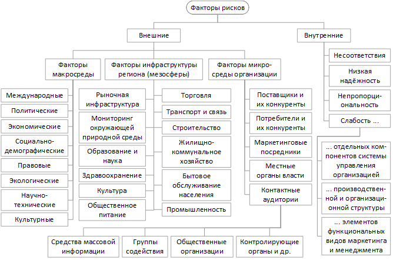
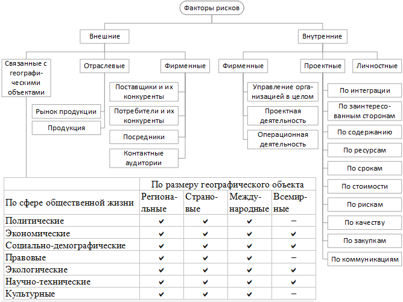
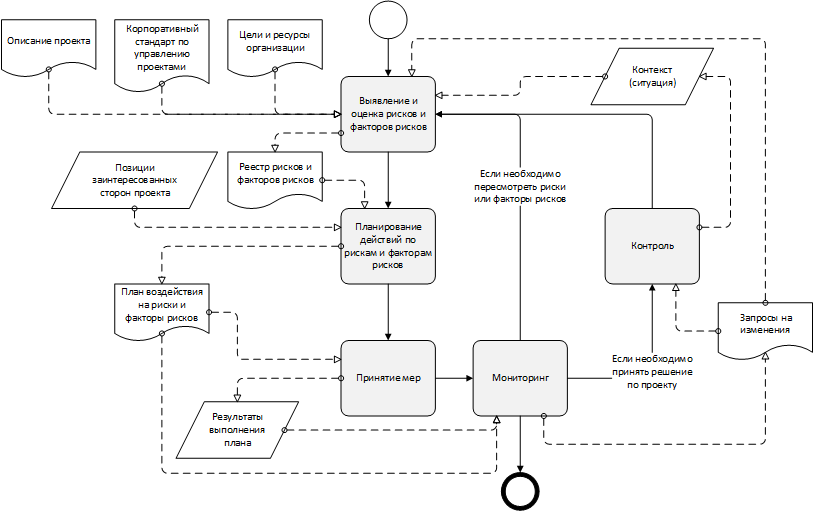
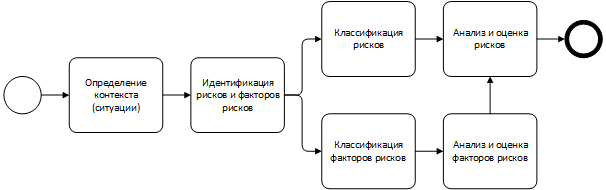

<meta charset="UTF-8" />
<link rel="stylesheet" href="dissertation.css" />

МИНИСТЕРСТВО НАУКИ И ОБРАЗОВАНИЯ

РОССИЙСКОЙ ФЕДЕРАЦИИ

Московский Технический Университет Связи и Информатики

(Федеральное государственное образовательное бюджетное учреждение высшего профессионального образования)

 

На правах рукописи

  

Ночевнов

Евгений Вячеславович

 

[анализ, факторы рисков, проекты в икт, исуп]

     

Специальность 08.00.05 «Экономика и управление народным хозяйством (менеджмент)»

    

Диссертация на соискание учёной степени

кандидата экономических наук

     

Москва – 2016

Работа выполнена на кафедре «Математическая Кибернетика и Информационные Технологии» МТУСИ.

| | |
|---|---|
**Научный руководитель** | доктор экономических наук, профессор кафедры МКиИТ
| | Вартанян Аревшад Апетович
**Официальные оппоненты** | доктор ...
| | кандидат ...
**Ведущая организация** | 

# Содержание

Введение

Глава 1. Теоретико-методологические основы построения КСУП для выявления и снижения рисков в проектах в области ИКТ

- Основные проблемы и факторы рисков в управлении проектами в области ИКТ
- Особенности КСУП, направленные на выявление и снижение рисков
- Исследование проблемы разработки ИСУП
- Выводы

Глава 2. Проблемы повышения устойчивости проектов в области ИКТ к различным факторам рисков

- Анализ принципов построения глоссариев в области управления проектами как фактора улучшения понимания в коллективе
- Разработка инструмента анализа пользовательских запросов к ИСУП для раннего выявления возможных проблем в управлении проектами
- **Другие инструменты и методы повышения устойчивости проектов в области ИКТ к различным факторам рисков** 
- Разработка концептуальной модели КСУП, предназначенной для повышения устойчивости проектов в области ИКТ
- Выводы

Глава 3. Организационно-методические рекомендации по построению и развитию КСУП в ИКТ

- Постановка и проверка гипотез об использовании ИСУП и соблюдении регламентов КСУП
- Формирование модели оценки эффективности применения ИСУП
- Выводы

Заключение

Литература

# Список сокращений

ИСУП - Информационная система управления проектами

КСУП - Корпоративная система управления проектами

МП - Менеджер проектов, руководитель проектов

ПО - Программное обеспечение

УП - Управление проектами

# Введение

**Актуальность диссертационного исследования.**

В настоящее время широко распространён проектный способ организации разработки, внедрения и эксплуатации информационных систем, особенно в динамичных и сложных областях, таких как энергетика, строительство, коммуникации, электроника.
Проектный подход позволяет компании легко видоизменяться и приспосабливаться к новой ситуации, целям, задачам, обеспечивая необходимые условия для инноваций развития творческой активности.
В данной работе под словом «проект» понимается уникальный набор процессов, состоящих из координируемых и контролируемых работ с датами начала и окончания, которые выполняются для достижения целей проекта (по стандарту ГОСТ Р ИСО 21500-2014 «Руководство по проектному менеджменту»). Идея процессного управления заключается в рассмотрении функций во взаимосвязи друг с другом, т. е. в виде процессов.

Поскольку проектам в области ИКТ характерны высокий уровень рисков и связанная с ним большая непредсказуемость процессов управления и результатов работы, то существует потребность в исследовании воздействия рисков, в т. ч. специфических для ИКТ, на проекты и результаты проектов и принятия соответствующих мер для снижения влияния и вероятности рисков. Возникновению рисков способствует набор различных факторов, влияющих прямо или косвенно на выполнение проекта.

Проблема управления проектами в области ИКТ осложняется тем, что они зачастую выполняются без строгого следования методикам управления проектами, поскольку эти методики недостаточно стандартизированы или недостаточно конкретны.

Внедрение в организациях, занимающихся проектами, корпоративной системы управления проектами (КСУП) позволяет повысить качество процессов управления проектами, в т. ч. управление рисками.
КСУП включает в себя нормативно-регламентную базу, информационную систему управления проектами (ИСУП) и подготовленный (обученный) персонал.

Эффективное управление проектами с использованием информационной системы позволяет наладить взаимодействие между участниками проектной группы, повысить их качество и скорость работы.
В России УП с использованием современных технологий и инфокоммуникационных инструментов в настоящее время получает широкое распространение, в основном среди крупных компаний, внедряющих большие проекты с участием различных специалистов.
Развитие и внедрение методов обработки информации и принятия решений повышает качество управления в компаниях, что позволяет в сочетании с оптимальным использованием человеческого потенциала создавать и поддерживать конкурентные преимущества разрабатываемых и внедряемых продуктов в области ИТ.

В настоящее время ИСУП накапливают большие объёмы информации, которую стоит использовать для выработки мер по улучшению процессов управления, в частности, по повышению устойчивости проектов к различным факторам рисков.

Таким образом, актуальность темы исследования обусловлена широким применением методов и методологий управления проектами, в т. ч. с помощью ИСУП, в проектах в области ИКТ и сохраняющимся высоким уровнем рисков.

**Степень научной разработанности проблемы**.
Вопросами разработки и внедрения программного обеспечения для управления проектами занимались Полковников А. В., Леффингуэлл Д. и др.
В России развитием научных положений в управлении проектами в целом занимались Воропаев В. И., Бурков В. Н., Новиков Д. А. и др.
Ципес Г. Л., Полковников А. В. и др. прорабатывали теоретико-методологические подходы построения и внедрения КСУП.
**Добавить про факторы рисков, управление рисками.**
Управлению проектами разработки и внедрения программного обеспечения посвящены исследования Стеллмана Э., Перссона Дж., и др.
В области разработки и исследования моделей и методологий разработки программного обеспечения работали Ройс В., Бек К., Якобсон И., Швабер К., Сазерленд Дж. и др.
Вопросами стандартизации процессов УП занимались многие национальные и международные органы и комитеты, среди которых можно выделить Институт управления проектами (PMI, США), Международную организацию по стандартизации (ISO), Федеральное агентство по техническому регулированию и метрологии (Росстандарт, Россия).

При этом в научных трудах указанных авторов рассматриваются методы и алгоритмы работы отдельных составляющих ИСУП, но они описывают только часть деятельности, не затрагивая такие вопросы, как проектирование архитектуры и данных и всей функциональности ИСУП.

**Объектом** диссертационного исследования являются современные российские компании и их подразделения, выполняющие проекты в области информационно-коммуникационных технологий.

**Предметом** диссертационного исследования являются теоретико-методологические подходы проектирования корпоративных системы управления проектами в области ИКТ.

**Цель диссертационного исследования**: разработка методов и подходов построения КСУП с целью повышения устойчивости выполняемых проектов в области информационно-коммуникационных технологий к различным факторам рисков.

**Задачи исследования**:

1. Исследовать понятия предметной области «управление проектами» и разработать принцип их классификации.
2. Проанализировать причины возникновения рисков в управлении проектами в области ИКТ.
3. Разработать инструменты и методы повышения устойчивости проектов в области ИКТ к различным факторам рисков.
4. Сформировать концептуальную модель КСУП, предназначенную для повышения устойчивости проектов в области ИКТ.
5. Предложить управленческий комплекс мероприятий по построению и развитию КСУП в ИКТ.

**Теоретическую и методологическую основу** исследования составляют работы зарубежных и отечественных авторов в области теории общего менеджмента, проектного управления, статистического анализа, проектирования информационных систем, управления требованиями.

**Информационную базу** исследования составили материалы научной периодической печати, учебные пособия для аспирантов, российские государственные, иностранные и международные стандарты по разработке программного обеспечения, управлению проектами и сертификации менеджеров проектов, а также статистика запросов существующей прикладной информационной системы для управления проектами, собранная в реальных условиях использования.

**Область диссертационного исследования** соответствует требованиям паспорта специальностей ВАК 08.00.05 «Экономика и управление народным хозяйством (менеджмент)», пунктам 10.8 «Управление экономическими системами, принципы, формы и методы его осуществления. Зависимость управления от характера и состояния экономической системы. Управление изменениями в экономических системах. Теория и практика управления интеграционными образованиями и процессами интеграции бизнеса», 10.10 «Проектирование систем управления организациями. Новые формы функционирования и развития систем управления организациями. Информационные системы в управлении организациями. Качество управления организацией. Методология развития бизнес-процессов. Развитие методологии и методов управления корпоративной инновационной системой» и 10.11 «Процесс управления организацией, её отдельными подсистемами и функциями. Целеполагание и планирование в управлении организацией. Контроль, мониторинг и бенчмаркинг. Механизмы и методы принятия и реализации управленческих решений. Управление проектом. Управление знаниями. Риск-менеджмент. Управление производством. Современные производственные системы».

В рамках диссертационного исследования получены и **выносятся на защиту следующие научные результаты**:

1. Предложена и обоснована структура глоссария понятий в области управления проектами.
2. Разработан метод выявления основных факторов рисков в управлении проектами.
3. Предложены методы для выявления и снижения влияния факторов рисков на процессы управления проектами, спроектирован и разработан инструмент статистического анализа пользовательских запросов прикладной информационной системы с целью формирования требований доработки ИСУП и отслеживания хода выполнения проектов.
4. Сформирована концептуальная модель КСУП, включающая в себя организационные и технические методы и средства повышения устойчивости проектов в области ИКТ.
5. Предложен управленческий комплекс мероприятий по построению и развитию КСУП в ИКТ.

**Научная новизна** результатов диссертационной работы заключается в разработке организационно-методического инструментария повышения устойчивости проектов в области ИКТ к различным факторам рисков, а также модели и методов построения и развития КСУП в области ИКТ.

**Теоретическая значимость** исследования состоит в углублении и специализации инструментов управления проектами. Полученные результаты могут быть основой для дальнейших исследований в области управления проектами, программами и портфолио, интеграции проектного менеджмента со стратегическим и оперативным.

**Практическая значимость исследования** определяется возможностью использования результатов диссертационного исследования по следующим направлениям:

- сокращение трудозатрат на формирование корпоративного стандарта управления и КСУП путём использования сформированной концептуальной модели КСУП в ИКТ;
- повышение устойчивости проектов к различным рискам благодаря предложенным инструментам и методам управления проектами;
- повышение качества управленческих решений при использовании инструмента статистического анализа пользовательских запросов в прикладных информационных системах.

**Апробация результатов работы**. Основные положения диссертации были представлены на  конференциях различного уровня. Среди них: Молодежная научно-практическая конференция СКФ МТУСИ «ИНФОКОМ-2013» (2013), Международная научно-практическая конференция «Общество, наука и инновации» (2013), Международная научно-техническая конференция «Перспективные технологии в средствах передачи информации» (2015). Также результаты диссертационной работы были использованы при написании методического пособия для магистрантов МТУСИ по дисциплине «Распределённые информационные системы».

**Внедрение результатов диссертационного исследования**. Материалы исследования использованы при разработке инструмента оценки работы сотрудников в прикладной системе Redmine в организации «CityAds» (Smart Leads Inc.). На основе предложенной концептуальной модели были разработаны и внедрены КСУП в компаниях ООО «Одмин и ко» и ООО «Унивеб».

Каков эффект от внедрения средства анализа в CityAds?

**Публикации**. По материалам и основным результатам  диссертации опубликовано 4 печатные работы, в т. ч. 1 статья.

**Структура диссертации**.
Материал диссертации сегментирован с выделением списка сокращений, введения, 3 глав, заключения с общими выводами по работе, списка использованных источников из *NN* наименований. Содержание работы изложено на *NN* страницах компьютерного текста и включает *NN* таблиц и *NN* рисунков.

Содержание диссертации подразделяется следующим образом:

Во введении обоснована актуальность темы диссертационного исследования, сформулированы его цели и задачи, объект и предмет исследования, определена теоретическая, методическая и информационная база, дана характеристика научной новизны и практическое значение полученных результатов исследования.

**В первой главе**:

- рассмотрены существующие глоссарии понятий в области управления проектами;
- предложен принцип построения глоссария на основе пирамиды бизнеса и функциям управленческого цикла (планирование, организация, мотивация и контроль), включающий в себя выделение общих понятий и связанных с продуктами проекта, материально-технической базой (производством) и персоналом (потребителями и участниками проекта в целом);
- проведено исследование ближайшего похожего по функциональности и предназначению программного обеспечения для управления проектами, которое можно расширить или доработать с целью более полной информационной поддержки управления ИТ-проектами: Microsoft Project, Redmine, Tryton. Рассмотрены их особенности, функции и недостатки;
- исследованы темы автоматизации процессов управления проектами, создания системы управления проектами и корпоративного стандарта управления, существующие национальные и международные станадарты, относящиеся к разработке ПО для УП. Сформулированы общие требования для информационной системы управления проектами в области ИКТ;
- исследованы факторы рисков ИТ-проектов, которые могут значительно осложнить ведение проекта и даже привести его к провалу. Факторы рисков разделены на группы внешних и внутренних, среди внутренних выделены организационные, связанные с продуктами проекта, психологические и производственные. Основой этой классификации также является пирамида бизнеса. Предложены идеи по доработке программного обеспечения для управления проектами с целью снижения ряда факторов.

**Во второй главе** определены способы, принципы построения, используемые инструменты и технологии реализации трёх программных продуктов: инструмент регистрации и анализа пользовательских запросов в существующей прикладной системе на примере Redmine, каркас ИСУП и созданная с его помощью ИСУП.

Статистический анализ был проведён на реальных данных с целью уточнения требований к функциональности и производительности ИСУП. Также было проведено моделирование работы и составлено техническое задание на ИСУП.

**В третьей главе** рассмотрены вопросы тестирования полученных результатов в ходе диссертационной работы, их внедрения на реальных предприятиях, описаны особенности внедрения каркаса ИСУП и требования к переводу результатов к промышленной эксплуатации.

Также приведены области возможного применения, оценка эффективности предлагаемых решений, полученная на основе теоретических и практических подходов, а также рекомендации по использования результатов диссертационной работы и перспективы их дальнейшего использования и развития.

В заключении излагаются основные констатации, выводы и рекомендации, вытекающие из результатов диссертационного исследования, проведенного автором.

В списке использованных источников перечислены информационные источники, которые непосредственно были использованы при проведении исследования, а также указаны наименования и выходные данные публикаций, использованных при выполнении диссертационного  исследования.
**^ тавтология**

**Список публикаций:**

1. *Ночевнов Е. В., Вартанян А. А*. Создание нового принципа построения глоссария для инструмента управления инфокоммуникационными проектами в экономике // Труды Северо-Кавказского филиала Московского технического университета связи и информатики. Молодежная науч.-практ. конф. СКФ МТУСИ «ИНФОКОМ-2013», Ростов-на-Дону, 22-25 апреля 2013 г. Ростов-на-Дону: СКФ МТУСИ, 2013. С. 468-470.
2. *Ночевнов Е. В*. Факторы рисков ИТ-проектов // Сборник статей Междунар. науч.-практ. конф. «Общество, наука и инновации», Уфа, 29-30 ноября 2013 г.: в 4 ч. — Ч. 1. — Уфа: РИЦ БашГУ, 2013. — С. 173-176.
3. *Ночевнов Е. В*. Разработка инструмента для анализа запросов пользователей в прикладных системах (на примере Redmine) / Е. В. Ночевнов // Вестник Астраханского государственного технического университета. Серия: Управление, вычислительная техника и информатика, 2015. — № 4. — С. 66-71.
4. *Вартанян А. А., Ночевнов Е. В*. Инструмент статистического анализа запросов пользователей прикладной системы для определения её доработок (на примере системы Redmine).

3. http://vestnik.astu.org/Content/UserImages/file/inform_2015_4/08.pdf

# Глава 1. Проблемы разработки каркаса ИСУП

## Основные проблемы и факторы рисков в управлении проектами в области ИКТ

Устойчивое развитие предприятия, как и любой организационной системы, определяется влиянием целого ряда внутренних и внешних факторов. Есть много причин неблагоприятного исхода проектов и много факторов, которые могут на них повлиять. Кроме того, отклонение одного фактора может влиять на отклонение других факторов. Поэтому допущение даже одного серьёзного рискового события может повлечь появление ещё большего количества рисков, что в итоге и приведёт к серьёзным обострениям выполнения проекта, вплоть до его срыва.

Многие проблемы могут оставаться незамеченными и не решёнными, если не проводится разносторонний анализ результатов проекта и его влияния на весь бизнес компании. Проблема управления ИТ-проектами осложняется тем, что они обладают большой непредсказуемостью и зачастую выполняются без строгого следования методикам управления ИТ-проектами, поскольку они недостаточно стандартизированы или недостаточно конкретны. Результаты проектов, в т. ч. проектов разработки программного обеспечения, во многом зависят от характера, опыта, интересов и стремлений сотрудников даже при тщательной регламентации и автоматизации бизнес-процессов в организации. Таким образом, можно говорить о существовании различных факторов, влияющих на выполнение проектов.

Следует различать понятия «рисковое событие» и «фактор риска». Под фактором риска в этой работе подразумевается характеристика объекта, субъекта, процесса, имеющая количественное или качественное значение, которая может быть причиной возникновения риска. Чтобы сработал риск, т. е. чтобы возникло рисковое событие, требуется воздействие одного или нескольких факторов риска. Одни и те же факторы рисков могут привести к нескольким событиям. Факторы рисков могут быть связаны между собой, усиливать или ослаблять друг друга. Возникший риск может влиять на некоторые факторы рисков, тем самым вызывая другие риски. Сами по себе факторы рисков не подразумевают нанесение ущерба проекту или организации в отличие от рисков.

Для идентификации факторов рисков, выявления мест их существования (или возникновения) и разработки мер следует использовать классификацию факторов рисков. Это необходимо не только в проектах в области ИКТ; классификация факторов рисков может быть составлена как для одной, так и для нескольких отраслей.
Классификация факторов рисков должна быть такой, чтобы было возможно оперативное и частое обновление значений факторов рисков в реестре, использующем эту классификацию, а также получение актуальных прогнозов состояния внешней и внутренней среды организации. Кроме этого, классификация факторов рисков должна способствовать разработке и применению инструментов управления рисками.

Цель разработки и применения классификации факторов рисков состоит в разработке методов управления внутренними факторами рисков и реагировании на изменения внешних факторов рисков, в частности формирование более точной и полной информации о их состоянии для того, чтобы повысить качество управленческих решений и устойчивость проекта к рисковым событиям в целом.

**Существующие классификации факторов рисков в управлении проектами**

Рассмотрим классификации факторов рисков из научных источников. В работе [[1]](#a-fath) используется достаточно подробная классификация внешних факторов рисков (см. рис. 1) и сделан акцент на том, что сначала необходимо анализировать внешние факторы, а затем внутренние, потому что «среди внешних факторов риска могут быть непреодолимые в текущее время и в перспективе слабости и "болезни", которые делают бессмысленными усилия по снижению внутренних рисков» [Там же, стр. 246-247]. При этом классификация внутренних факторов рисков основана на сути возможных проблем в организации, а не месте их возникновения, что затрудняет выработку корректирующих мер при использовании этой классификации до появления рисковых событий.

Рис. 1. Классификация факторов рисков по Фатхутдинову

В работе [[2, стр. 93-94]](#a-kangro) также выделены внешние и внутренние факторы рисков. Внешние факторы подразделяются на международные, федеральные, региональные, отраслевые. Внутренние факторы -- на организационные, финансово-инвестиционные, факторы, связанные с экономической деятельностью и факторы, связанные с обеспечением экономической безопасности фирмы. В то же время, в описании этой классификации нет чёткого разделения между рисками и факторами рисков, что приводит к противоречию, обозначенному автором: «существуют факторы риска, которые можно в том или ином случае
отнести либо к внешним, либо к внутренним факторам. Например, налоговый риск в случае неблагоприятного изменения налогового законодательства в процессе предпринимательской деятельности относится к группе внешних инвестиционных рисков, а в случае налоговых ошибок, допущенных при исчислении налоговых платежей, — к внутреннему инвестиционному риску» [[2, стр. 94]](#a-kangro). В классификации внутренних факторов рисках делается акцент на экономической составляющей деятельности организации и не затрагиваются психологические аспекты работников, в т. ч. мотивы побуждения, которые могут быть вызваны не только их моральным и материальным вознаграждением.

При работе с факторами рисков к ним может быть применён ряд классификационных признаков, среди них можно выделить классификацию по направлению (экономика, техника, управление и пр.) и по уровню иерархии (исполнительский, фирменный, отраслевой и др.) [[1, стр. 240-241]](#a-fath). Чем ниже уровень иерархии у фактора риска, тем большее влияние на него имеет организация.

**Предлагаемое решение**

Для составления классификации был использован следующий список факторов рисков, присущих проектам в области ИКТ:

Внешние факторы рисков ИТ-проектов:

- Неблагоприятная конъюнктура;
- Политическая нестабильность;
- Изменение возможностей заказчика и подрядчиков.

Внутренние факторы рисков ИТ-проектов:

1. Организационные:
   - Нечеткое разграничение ответственности, в том числе между проектными командами заказчика и исполнителя;
   - Планирование:
      1. с использованием ошибочных целей,
      2. на основе неполных или противоречивых данных,
      3. с привлечением только плановиков,
      4. без учёта предыдущего опыта,
      5. без учёта доступности ресурсов,
      6. без учёта координации,
      7. без учёта мотиваций,
      8. с излишней или недостаточной детализацией,
      9. не для контроля,
      10. без корректировки плана или без учёта изменений в требованиях;
   - Отсутствует управление ожиданиями заинтересованных сторон;
   - Изменение и неправильная расстановка приоритетов (слишком много внимания уделяется второстепенным вопросам);
   - Отсутствует организационная политика;
   - Не используется методология управления проектами;
   - Отсутствует стратегическое планирование и план дальнейшего применения и развития проекта;
   - Отсутствует система оперативной отчётности (отправка отчётов вовремя заинтересованным сторонам) [[3]](#a-tovb-cipes);
   - Неправильная организация сбыта готовой продукции [[4, стр. 109]](#a-iln)
2. Связанные с продуктом проекта:
   - Не определена цель проекта или есть отступления от цели;
   - Недостаточно прозрачный процесс управления проектом;
   - Искажение данных о проекте;
   - Не учитывается свой и мировой опыт, стандарты и достижения, предложения конкурентов;
   - Отсутствие контроля качества, несоответствие средств и методов измерения показателей качества требуемому уровню.
   - Неучтённые отклонения от технического задания;
   - Не учтена отраслевая специфика (несоответствие ассортимента масштабам рынка, неправильное представление продукции и т. п.).
3. Психологические:
   - Нехватка трудовых ресурсов;
   - Недостаточная квалификация проектной команды;
   - Участники недостаточно вовлечены в проект;
   - Участники часто отвлекаются на другие дела;
   - Культурные различия между участниками проекта;
   - Неготовность заказчика и/или исполнителя к новшествам;
   - Незаинтересованность ключевых участников в получении результата проекта, низкая мотивация;
   - Трудности межличностного взаимодействия: утрата доверия, отсутствие обратной связи, недоступность ключевых участников, непонимание другой стороны, действия без согласования между сторонами;
   - Личностные качества участников проекта и отношения между ними;
   - Уход или смена ключевых участников проекта, в т. ч. заказчика;
   - Трудности адаптации работников.
4. Производственные:
   - Нехватка материальных ресурсов или их низкое качество;
   - Ненадёжные (несвоевременные) поставки ресурсов;
   - Ошибки оценки бюджета, ресурсов, трудозатрат, сложности, сроков проекта;
   - Ошибки оценки спроса и целевой аудитории.

В основу предлагаемой в этой работе классификации факторов рисков в управлении проектами (рис. 2) легла классификация внешних факторов, описанная в работе [[1, стр. 246-247]](#a-fath), и классификация по уровню иерархии. Ключевой идеей предлагаемой классификации стало разделение факторов рисков на такие категории, которыми могут заниматься отдельные люди, специализирующиеся на этих категориях, что облегчит идентификацию и отслеживание значений факторов рисков. Ввиду сложности организационной системы в настоящее время предлагается использовать экспертное мнение, различные источники информации и раздельный труд специалистов.

Рис. 2. Предлагаемая классификация факторов рисков

Поскольку под фактором риска подразумевается измеримая характеристика объекта, субъекта, процесса, которая может привести к проявлению риска, то можно понимать каждую категорию факторов рисков как группу характеристик (табл. 1). Отраслевые факторы рисков связаны с конкретными отраслями, фирменные -- с конкретными организациями, проектные -- с конкретными проектами, личностные -- с конкретными людьми. Связь с конкретными субъектами и объектами важна потому, что ряд факторов может присутствовать или быть важным только для некоторых объектов и субъектов.

Таблица 1. Описание категорий факторов рисков в управлении проектами

| Категория факторов рисков | Описание |
|---|---|
| Связанные с географическими объектами | Характеристика регионов и сфер общественной жизни |
| Отраслевые | Характеристика субъектов, объектов, процессов в отрасли |
| Фирменные, внешние | Характеристика внешних объектов и субъектов и связей с ними, процессов взаимодействия |
| Фирменные, внутренние | Характеристика структуры организации и управления организацией |
| Проектные | Характеристика структур, объектов, процессов управления конкретным проектом |
| Личностные | Характеристика субъектов - работников, заинтересованных сторон, их особенностей и процессов взаимодействия между собой |

Проектные факторы рисков подразделяются по предметным группам из стандартов PMBoK (5-е изд.) [[5]](#a-pmbok) и ISO 21500 (ГОСТ Р ИСО 21500—2014) [[6]](#a-gost-21500), описывающих процессный подход к управлению проектами. При классификации внутренних факторах рисков использовался список факторов, приведённый в работе [[7]](#a-factory-riskov).

В таблице на рис. 2 галочки в ячейках обозначают, что возможна запись факторов рисков в эти ячейки; прочерки стоят для всемирных политических, правовых и культурных факторов рисков, потому что в настоящее время не существует единого признанного всемирного политического центра, которому подчиняются все страны, а утверждение о существовании всемирной (общечеловеческой) культуры может быть спорным.

Личностные факторы рисков в управлении проектами в предлагаемой классификации не разделены на категории — это обширная тема, заслуживающая отдельного рассмотрения. Среди личностных факторов можно особо выделить проблемы взаимодействия сотрудников в командах [[8]](#a-vartanyan-koal).

Чтобы определить, в какую категорию следует отнести фактор риска, нужно ответить на вопросы:

1. Кому он принадлежит, на кого возложен?
2. Кого он должен озадачивать в первую очередь и кому он под силу?
3. Кто создаёт и развивает эту область?
4. Кто несёт ответственность за ухудшение этого фактора и появление связанных с ним событий?

Среди источников и методов идентификации и отслеживания факторов рисков можно выделить:

- по факторам, связанным с географическими объектами: экспертное мнение, обзор новостей;
- по отраслевым факторам: экспертное мнение, обзор новостей, аналитика;
- по внешним фирменным факторам: на основе коммуникационных каналов между организацией и другими физическими и юридическими лицами;
- по внутренним фирменным факторам: исследование бизнес-процессов компании с помощью различных подходов; сам процесс сбора и исследования материала по этой категории факторов рисков будет способствовать развитию организации;
- по проектным факторам: мнение руководителя проекта, проектная документация; пожалуй, детально заниматься этими факторами могут только большие команды в сложных и значимых проектах (см. табл. 2);
- по личностным: мнение руководителя проекта, менеджера по персоналу, участие команды проекта.

Таблица 2. Примеры факторов рисков в управлении проектами в области ИКТ

| Категория | Факторы рисков |
|---|---|
| Управление организацией в целом | Организационная структура, стратегия фирмы, стратегическое планирование и план дальнейшего применения и развития результатов проекта |
| Проектная деятельность | Прозрачность процессов управления проектами, контроль качества управления проектами, ошибки оценки бюджета, ресурсов, трудозатрат, сложности, сроков проекта |
| Операционная деятельность | Организация сбыта (продажи, перевода в эксплутацию) готовой продукции, трудности адаптации работников |
| По интеграции | Методология управления проектами, неучтённые отклонения от технического задания, учёт своего и мирового опыта, стандартов и достижений, предложений конкурентов, корректность постановки и соблюдения цели проекта, ошибки планирования |
| По заинтересованным сторонам | Уход или смена ключевых участников проекта, в т.ч. заказчика, незаинтересованность ключевых участников в получении результата проекта, низкая мотивация, соответствие ожиданиям заинтересованных сторон |
| По содержанию | Расстановка приоритетов в проекте |
| По ресурсам | Нехватка материальных ресурсов или их низкое качество, члены команды часто отвлекаются на другие дела, члены команды недостаточно вовлечены в проект, недостаточная квалификация проектной команды, нехватка трудовых ресурсов, разграничение ответственности, в т. ч. между проектными командами заказчика и исполнителя |
| По качеству | Контроль качества продукции, соответствие средств и методов измерения показателей качества требуемому уровню |
| По коммуникациям | Система оперативной отчётности (отправка отчётов вовремя заинтересованным сторонам) |
| Личностные | Культурные различия между участниками проекта, неготовность заказчика и/или исполнителя к новшествам, трудности межличностного взаимодействия (утрата доверия, отсутствие обратной связи, недоступность ключевых участников, непонимание другой стороны, действия без согласования между сторонами) |
| Рынок продукции | Динамика и цикличность спроса, особенности ценообразования, характер и острота конкуренции |
| Продукция | Длительный производственный цикл, частота технологических нововведений, капиталоёмкость, экспортный потенциал, высокая чувствительность |
| Контактные аудитории | Средства массовой информации, группы содействия, общественные организации, контролирующие органы |

**Применение предлагаемой классификации**

Для использования факторов рисков в прогнозировании управленческих ситуаций необходимо установить зависимости между факторами и уровнем риска. Количество рисков и их факторов трудно сосчитать, даже в небольших проектах могут быть десятки факторов рисков. Поэтому необходимо выбрать наиболее важные из них на основе статистических зависимостей между рисками и факторами рисков [[1, стр. 248]](#a-fath).

Чтобы определить, каково значение фактора риска и что означает «усилить» и «ослабить» фактор риска, рассмотрены три примера из разных категорий (табл. 3). В отличие от риска, у фактора риска нет вероятности, но есть влияние (на риски и другие факторы) и выраженность (т. е. насколько сильно присутствует фактор риска). Поэтому под значением фактора риска в этой работе понимается его выраженность.

В настоящее время затруднительно определить единицу измерения всех факторов рисков ввиду их большого количества, разнообразия и субъективности их оценки. Поэтому предполагается использовать порядковую шкалу для измерения выраженности факторов рисков, хотя интервальная и, тем более, абсолютная шкалы дали бы больше возможностей в использовании факторов рисков в математических выражениях. Шкала выраженности факторов рисков имеет значения ноль (отсутствие), один (присутствие) и доли единицы для некоторых факторов рисков, обозначающие частичное присутствие.

Таблица 3. Пример описания факторов рисков

| Фактор | Может привести | Усиливается | Ослабляется |
|---|---|---|---|
| Изменение требований и условий деятельности организаций отрасли местными органами власти | К ограничению выполнения проекта, ограничению применения его результата, утрате актуальности проекта, усилению конкурентов, перспективе сворачивания бизнеса, изменению содержания проекта; в случае положительных изменений (за счёт снятия ограничений) -- доступ к дополнительному финансированию, уменьшение необходимых сроков и затрат. | Прямо -- рассмотрением и принятием законов и указов, регулирующих отрасль; косвенно -- серией резонансных общественно-политических событий, влиянием деловых и политических групп. | Из-за общественного недовольства регулированием и отдаляющимся сроком последнего регулирования отрасли (чем стабильнее состояние законодательной базы, тем легче под неё подстроиться). |
| Несоответствие заданному уровню средств проверки и требований качества | К затрате времени и ресурсов на то, что не нужно проверять; к снижению качества из-за того, что не проверяется то, что нужно проверять; в целом -- к несоответствию результата ожиданиям потребителей или заинтересованных сторон. | Допуском ошибок в понимании ожиданий и целей проекта. | Корректирующими воздействиями, направленными на устранение противоречий между заданным уровнем и средствами проверки и требованиями качества. |
| Культурные различия между участниками проекта | К напряжённости в отношениях в команде, непониманию другой стороны, формированию противоборствующих коалиций в команде проекта, ощущению отторженности, неприятию у участников проекта. | Использованием различных языков, в т. ч. профессиональных; разными толкованиями одних и тех же понятий; приверженностью различным традициям. | Использованием общего языка и общей терминологией, наличием общего жизненного опыта и общих жизненных установок. |

Для управления факторами рисков следует сохранять информацию о них в реестре факторов рисков: название, описание, влияние на риски и другие факторы (на что влияет, при каких условиях, в какой степени), а также условия усиления и условия ослабления этого фактора рисков. Поскольку факторов рисков может быть очень много, то ослеживание их состояния может занимать много времени и сил. Поэтому целесообразно рассматривать только те факторы рисков, которые (по мнению эксперта) могут привести к рисковым событиям.

Принятие мер по изменению фактора риска (уменьшению, устранению) может быть выражено во времени и планируемых затратах. Это позволит оценить планируемые финансовые и временны́е ресурсы, необходимые для обеспечения устойчивости проектов, а также определить, чем в текущий момент лучше заниматься: какие факторы рисков можно оставить, а какие нужно изменить; принять последствия или контрмеры?

Математически можно выразить влияние факторов риска на другой фактор или риск как _f_ (фактор 1, фактор 2, фактор 3, ..., фактор N). Факторы рисков можно сравнивать между собой по выраженности (равенство, неравенство, больше, меньше), а также с эталонным значением, но нельзя складывать, вычитать, умножать и делить, потому что используется порядковая шкала. Возникает проблема в составлении и обосновании формулы для каждого фактора и риска: нужно выделить наиболее значимые факторы для каждой формулы и обосновать применение определённых математических (или логических) операций и функций, при этом в проекте может быть несколько десятков или сотен факторов рисков. Альтернативным решением составления формулы может быть использование машинного обучения для поиска связей между рисками и факторами рисков и формирования оптимальной формулы:

1. Некоторое время учитель обучает информационную систему управления факторами рисков (далее: ИСУФР), указывая входные параметры (значения факторов рисков) и возникающие события.
2. Между значениями рисков и факторов рисков подсистема обучения ИСУФР пытается найти зависимости (корреляции) и выводит их на экран.
3. Учитель может принять некоторые предположения подсистемы обучения ИСУФР как правдивые или отклонить как заведомо ложные.

В дальнейшем потребуется автоматизированная корректировка формул:

1. Пользователь указывает значения факторов рисков.
2. Подсистема анализа ИСУФР вычисляет систему уравнений, показывающих изменение выраженности факторов и вероятности рисков.
3. Пользователь принимает управленческие решения на основе сформированного прогноза.
4. Пользователь указывает, что изменилось и какие прогнозы подсистемы анализа ИСУФР оказались верными, а какие ложными.
5. Подсистема обучения ИСУФР соответствующим образом изменяет предположения о корреляции факторов рисков между собой и с рисками, а также формулы, связанные с ними.

Важно учитывать, что знание прогнозов влияет на действия, предпринятые пользователем. Таким образом, пользователь ИСУФР сам оказывается фактором риска, который может как способствовать появлению рисковых событий, так и противодействовать им.

Предложенные подходы обучения и анализа ИСУФР похожи на имитационные методы и методы анализа чувствительности проекта. Различия в том, что анализ чувствительности проекта, как правило, проводится по финансовым показателям (ЧДД, ставка процента и др.), а для начала имитационного моделирования необходимо установить корреляции между факторами рисков [[9, стр. 843]](#a-mazur). В целом, имитационное моделирование является частью предложенных подходов обучения и анализа ИСУФР.

В перспективе часть значений факторов рисков может быть вычислена или получена из нескольких источников, например, из новостей, что позволит уменьшить нагрузку на оператора ИСУФР; для этого потребуются методы анализа текстов.

Некоторые факторы рисков могут быть снижены с помощью информационной системы управления проектами (ИСУП). Так, при планировании на основе неполных или противоречивых данных может быть создан не тот продукт, который нужен; возможны ошибки в оценке сложности и состава продукта. Решением этой проблемы может быть формализация требований – опросники, базы знаний.

Планирование без учёта опыта или на основе неподходящего опыта (например, опыт в другой области или с другой сложностью проекта) могут давать нереальные оценки длительности. Чтобы снизить этот фактор риска,  нужно учитывать опыт в планировании содержания и длительности работ, ресурсов, стоимости, качества, рисков и закупок позволит накопление базы похожих проектов и задач.

Планирование без учета доступности ресурсов может стать причиной остановок в работе, связанных с ожиданием завершения других работ, а вместе с этим – и рост фактического срока выполнения проекта. Нужно, чтобы ИСУП корректировала план (расписание), например, при планировании каждого дня.

Планирование без учета координации. Любой достаточно большой проект разбивается на относительно независимые части, за реализацию которых отвечают самостоятельные подразделения. При отсутствии координирующих воздействий со стороны руководителя проекта они могут действовать, преследуя свои частные, локальные цели, что приводит к хаосу и срыву реализации проекта в целом [[9, с. 535]](#a-mazur). Все изменения сроков и приоритетов задач и их порядка выполнения должны автоматически приводить к пересчёту плана проекта.

Управление ожиданиями. Можно хранить список ожиданий в виде текста или таблицы со столбцами «Кто» и «Что ожидает».

Изменение и неправильная расстановка приоритетов (слишком много внимания уделяется второстепенным вопросам). Обнаружить это позволит диаграмма Ганта и другие средства визуализации, показывающие сроки выполнения проекта в зависимости от порядка выполнения работ по проекту.

Отсутствие контроля качества, несоответствие средств и методов измерения показателей качества требуемому уровню. Возможным решением этой проблемы может быть автоматизация тестирования, подготовка приёмочных тестов и интеграция средств тестирования с ИСУП (например, создание задач по проваленным тестам бета-версии продукта).

В настоящее время классификации факторов рисков применяются для работы с реестрами факторов рисков. Предложенная классификация отличается глубиной и широтой охвата возможных факторов рисков в управлении проектами в области ИКТ и позволит составить реестр не только внутренних, но и внешних факторов рисков. Она может применяться в управлении различными проектами в области ИКТ.

## Особенности КСУП, направленные на выявление и снижение рисков

### Постановка задачи

[сложный абзац]
Корпоративная система управления проектами (КСУП) -- комплекс организационных, методических, технических, программных и информационных средств, направленных на поддержку и повышение эффективности процессов планирования и управления проектами в компании [[9, стр. 394]](#a-mazur). Информационная система управления проектами (ИСУП) -- это программное обеспечение, используемое для организации и поддержки процессов управления проектами, оно является частью КСУП. В то же время, КСУП -- часть интегрированной системы управления предприятием. Соответственно, компоненты КСУП должны быть совместимы и интегрироваться с ней: регламенты КСУП совместимы с регламентами системы управления предприятием, ИСУП интегрирована с КИС (корпоративная информационная система), если она используется, и т. д. [http://www.cfin.ru/software/project/epm.shtml]

Трудно представить себе управление сложными проектами без управления рисками, ведь проекты, как правило, существуют в условиях неопределённости как внешней среды, так и содержания процессов управления проектом. Сложность проекта и его внешней среды делают затруднительным или невозможным составление подробного плана проекта, учитывающего существующие и возможные в будущем условия выполнения проекта и применения его результатов. Поэтому КСУП должна включать в себя средства по управлению проектными рисками, позволяющие учитывать, обнаруживать риски и принимать меры не только по устранению последствий наступивших рисков, но и по снижению вероятности наступления риска и ущерба от него. В этой работе используется определение понятия «риск» из ГОСТ Р 51897-2011 как «следствие влияния неопределенности на достижение поставленных целей» [ГОСТ Р 51897-2011 Менеджмент риска. Термины и определения].

На каждом уровне и для каждой роли есть своё восприятие важности рисков и свои виды рисков. Условно говоря, риск, что некий Вася покинет проект, должен волновать подрядчика, а не заказчика и инвестора. Инвестору безразлична роль некого Васи в проекте; главное, «взлетит» проект или не «взлетит» -- будет от проекта польза и доходы или нет. Соответственно, и свои методы работы с рисками. Можно сказать, что для каждого риска можно определить некоторый оптимальный уровень в иерархии управления, на котором им лучше всего заниматься -- отслеживать, принимать меры. Разные уровни -- разные методы -- разные задачи.
[Это стоит рассмотреть подробнее со спецификой ИКТ.]

[Рыжов А. В. Применение объектно-ориентированного подхода при разработке и внедрении модуля управления рисками инвестиционных проектов, как части системы управления проектами // Объектные системы. 2015. №10 (10). С.100-104.]
В количественном выражении риск обычно определяется как изменение численных показателей проекта: чистой приведенной стоимости (NPV), внутренней нормы доходности (IRR) и срока окупаемости (PB). 
Многие компании при внедрении систем управления проектами не используют подсистемы управления рисками. Это объясняется тем, что подход к управлению рисками проектов в настоящее время развит крайне слабо и в полном объеме не применяется в компаниях.
Причины тому кроятся в следующем:
- отсутствуют формализованные бизнес-процессы управления рисками;
- в компании отсутствует единая принятая методология по управлению рисками;
- отсутствуют инструменты объективного мониторинга рисков проектов в режиме реального времени;
- низкий уровень квалификации руководителей проектов в части выявления и управления рисками.

В этой работе предлагается рассмотреть, что именно должна содержать КСУП, чтобы было возможным своевременное выявление и снижение проектных рисков. [То есть предлагается разработать или доработать инструменты для управления рисками.]

### Существующие решения

Для внедрения корпоративной системы управления проектами (КСУП) необходимо определить [http://unit-edu.ru/courses/detail.php?ID=697]:
- Цели внедрения КСУП
- Компоненты КСУП:
  - НРБ -- нормативно-регламентная база (в некоторых источниках её называют методологией управления проектами),
  - Информационная система управления проектами,
  - Подготовленный персонал по управлению проектами (возможно также создание подразделения по управлению проектами)
- Задачи КСУП
- Этапы внедрения КСУП

>----- http://www.pmcity.ru/consulting/corporate/
НРБ описывает процессы управления проектами компании. Она представляет собой набор процедур управления проектами и шаблонов документов, разработанных специально для компании-заказчика.

Организационная структура управления проектами (могут встречаться названия «комитет по реализации проектов», «проектный офис», «офис управления проектами») обеспечивает выполнение процессов проектного управления, осуществляет функции координации и контроля соблюдения сроков, бюджета всех проектов, а также позволяет вести контроль общего хода проектов по ключевым точкам.

Информационная система управления проектами обеспечивает эффективное планирование и контроль исполнения работ проекта, консолидирует данные о выполнении проектов на всех уровнях. Функциональные требования к информационной системе разрабатываются на основе процессов проектного управления, оптимальных для компании-заказчика.

Повышение эффективности системы управления проектами достигается за счет разумной формализации процедур подготовки, принятия управленческих решений и организации их исполнения, а также за счет разработки форм взаимодействия участников проекта, контроля и отчетности.
>-----

Этапы внедрения КСУП могут различаться в разных организациях, в общем используется следующий порядок работ [http://unit-edu.ru/courses/detail.php?ID=697][http://www.pmexpert.ru/services/training/moscow/detail.php?ID=104][http://www.b-solutions.ru/serv/projects/pmo/services3-PMO-11.html][http://juco.ru/business/pm/pm-consulting/pm-system-development]:

1. Организация проекта внедрения КСУП (создание рабочей группы и др.), обследование проектной деятельности организации (как есть сейчас).
2. Разработка нормативно-регламентной базы (НРБ).
3. Разработка (настройка) и установка ИСУП.
4. Подготовка персонала к использованию разработанной НРБ и ИСУП, в т. ч. создание подразделения для управления проектами, обучение сотрудников.
5. Эксплуатация КСУП, в т. ч. опытная и промышленная.

Разработка и внедрение КСУП зачастую выполняется итеративно, небольшими частями, чтобы в короткие сроки запускать КСУП в эксплуатацию, получать обратную связь по результатам внедрения, подстраивать КСУП под меняющиеся потребности организации и др.

Входные данные для разработки КСУП: описание бизнес-процессов, организационная структура, зоны ответственности подразделений, нормативная документация по процессам [http://journal.itmane.ru/node/40].

В PMBoK упоминается процесс идентификации рисков проекта, а факторы рисков и рисковые события рассматриваются только как возможные причины наступления конкретных рисков. PMBoK не описывает управление факторами рисков -- их идентификацию, классификацию, оценку, мониторинг, обновление реестра факторов рисков и связей факторов рисков между собой. Соответственно, планирование управления рисками по PMBoK включает в себя процессы по работе с определёнными рисками, а не их причинами. По мнению автора, чтобы действовать превентивно с рисками, нужно уделять внимание так же и факторам рисков.

При рассмотрении темы управления рисками по стандартам ГОСТ следует учитывать, что значение понятия «управление риском» отличается от принятого в научной и профессиональной среде (например, [[9, стр. 823]](#a-mazur), [http://www.e-xecutive.ru/wiki/index.php/Управление_рисками]): понятию «управление риском» из ГОСТ соответствует «контроль риска», а «менеджмент риска» из ГОСТ -- это «управление риском» [ГОСТ Р 51897--2011 Менеджмент риска. Термины и определения].

ГОСТ Р 51901.1--2002 может быть применён для описания управления рисками в КСУП, в частности, в этом стандарте упоминаются возможные действия и методы для определения опасностей, источников и последствий риска. К выявлению и снижению проектных рисков по этому стандарту можно отнести:

[Это раскрывает содержание этапа «Выявление и оценка рисков и факторов рисков» на схеме. Тут идентификация и определение контекста отнесены к анализу.]
- анализ риска:
  - определение области применения анализа риска (внешние и внутренние факторы, которые следует учитывать при управлении риском, сфера применения критериев риска);
  - идентификация опасности, предварительная оценка последствий, оценка величины риска;
  - проверка результатов анализа;
  - документальное обоснование;
  - корректировка результатов анализа с учётом последних данных;
- оценка риска:
  - анализ частот опасностей: проводится на основе статистики по аналогичным рискам и проектам, аналитических и имитационных методов, мнения экспертов;
  - анализ последствий.

Область применения анализа риска в ГОСТ Р 51901.1--2002 [определение контекста] включает в себя основания для проведения анализа риска, описание исследуемой системы, установление источников информации о факторах, имеющих отношение к анализируемым действиям и проблеме, описание предположений и условий анализа риска, описание требуемых выходных данных.

Из ГОСТ Р ИСО 31000--2010 можно добавить к написанному выше, что понятие «источник риска» близко по смыслу к «фактору риска». Предлагаемые действия по работе с источником риска включают в себя [ГОСТ Р ИСО 31000--2010 Менеджмент риска. Принципы и руководство]:

- идентификацию источников при анализе риска;
- учитывание при анализе риска положительных и отрицательных последствий источников, а также возможности того, что эти последствия могут произойти;
- установление связей рисков и источников рисков между собой.

[переход...]

В настоящее время различные ИСУП поддерживают следующие функции:

- моделирование ситуаций по методу Монте-Карло, количественный анализ риска (по последствиям) (например, RiskyProject [[10]](#a-finanalis));
- корреляции рисков событий (?) (например, RiskyProject)
- определение вероятности завершения проекта к определённому сроку (с помощью вероятностей завершения отдельных работ проекта в срок) (например, OpenPlan) (или это и есть Монте-Карло? + PERT);
- Microsoft Project Server позволяет определять, анализировать риски проектов и планировать мероприятия по их минимизации;
- анализ чувствительности и точки безубыточности проекта (Project Expert);

... но нет раннего обнаружения рисков, когда легче и дешевле всего обезопасить проект от наступления рисковых событий. Вместо этого в существующих ИС предлагается вести реестр рисков, где в описании каждого риска может быть приведён список его возможных причин, как правило, событий.

В стандартной поставке несерверной, однопользовательской версии Microsoft Project 2016 управление рисками не предусмотрено, можно записывать риски как задачи и показывать или скрывать их, моделируя выполнение проекта в зависимости от рисков, но это влияет только на срок, стоимость проекта и занятость его участников; или вести реестр рисков и делать вычисления с ними (например, определение важности риска по его вероятности и степень ущерба) [http://blogs.technet.com/b/project_ru/archive/2016/01/20/upravlenie-riskami-v-project-2016-vvedenie-i-identifikacija-riskov.aspx]. Смоделировать крах проекта в однопользовательской версии Microsoft Project 2016 не получится, т. е. когда дальнейшие работы «по-прежнему» невозможны, а «по-новому» значит начать проект с самого начала.

В серверной версии Microsoft Project 2016 есть триггеры рисков -- понятие, близкое к факторам рисков. Триггер -- то, что может вызвать риск. Триггеры указывают (перечисляют) для каждого риска, но определение сложного графа связей триггеров и рисков между собой в программе не предусмотрено. Как таковое отслеживание состояния триггеров в Microsoft Project не удалось обнаружить. Возможности серверной версии Microsoft Project 2016 по управлению рисками включают в себя учёт рисков и связи рисков с проектами и задачами.
Дополнения TurboRisk, RiskyProject и другие добавлют к Microsoft Project функции анализа рисков с помощью моделирования «что-если» и определения вероятности завершить проект в рамках срока или бюджета (применение методов PERT и Монте-Карло). Аналогичные функции по анализу рисков предлагает ИСУП Oracle Primavera без учёта дополнений.
В CA PPM есть оценка рисков по 11 шкалам, по смыслу эти шкалы похожи на группы факторов рисков.

Близкие по смыслу и месту употребления понятия к «фактору рисков»: опасность, источник риска, причина риска, триггер.
Триггер -- пороговое значение риска, после его достижения руководитель проекта (или риск-менеджер) вырабатывает управленческие решения по контролю риска [http://blogs.technet.com/b/project_ru/archive/2016/01/20/upravlenie-riskami-v-project-2016-vvedenie-i-identifikacija-riskov.aspx]. Триггеры определяет сам руководитель проекта (или риск-менеджер).
Фактор риска, как показано в работе [[11]](#a-klassif-f-r), является количественно или качественно измеримой характеристикой объекта, субъекта, явления или процесса, которая может привести к появлению риска.
Источник риска -- объект или деятельность, которые самостоятельно или в комбинации с другими обладают возможностью вызывать повышение риска [ГОСТ Р 51897-2011]. Возможная трактовка: источник риска -- место возникновения риска.
Опасность -- источник потенциального вреда [ГОСТ Р 51897-2011]. Источник риска -> появился риск, но риск ещё не бабахнул, а когда бабахнет, появится опасность. Источник риска порождает риск, а риск порождает опасность.
Причина риска ~ рисковое событие [http://menyailo.ru/istochniki-vozniknoveniya-faktory-i-prichiny-riska/]. Факторы риска -- это условия, способствующие проявлению причин риска [Там же]. Фактор риска – это существенное обстоятельство, оказывающее влияние на уровень риска [Там же]. Причина риска – явление, являющееся основанием и влекущее наступление рисковой ситуации [Там же].

[Если мне нечего к этому добавить, то лучше не упоминать «Известные неизвестные» и «Неизвестные неизвестные»]
«Известные неизвестные». Это те риски, которые можно идентифицировать и подвергнуть анализу. В отношении таких рисков можно спланировать ответные действия.
«Неизвестные неизвестные». Риски, которые невозможно идентифицировать и, следовательно, спланировать ответные действия. [http://citforum.ru/SE/project/arkhipenkov_lectures/9.shtml]
Управленческие резервы на непредвиденные обстоятельства не входят в базовый план по стоимости проекта, но включаются в бюджет проекта [Там же].

### Предлагаемое решение

[Как определить, что КСУП соответствует требованиям, накладываемым для выявления и снижения рисков?]
[Затем определить особенности КСУП, направленные на выявление и снижение рисков, в частности -- делающие КСУП соответствующей обозначенным требованиям/критериям. Среди особенностей выделить только те, которые необходимы для выявления и снижения рисков в проектах в области ИКТ, а также для поддержки этих особенностей.]

Целью разработки такой КСУП является обеспечение устойчивости к различным рискам при выполнении проектов в области ИКТ. Из этого следуют задачи:

- ведение реестра рисков и факторов рисков;
- применение аналитических и прогнозных методов в исследовании рисков и факторов рисков;
- представление результатов анализа и прогнозов состояния проектов в зависимости от влияния различных рисков и факторов рисков;
- раннее обнаружение проблем в проектах на основе факторов рисков;
- определение и принятие необходимых мер для устойчивости проектов.

Для этого НРБ должна описывать:

- управление рисками и факторами рисков, в т. ч. учёт, определение условий и мер воздействия на риски и факторы рисков;
- когда и при каких условиях заниматься риском и фактором рисков;
- как управлять связями рисков и факторов рисков между собой;
- какой должна быть форма отчётности по рискам и факторам рисков;
- какие аналитические и прогнозные методы применять, в каких условиях они применимы, какие данные на входе и выходе, в чём суть этих методов;
- как должны быть обоснованы прогнозы по возникновению рисковых событий, составленные на основе факторов рисков.

Необходимые функции и особенности ИСУП:

- хранение рисков и факторов рисков как объектов ИСУП: структура данных, функции объектов, взаимодействие (связи) с другими объектами ИСУП;
- применение аналитических и прогнозных методов включает в себя алгоритмы, обоснование, доказательство соответствия алгоритмов поставленной задаче;
- составление, хранение и предоставление отчётов по рискам и факторам рисков;
- моделирование состояния проекта в зависимости от рисков, факторов рисков и принятых мер;
- рассмотрение проекта как части деятельности организации: проекты могут влиять друг на друга, воздействуя на факторы рисков других проектов; проекты не изолированы от внешней среды проектов.

Программы обучения персонала должна включать темы и описывать применение управленческих инструментов для формирования необходимых знаний и навыков по работе с рисками и факторами рисков.

**почему? объяснить / определить критерий выборки именно этих методов**
Для анализа факторов рисков могут подходить те методы, которые ...
Среди методов, удовлетворяющих этому критерию, можно назвать: **добавить пояснения, что они обозначают и как могут быть применены к факторам рисков**

- ведомости проверок -- составление реестра типовых опасных веществ и (или) источников потенциальных аварий; если рассмотривать «опасные вещества» и «источники потенциальных аварий» как частные случаи факторов рисков, то этот метод, фактически, позволит составить реестр типовых факторов рисков в управлении проектами;
- общий анализ отказов;
- модели описания последствий;
- методы моделирования, например, Монте-Карло;
- парные сопоставления;
- обзор данных по эксплуатации;
- анализ скрытых процессов;
- анализ «дерева неисправностей»;
- анализ «дерева событий»;
- предварительный анализ опасностей;
- анализ видов, последствий и критичности отказов -- здесь следует вместо «аварийных состояний оборудования» использовать «значения факторов рисков»;
- анализ влияния человеческого фактора;
- структурная схема надёжности.

Применение этих аналитических методов к факторам рисков заслуживает особого рассмотрения, поскольку эти методы позволят сформировать инструментарий для более полного и комплексного управления проектными рисками.

### Исследование результата (как соотносится с другими решениями, что ещё есть интересного, в каких условиях, как и где применять, перспективы развития)

[Где это может быть использовано: разработка модели КСУП, направленной на успешное выполнение проектов при минимальном влиянии рисков на успех проекта, подразумеваются проекты в области ИКТ.]

Количественной оценкой получаемого экономического эффекта [от внедрения ИС управления рисками / факторами рисков] можно считать разность суммы прогнозируемых потерь от выявленных рисков до и после ввода системы в эксплуатацию.

### Выводы

## Исследование проблемы разработки ИСУП для раннего выявления рисков

### Для чего?

<--- почему важно иметь поддержку управления рисками в ИСУП -->
<--- по возможности, ИСУП должна автоматизировать то, что имеет смысл автоматизировать в КСУП: есть управление рисками в КСУП и определены некоторые критерии и средства (как выявить риск? как контролировать риск?), применение которых можно автоматизировать -->

Согласно PMBoK, управление рисками в проекте является одной из дисциплин управления проектом. В научной и профессиональной литературе описано, какие методы управления рисками применять, какие действия включает в себя управление рисками, как проводить анализ рисков и прочее. В этой работе предлагается рассмотреть, какие качества и возможности должна иметь информационная система управления проектами (ИСУП) для раннего выявления рисков. Под ранним выявлением подразумевается обнаружение потенциального риска до его наступления, используя совокупность факторов риска, что позволяет среагировать на риск, когда его важность возросла, а стоимость принятия мер по нему ниже, чем при наступившем риске.

Поддержка управления рисками в ИСУП позволяет не только вести учёт рисков, но и связывать риски с работами, автоматизировать анализ рисков, моделировать ситуации в проектах. Это позволяет собрать более полную информацию, необходимую для принятия решений по проекту в условиях неопределённости. Для этого в нормативно-регламентной базе (НРБ) должны быть определены требования и условия применения, инструменты и критерии управления рисками. ИСУП является вспомогательным средством, реализующим процессы и процедуры, определённые в НРБ. НРБ -- документ, определяющий объекты управления (организация, подразделение, проект и т. п.), процессы, порядок и сроки выполнения управленческих задач, распределение обязанностей сежду участниками процессов, состав, формы и содержание выпускаемых документов и другие обязательные для исполнения требования [[9, стр. 384]](#a-mazur). За основу НРБ могут быть взяты действующие национальные или международные стандарты по УП.

В некоторых источниках (например, [http://www.b-solutions.ru/serv/projects/pmo/services3-PMO-4.html]) вместо названия "НРБ" используют словосочетание "методология управления проектами" (в масштабе организации), но тогда стирается смысловая грань между регламентами организаций и методологиями PMI (PMBoK), IPMA, PRINCE2.

<--- можно убрать (начало) --->

Корпоративная система управления проектами (КСУП) -- комплекс организационных, методических, технических, программных и информационных средств, направленных на поддержку и повышение эффективности процессов планирования и управления проектами в компании [[9, стр. 394]](#a-mazur). КСУП включает в себя нормативно-регламентную базу (НРБ), ИСУП и подготовленный (обученный) персонал.

Типовая структура НРБ [[9, стр. 385]](#a-mazur):

- общие положения и терминология;
- классификация и описание объектов управления (проектов), в т. ч. их жизненный цикл;
- методические и регламентные документы по процессам управления проектами;
- детальные инструкции по использованию процедур и функций управления;
- описание организационных структур проектов и ролей;
- формы и состав основных документов по управлению проектами.

НРБ включает в себя:

- определение ответственности МП и его полномочий;
- определение организационной структурой проекта, ответственности, полномочий, ролей и системы мотивации его основных участников;
- согласованные управленческие процедуры, включая планирование, организацию исполнения, управление рисками и запросами на изменения, распределение информации и отчётности, принятие решений и утверждение результатов.

Разработка и внедрение КСУП представляет собой комплекс последовательных мероприятий, требующий тщательной проработки с целью формирования краткосрочных и долгосрочных эффектов от её внедрения.

Основными задачами ИСУП в настоящее время являются: **в области управления рисками!**

1. Повышение эффективности УП за счёт разработки и оптимизации моделей проектов, в т. ч. уменьшение или устранение ненадёжности и несвоевременности передачи информации о выполнении проектов.
2. Обеспечение принятия управленческих решений с помощью аналитических и прогнозных расчётов, моделирования ситуаций в ходе реализации проектов, в <nobr>т. ч.</nobr> срабатывание рисков, и предупреждения возможных последствий для проектов.
3. Обеспечение единого информационного пространства, коммуникаций, сбора, обработки и анализа данных о ходе выполнения работ по проекту. Информационная поддержка корпоративной системы управления проектами.

<--- можно убрать (конец) --->

Информационные системы управления проектами помогают определить отклонения фактического хода выполнения работ от запланированного, проводить анализ и оценку проектных рисков, моделировать управленческие воздействия на моделях проектов и принимать обоснованные управленческие решения.

**См. [[12]](#a-liberzon-principles)**.

<--- можно убрать (начало) --->

Слово «организация» в этой работе используется в двух значениях:

1. Группа работников и необходимых средств с распределением ответственности, полномочий и взаимоотношений [[13]](#a-gost-9000), «организационная система» [[14, стр. 53]](#a-novikov-methodology).
2. Совокупность процессов или действий,  ведущих к образованию и совершенствованию взаимосвязей между частями целого [[15]](#a-phil-dic).

<--- можно убрать (конец) --->

Управленческая деятельность считается эффективной, если она полностью или частично решает поставленную задачу, воплощается в ожидаемом результате (внешняя эффективность, выгодность), причём обеспечивает его достижение за счёт оптимального использования имеющихся ресурсов (внутренняя эффективность, экономичность) [[16, стр. 30]](#a-vesnin).

### Как будем исследовать ИСУП, чтобы выявить необходимые объекты, субъекты, процессы?

<--- как ИСУП может помочь в управлении рисками? --->

Cредства управления рисками в ИСУП включают в себя позволяют:

- вести реестр рисков;
- связывать риски с проектами и задачами;
- проводить количественный анализ рисков;
- моделировать ситуации в проекте в зависимости от наступления рисков, в т. ч. для определения вероятности завершения проекта к определённому сроку;
- планировать мероприятия по минимизации рисков.

Этими функциями обладают такие продукты, как Microsoft Project, OpenPlan, Oracle Primavera [[17]](#a-primavera-risks) и CA PPM [[18]](#a-ca-risks).

Кроме этого, ИСУП может быть спроектирована так, чтобы снизить или устранить ряд типовых рисков в организации или отрасли.

<--- определить способы исследования, критерии (именно в том, что нужно для раннего выявления рисков) --->

В этой работе предлагается использовать совокупность факторов рисков для прогнозирования наступления рисков, чтобы улучшить качество управленческих решений по проектным рискам.

### Выявление необходимых объектов, субъектов, процессов. Достоинства и недостатки

#### Поддержка управления рисками в ИСУП

Согласно ГОСТ Р 51897—2011, риск -- это следствие влияния неопределённости на достижение поставленных целей, под неопределенностью понимается состояние полного или частичного отсутствия информации, необходимой для понимания события, его последствий и их вероятностей. Риск называется позитивным, если ожидаемый результат риска благоприятен для проекта, в частности, увеличивает возможность получения значительного дохода от продуктов проекта. Риск называется негативным, если ожидаемый результат риска приводит к потере части ресурсов, недополучения доходов или другим потерям.

Способы реагирования на риск включают в себя принятие риска и меры по минимизации риска, в т. ч. (по ГОСТ Р 52806—2007):

- устранение или предупреждение риска;
- распределение риска (передача, страхование);
- снижение степени вероятности;
- снижение степени последствий.

Свойства рисков:

- название;
- описание;
- причины;
- вероятность;
- влияние на проект (низкое, среднее, высокое);
- вид и численное значение потерь (ущерба) от наступления рискового события.

Влияние риска на проект может быть уточнено до характеристик проекта (сроки, стоимость, содержание и др.).

<--- что нужно для поддержки управления рисками в ИСУП? --->

Реестр рисков, реестр факторов рисков, связывание рисков с факторами рисков и с задачами, факторов рисков -- с проектами (связь необязательна, поскольку не все факторы рисков существуют в нескольких проектах и они могут иметь различные условия существования). Применение реестров: средства анализа рисков, моделирования состояния проекта, средства прогнозирования рисков.

<--- как эта поддержка выполнена в существующих решениях? --->

Реализация требований по управлению рисками | Microsoft Project | Oracle Primavera | CA PPM
|---|---|---|---|
Реестр рисков | есть в серверной версии, может быть добавлен в однопользовательской | есть | есть
Реестр факторов рисков | нет | нет | нет
Связь рисков с факторами рисков | есть возможность вести список причин для каждого риска (в серверной версии), но причины не структурированы | **нет?** | **нет?**
Связь рисков с задачами | есть | есть | есть
Связь факторов рисков с проектами | нет | нет | нет
Cредства анализа рисков | есть | есть | есть
Cредства моделирования состояния проекта | есть | есть | **есть?**
Cредства прогнозирования рисков | **нет?** | **нет?** | **нет?**

<--- как риски связаны со стоимостью? --->

Возможные последствия рисков по отношению к затратам можно отнести к таким категориям, как:

- проект не окупит затрат на него и не принесёт пользу (например, при потере актуальности; за этим может последовать досрочное закрытие проекта);
- возросшая стоимость проекта неприемлема для его заинтересованных сторон или выгодополучателей;
- стоимость проекта остаётся на приемлемом уровне.

Стоимость проекта определяется совокупностью стоимостей ресурсов, стоимостью и временем выполнения работ проекта [[9, стр. 590]](#a-mazur). Бюджет -- это реестр планируемых расходов и доходов с распределением по статьям на соответствующий период времени, определяющий ресурсные ограничения проекта [[9, стр. 592]](#a-mazur). Смета проекта -- документ, содержащий обоснование и расчёт стоимости проекта (контракта), как правило, на основе объёмов работ проекта, требуемых ресурсов и цен [[9, стр. 592]](#a-mazur). После согласования на основе сметы формируется бюджет.

Заказчик может финансировать и контролировать выполнение проекта на основе сметы. Смета содержит перечень работ, сгруппированных по области, виду деятельности или другими способами, со сроками и стоимостью работ, а также общий срок и общую стоимость проекта.

Все затраты по проекту можно классифицировать:

- как прямые и накладные расходы;
- повторяющиеся и единовременные;
- постоянные и переменные по признаку зависимости от объёма работ;
- плату за сверхурочное и нормальное рабочее время.

Бюджетирование проекта -- определение стоимостных значений выполняемых в рамках проекта работ и проекта в целом; процесс формирования бюджета, описывающего распределение затрат по статьям, видам работ, по времени их выполнения или по иной структуре [[9, стр. 601]](#a-mazur).

При контроле стоимости проекта учитываются следующие показатели [[9, стр. 606-607]](#a-mazur):

- затраты, необходимые для завершения (НДЗ) -- сколько средств ещё нужно вложить, чтобы завершить работу;
- расчётная стоимость -- общая сумма затрат при завершении работы, равна сумме фактических и НДЗ затрат.

Расхождение по затратам -- разница между фактическими и плановыми затратами [[9, стр. 607]](#a-mazur).

Метод освоенного объёма основан на определении отношения фактических затрат к объёму работ, которые должны быть выполнены к определённой дате. Выявленные тенденции используются для прогноза будущей стоимости работ при завершении проекта и для определения факторов, оказывающих влияние на график выполнения работ. [[9, стр. 607-609]](#a-mazur)

Освоенный объём -- плановая стоимость фактически выполненных работ.

По затратам [[9, стр. 613]](#a-mazur):  
CV (Cost variance) - отклонение в денежных единицах, равно разнице между освоенным объёмом и фактическими затратами.  
CVP - отклонение в процентах, равно 100% * CV / освоенный_объём.

По расписанию [[9, стр. 613]](#a-mazur):  
SV (Schedule variance) - отклонение в денежных единицах, равно разнице между освоенным объёмом и плановыми затратами.  
SVP - отклонение в процентах, равно 100% * SV / освоенный_объём.

Индекс освоения затрат [[9, стр. 611]](#a-mazur): освоенный_объём / фактические_затраты.  
Индекс выполнения плана [[9, стр. 611]](#a-mazur): освоенный_объём / плановые_затраты.

Оценка конечной стоимости проекта [[9, стр. 613]](#a-mazur): плановые_затраты * индекс_освоения_затрат.

<--- как можно обнаружить риск по изменению стоимостных показателей --->
Риск опреляется величиной возможных потерь (последствий)
<--- можно ли выразить изменение стоимостных показателей как фактор риска? --->
Тогда получается: рисковое событие -> последствия -> изменение факторов рисков

**ГОСТ Р ИСО/МЭК 16085—2007** «Менеджмент риска. Применение в процессах жизненного цикла систем и программного обеспечения».

Процесс менеджмента риска представляет собой непрерывные систематические действия с риском на всех стадиях жизненного цикла продукции или услуги.
Процесс менеджмента риска состоит из следующих действий:

<--- я это как раз изобразил на схеме! но с факторами рисков --->

- планирования и внедрения менеджмента риска;
- управления профилем риска проекта;
- анализа риска;
- мониторинга риска;
- обработки риска;
- оценки процесса менеджмента риска.

Процесс менеджмента риска не является каскадным процессом.

Профиль риска проекта -- текущие и хронологические данные о риске, присущем
проекту, в виде резюме или общего описания всех соответствующих индивидуальных рисков.

5.1.2.3 Установление и поддержка профиля риска проекта
Организация должна установить и поддерживать в рабочем состоянии профиль риска проекта. Профиль риска проекта должен содержать информацию о совокупном риске проекта, профилях всех индивидуальных рисков, которые, в свою очередь, включают в себя текущее состояние и хронологию риска. Профиль риска проекта должен включать в себя (при необходимости список может быть дополнен):

- особенности менеджмента риска;
- хронологические записи о статусе каждого риска, в том числе вероятность появления опасного события, его последствия и допустимый риск;
- приоритет каждого риска на основании критериев, представленных причастными сторонами;
- информацию о действиях с риском, а также статус обработки риска.

Профиль риска должен содержать подробное описание каждого риска и причины опасного события, используемую шкалу оценок, необходимые измерения для оценки статуса риска, планы действий в случае непредвиденных обстоятельств и другую информацию, связанную с определением статуса риска.
Если произошли изменения в статусе индивидуального риска, организация должна актуализировать профиль риска проекта, например при изменениях в описании, экспозиции или обработке риска, изменениях особенностей менеджмента риска проекта или при выявлении нового риска. Для быстрого сбора данных, обмена информацией и ее оценки информация может быть представлена в электронном виде.

Запись в реестре рисков включает в себя описание риска, вероятность наступления, последствия, ожидаемое время возникновения рискового события.

<--- убрать (начало) --->

В стандарте **ГОСТ Р 52806—2007** «Менеджмент рисков проектов. Общие положения» приведён пример классификационной матрицы для проведения качественного анализа рисков (см. таблицу 1). Классификационная матрица качественного анализа может быть использована для выбора рисков, на которые следует обратить особое внимание при разработке предупредительных мер и при контроле рисков.

Таблица 1. Классификационная матрица качественного анализа

<table>
<thead>
<tr><th rowspan="2">Степень  вероятности риска</th><th colspan="3">Степень воздействия риска (ущерб)</th></tr>
 <tr><th>минимальная</th><th>средняя</th><th>значительная</th></tr>
</thead>
<tbody>
 <tr><td>Вероятно</td><td>Средняя</td><td>Высокая</td><td>Высокая</tr>
 <tr><td>Возможно</td><td>Низкая</td><td>Средняя</td><td>Высокая</tr>
 <tr><td>Маловероятно</td><td>Низкая</td><td>Низкая</td><td>Средняя</tr>
</tbody>
</table>

<--- убрать (начало) --->

Так же в стандарте **ГОСТ Р 52806—2007** указаны возможные меры по обработке негативных рисков (тех, которые могут повлечь ущерб):

- устранение или предупреждение риска;
- распределение риска;
- снижение степени вероятности;
- снижение степени последствий.

#### Обработать и отфильтровать

<--- оставить то, что касается рисков или управления рисками --->
<--- выделенные функции, свойства, требования лучше привести одним списком, при необходимости сгруппировать --->

В стандарте **ГОСТ Р ИСО 21500—2014** процессы проектного менеджмента классифицированы двумя способами, как принадлежащие к определенным группам процессов с точки зрения проектного менеджмента (управленческие группы) и к группам, построенным на принадлежности к определенному предмету управления (предметные группы). Управленческие группы:

- группа процессов инициирования;
- группа процессов планирования;
- группа процессов исполнения;
- группа процессов контроля;
- группа процессов завершения.

Предметные группы:

- интеграция (процессы, необходимые для выявления, определения, комбинирования, объединения, координации, контроля и завершения различных процессов и работ, связанных с проектом);
- заинтересованные стороны (процессы по выявлению всех заинтересованных лиц проекта и взаимодействию с ними);
- содержание (процессы, обеспечивающие определение и включение в проект только тех работ и результатов, которые необходимы для успешного выполнения проекта);
- ресурсы (процессы, позволяющие обеспечить проект человеческими, материальными, инфраструктурными и иными ресурсами достаточными для достижения поставленных целей);
- сроки (процессы, необходимые для создания календарного графика проекта, отслеживания его выполнения и обеспечения своевременного завершения);
- стоимость (процессы формирования бюджета, отслеживания его выполнения и контроля затрат);
- риски (процессы, необходимые для идентификации и управления угрозами и возможностями);
- качество (процессы, необходимые для планирования и обеспечения и контроля качества);
- закупки (процессы, требуемые для планирования снабжения, приобретения или получения необходимых для завершения проекта продуктов, услуг или результатов, а также процессы управления взаимоотношениями с поставщиками);
- коммуникации (процессы, необходимые для планирования и управления коммуникациями, а также для распространения информации, относящейся к проекту).

Подробное описание всех процессов содержится в стандарте ГОСТ Р ИСО 21500—2014, ниже приведены требования к ИСУП для поддержки этих процессов.

**Описать используемый метод определения требований по описанию процессов.**

По разработке устава проекта:

- хранение устава проекта, в т. ч. даты начала и окончания проекта, назначение руководителя проекта с определением его ответственности и полномочий, цели и ожидаемые результаты проекта;
- определённая процедура утверждения устава проекта (зависит от требований организации).

По разработке планов проекта:

- хранение плана проектного менеджмента, который определяет способ реализации, мониторинга и контроля проекта, а также определение ролей, областей ответственности, организационных структур и процедур управления по предметным группам;
- хранение плана проекта, включающего в себя определение содержания, сроков, стоимости и других предметных групп управления, целевые показатели;
- все параметры, описанные в плане проекта, должны быть согласованы и увязаны друг с 
другом;
- уведомление заинтересованных сторон о составлении и редактировании плана проекта;
- возможность пересмотра планов на основе запросов на изменения.

По контролю проектной деятельности:

- измерение производительности, оценка полученных результатов и определение тенденций, которые могут повлиять на реализацию проекта;
- представление собранной информации в наглядном виде (отчёты);
- создание запросов на изменения.

По контролю изменений:

- утверждение и отклонение запросов на изменения до их осуществления;
- контроль выполнения изменений;
- хранение оценки влияния изменений на содержание, необходимые ресурсы, сроки, затраты, качество, риски, последствия;
- уведомление заинтересованных сторон об утверждении изменения, которые будут его воплощать.

По завершению проекта или фазы:

- фиксация результатов проекта (или фазы) и сравнение полученных результатов с ожидаемыми;
- проверка корректности завершения или остановки процессов управления проектом (или фазой);
- сбор проектных документов для передачи в архив (в соответствии с принятыми стандартами в организации);
- весь персонал проекта и привлеченные ресурсы должны быть высвобождены, т. е. не должны продолжаться работы по выполнению проекта и не должны тратиться ресурсы;
- этот процесс выполняется, даже если не получены какие-либо результаты, передаваемые заказчику.

По сохранению накопленного опыта:

- формирование отчётов для анализа выполнения проекта;
- хранение документально оформленного накопленного опыта;

По определению состава заинтересованных лиц:

- хранение реестра заинтересованных лиц проекта;
- хранение организационной структуры проекта.

По руководству заинтересованными лицами проекта:

- создание запросов на изменения.

По определению содержания:

- хранение описания содержания проекта;
- хранение списка требований.

По определению структуры декомпозиции работ:

- хранение структуры декомпозиции работ и её справочника (т. е. определение используемых в элементах структуры понятий);
- связь между требованиями и элементами структуры декомпозиции работ с целью обеспечения реализации всех утверждённых требований.

По определению работ:

- хранение списка работ;
- связь между работами и структурой декомпозиции работ.

По управлению содержанием проекта:

- определение текущего состояния содержания проекта;
- сравнение текущего состояния с утвержденными целевыми показателями для выявления любых отклонений;
- прогноз содержания проекта по его завершении;
- создание запросов на изменения, которые направлены на устранение отрицательных последствий для содержания проекта.

По формированию команды проекта:

- возможность участия в проекте внештатных сотрудников и субподрядчиков;
- хранение информации, включающей в себя:
 - определение времени, степени вовлечения, обязательств, ролей и ответственности членов команды проекта;
 - определение места выполнения работ;
 - определение требований к отчетности и организации взаимодействия.

По оценке ресурсов проекта:

- хранение потребности в ресурсах для каждой работы проекта, включая название, тип (человеческие ресурсы, оборудование, материалы и другое), объём, характеристики, источники ресурсов, а также даты начала и завершения работы на проекте.

По определению организационной структуры проекта:

- хранение организационной структуры проекта, включая роли, ответственность и полномочия лиц, непосредственно участвующих в проекте;
- хранение списка ролей, используемых в проекте.

По управлению ресурсами проекта:

- создание запросов на изменения.

По определению последовательности работ:

- связывание задач между собой для формирования последовательности работ.

По оценке длительности работ:

- хранение оценки длительности работ.

По разработке расписания:

- алгоритмы оптимизации расписания и выравнивания ресурсов;
- построение сетевой диаграммы;
- хранение расписания.

По контролю расписания:

- сравнение плановых и фактических показателей выполнения проекта на основе расписания;
- формировании прогнозов, касающихся сроков завершения проекта;
- создание запросов на изменения.

По оценке затрат:

- хранение оценки затрат по каждой работе.

По составлению бюджета:

- утверждение перечня показателей эффективности затрат;
- хранение бюджета проекта (расписанные затраты по временным периодам).

По контролю затрат:

- определение текущего состояния затрат проекта;
- выявление отклонений путем сравнения с целевыми показателями затрат;
- формирование прогноза стоимости проекта по завершении;
- создание запросов на изменения.

По идентификации рисков:

- хранение реестра рисков.

По оценке рисков:

- хранение оценок влияния, вероятности и приемлемости рисков для ключевых заинтересованных сторон проекта;
- ранжирование рисков на основе их оценок.

По реагированию на риски:

- хранение плана действий в случае возникновения рисков;
- хранение плана действий по рискам до их возникновения (как предотвратить, минимизировать, передать или принять негативные риски; как усилить позитивные риски);
- создание запросов на изменения.

По управлению рисками:

- создание запросов на изменения.

По планированию качества:

- определённая процедура согласования с куратором проекта и другими заинтересованными лицами целей проекта и стандартов, соответствие требованиям которых необходимо обеспечить (зависит от требований организации);
- хранение плана обеспечения качества, который определяет виды обследований, области 
ответственности и состав участников;
- связь мероприятий по обеспечению качества с расписанием проекта;
- консолидация всей информации, связанной с обеспечением качества, в плане по качеству.

По обеспечению качества:

- создание запросов на изменения.

По контролю качества:

- мониторинг обеспечения качества конкретных результатов проекта и процессов и выявление 
дефектов с использованием установленных инструментов, процедур и методов;
- хранение отчётов по результатам аудита;
- создание запросов на изменения.

По планированию закупок:

- хранение плана закупок.

По выбору поставщиков:

- возможность сбора и оценки предложений поставщиков.

По управлению контрактами:

- отчёты по выполнению обязательств поставщиками.

По планированию коммуникаций:

- хранение плана коммуникаций.

По распространению информации:

- сбор информации, формирование и рассылка отчётов заинтересованным лицам в соответствии с планом коммуникаций и при реагировании на неожиданно возникающие запросы информации.

По процессам «Руководство проектной деятельностью», «Развитие команды проекта (проектной команды)», «Управление командой проекта», «Управление коммуникациями» возможно определить требования к отдельным, специальным методам УП.

В инициацию проекта может входить подписание контракта (при заказной разработке), тогда закрытие проекта включает в себя закрытие контракта. Однако закрытие контракта не всегда подразумевает закрытие проекта, например, результаты проекта могут быть переданы другому заказчику.

#### Обобщённое

«Общие функции менеджмента, отражающие его содержание, порядок управления деятельностью организации, были сформулированы в 1916 г. А. Файолем. Это организация, планирование, координация, контроль и распорядительство. Сегодня к ним можно добавить ещё мотивацию, информирование и развитие» [[Цит. по: 16, стр. 9]](#a-vesnin). Это справедливо и для УП. Общие функции менеджмента, применённые к управлению проектами, составляют основу системы управления проектами **(спорное утверждение?)**. ИСУП включает в себя функции организации, планирования, координации, контроля, распорядительства и информирования о выполнении проектов.

<--- определения следует приводить там, где они в первый раз используются --->

План -- развёрнутая во времени система решений взаимосвязанных проблем, учитывающая возможные изменения среды и позволяющая организации достичь такого состояния, при котором реализуются нормативные требования и цели заинтересованных сторон [[16, стр. 363]](#a-vesnin).

Контроль -- процедура оценивания соответствия путём наблюдения и суждений, сопровождаемых соответствующими измерениями, испытаниями или калибровкой [[13]](#a-gost-9000). Контроль представляет собой неотъемлемую часть процесса принятия и реализации управленческого решения. С помощью контроля можно оценить правильность решений и выявить потребность в корректировке. Основная цель контроля -- обеспечение выполнения плановых показателей и повышение общей эффективности планирования [[9, стр. 559]](#a-mazur).

Контроль осуществляется на основе фактических результатов. Вспомогательным инструментом контроля является прогноз -- система аргументированных представлений о будущем состоянии организации и её окружения [[16, стр. 384]](#a-vesnin). Прогноз показывает возможное будущее состояние исследуемого объекта. В качестве объектов прогноза могут выступать процессы, явления, события, их качественные и количественные параметры. В области УП могут быть интересны прогнозы выполнения проектов, в т. ч. в случае наступления рисков, с целью выработки и принятия управленческих решений. **Подробнее про применение прогноза в УП.**

Контроль должен быть всеохватывающим, т. е. держать в поле зрения основные сферы деятельности организации и процессы, протекающие в ней, связанные с принятием и реализацией решений. Но контроль не должен быть тотальным, т. е. по каждому событию. Собираемой и анализируемой информации для контроля должно быть достаточно для получения объективной картины ситуации.

Контроль должен быть постоянным, происходить в течение всего срока реализации решения. Современный подход к контролю направлен на предотвращение ошибок, а не их исправление. Затраты на контроль должны быть меньше получаемой от него пользы, это достигается оптимизацией всех связанных с контролем издержек [[16, стр. 415]](#a-vesnin). Требования к системе контроля вырабатываются до начала выполнения проекта с участием заинтересованных сторон и определяют состав анализируемой информации, структуру отчётов и ответственность за сбор данных, анализ информации и принятие решений [[9, стр. 562]](#a-mazur).

Мониторинг -- систематическое или непрерывное наблюдение за объектом с обеспечением контроля и (или) измерения его параметров, а также проведение анализа с целью предсказания изменчивости параметров и принятия решения о необходимости и составе корректирующих и предупреждающих действий [[19]](#a-gost-53114).

Контроль и его воплощение в ИСУП: **указать источник**

- Средства проверки и оценки результатов работ.
- Корректировка результатов работ.
- Выявление рисков по совокупности измеряемых показателей.

Информационная функция и её воплощение в ИСУП: **указать источник**

- Сбор, обработка и анализ данных - это основной способ использования ИСУП.
- Предоставление сведений в удобной форме, в т.ч. с помощью аналитических функций.

### Решение противоречия: что нужно изменить или добавить

<--- Что именно нужно добавить в ИСУП, чтобы можно было реализовать управление факторами рисков и применять их: делать прогнозы, моделировать состояние проекта? --->

### Условия и место применения
### Перспективы развития, выводы

## Выводы

В первой главе рассмотрены существующие глоссарии понятий в области управления проектами и предложен принцип построения глоссария (определения приведены в Приложении 1) на основе пирамиды бизнеса и функциям управленческого цикла (планирование, организация, мотивация и контроль), включающий в себя выделение общих понятий и связанных с продуктами проекта, материально-технической базой (производством) и персоналом (потребителями и участниками проекта в целом).

Проведено исследование ближайшего похожего по функциональности и предназначению программного обеспечения для управления проектами, которое можно расширить или доработать с целью более полной информационной поддержки управления ИТ-проектами: Atlassian JIRA, Microsoft Project, Redmine, Tryton. Рассмотрены их особенности, функции и недостатки.

Исследованы темы автоматизации процессов управления проектами, создания системы управления проектами и корпоративного стандарта управления. Сформулированы общие требования для информационной системы управления проектами в области ИКТ.

Исследованы факторы рисков ИТ-проектов, которые могут значительно осложнить ведение проекта и даже привести его к провалу. Предложена классификация факторов рисков в управлении проектами в области ИКТ. Предложены идеи по доработке программного обеспечения для управления проектами с целью снижения ряда факторов и алгоритмы составления прогнозов возникновения рисковых событий на основе факторов рисков.

# Глава 2. Моделирование и разработка каркаса ИСУП

## Анализ принципов построения глоссариев в области управления проектами как фактора улучшения понимания в коллективе

При ведении проектов в компании обычно действует соглашение по используемой терминологии. Использование единой терминологии значительно улучшает понимание в коллективе. В то же время, различные толкования зачастую помогают лучше понять смысл некоторого понятия, поскольку эти толкования рассматривают понятие с разных и, возможно, с нескольких сторон. То или иное определение может побудить к улучшению понимания сути предмета и к развитию других понятий и систем понятий.

Проектное внедрение информационных систем, как правило, проводится по государственным и международным стандартам. Назначение стандартов в контексте УП [[20]](#a-cfin-standards):

- чёткое формирование целей и требований;
- определение показателей оценки качества;
- повышение качества выполнения процессов;
- определение полномочий и ролей участников стандартизируемых процессов;
- передача успешных приёмов и подходов (передача передового опыта).

В международном стандарте ISO 21500:2012 «Guidance on project management», принятом в России под именем ГОСТ Р ИСО 21500-2014 «Руководство по проектному менеджменту», «проект» определён как уникальный набор процессов, состоящих «из координируемых и контролируемых работ с датами начала и окончания, которые выполняются для достижения целей проекта» [[6]](#a-gost-21500). В этом определении подчёркивается уникальность набора процессов и ничего нет утверждений об уникальности результатов проектов, потому что этот стандарт ISO имеет отношение к общему проектному управлению, а определение уникальности результатов -- к отраслевым методикам.

В стандарте ISO 10006:2003 «Системы менеджмента качества. Руководство по менеджменту качества при проектировании», принятом в России под кодовым именем ГОСТ Р ИСО 10006–2005 [[21]](#a-gost-10006), рассказывается об основных принципах и практических методиках, которые влияют на качество разработки и реализации проектов. Стандарт разделяет понятия на общие термины (такие как «процесс» и «проект») и по разделам: «системы менеджмента качества при проектировании», «ответственность руководства», «управление ресурсами», «изготовление продукции», «измерения, анализ и улучшение».

Кроме того, есть американский стандарт PMBOK «Руководство к своду знаний по управлению проектами» [[5]](#a-pmbok). Он широко применяется во всём мире, в том числе в России, и был создан в Институте управления проектами (PMI). В первой части этого стандарта содержатся основные сведения об УП, определены основные термины и общий обзор его глав. Вторая часть содержит описание групп управленческих процессов, третья часть описывает области знаний по УП. Термины никак не сгруппированы и даны в алфавитном порядке.

PMI также подготовил «PMI Lexicon of Project Management Terms» [[22]](#a-pmi-lexicon) («Словарь терминов управления проектами», перевод автора). Понятия никак не сгруппированы и даны в алфавитном порядке.

Представляет интерес также ГОСТ Р 54869–2011 «Проектный менеджмент. Требования к управлению проектом» [[23]](#a-gost-54869). Он содержит только основные понятия УП и описание требований к процессам управления.

В рассмотренных источниках приводятся или только некоторые понятия из области управления проектами, или отсутствует их классификация. Таким образом, стоит вопрос создания более полной классификации понятий управления проектами. Для этого в данной работе предлагается использовать пирамиду бизнеса [[24]](#a-vartanyan-is) и управленческий цикл.

Матрица бизнеса включает в себя элементы, характеризующие состояние трёх составляющих продаж (работники, производство, продукт) и трёх факторов продаж: бренд (репутация, титулы и регалии), опыт (история взаимоотношений с потребителями, с предприятиями, с продуктами и услугами) и логическая рациональная аргументация (свойства, функциональность продукта, навыки и умения работников, оборудование, помещение для производства). Матрица бизнеса, элементы которой получаются на пересечении факторов и составляющих продаж, позволяет оценить состояние предприятия и его составляющих в любой момент времени в произвольной точке пространства, наметить план изменений в интересах его потребителей.

Пирамида бизнеса включает в себя видение руководителя (или основных акционеров), миссию предприятия, матрицу бизнеса и маркетинговую деятельность компании. В вершине пирамиды можно расположить миссию компании, а в основании – матрицу бизнеса.

Управленческий цикл – это логическая последовательность действий менеджера, обобщённых в отдельные фазы или группы, направленная на решение управленческой задачи. Управленческий цикл включает в себя планирование, организацию, мотивацию и контроль [[25]](#a-meskon).

Для построения классификации предлагается распределить понятия по четырём разделам: «общие понятия», «продукт», «производство» и «люди». Понятия в разделе «производство» можно дополнительно разделить по группам управленческого цикла: планирование, организация и контроль. В разделе «люди» – «лицо или группа лиц» и по управленческому циклу: планирование, организация, мотивация и контроль. Общие понятия предлагается разделить на «основополагающие понятия», «области управления проектами», «свойства и составляющие проекта» и «организация управления проектами».

Общая схема классификации и некоторые термины в качестве примера представлены в <nobr>таблице 1</nobr>.

Таблица 1. Пример классификации понятий УП по пирамиде бизнеса и управленческому циклу

Раздел и подраздел	| Примеры
---------------------------|-----------
Общие понятия	 | 
- Основополагающие понятия	| Проект, программа, портфель
- Области управления проектами	| Качество, маркетинг, риски
- Свойства и составляющие проекта	| Идея проекта, продолжительность проекта, финансовый результат
- Организация управления проектами	| Жизненный цикл проекта, фазы
Продукт	| Программное обеспечение
Производство	| 
- Планирование |	Дерево целей, веха, стратегическое управление
- Организация	| Проектная зрелость, ИСУП
- Контроль	| Мониторинг проекта, запрос на изменения
Люди	| 
- Лицо или группа лиц	| Руководитель проекта, потребитель, спонсор, клиент, команда проекта
- Планирование	| Кадровое планирование
- Организация	| Офис программы
- Мотивация	| Групповая мотивация
- Контроль |	Инструктаж

## Разработка инструмента анализа пользовательских запросов к ИСУП для раннего выявления возможных проблем в управлении проектами

В настоящее время автоматизация производственной деятельности, управление проектами, ресурсами и бизнес-процессами востребованы во многих компаниях, занимающихся разработкой и предоставлением высокотехнологичных продуктов и услуг, а так же там, где задействовано большое количество людей и оборудования. Разработчики программного обеспечения создают прикладные информационные системы для деятельности компаний, её функциональных подразделений и проектных команд, а также вспомогательные продукты, такие, как программы для управления базами данных и учётными записями [[24, стр. 31]](#a-vartanyan-is).

Бизнес-процесс -- совокупность различных функций, видов деятельности (цепочки работ), которые, вместе взятые, создают продукт или услугу, представляющие ценность для внешних или внутренних потребителей [[26]](#a-mazur-process). Бизнес-процесс разбивается на отдельные бизнес-операции. Идея процессного управления заключается в рассмотрении функций во взаимосвязи друг с другом, т. е. в виде процессов. Процессное управление организацией основано на информационных моделях предприятия: организационно-функциональной структуры, бизнес-процессов, жизненного цикла продукта, а также моделях внешней среды. Набор таких моделей создаёт системное представление об организации  и закладывает возможность управления организацией с системных позиций.

Разработчикам прикладного программного обеспечения в процессе промышленной эксплуатации интересны проблемы, возникающие у пользователей в части производительности и скорости работы программы, достоверности и согласованности используемых данных. Производительность и скорость работы системы тесно связаны с прилагаемой нагрузкой со стороны пользователя. Под словом «нагрузка» мы понимаем совокупный размер данных одновременно выполняемых запросов в системе, инициируемых пользователями в системе и встроенных в систему алгоритмов обработки данных. Большая нагрузка задаёт высокие требования к производительности системы, поэтому необходимо оперативно вносить изменения в оборудование и код системы для обеспечения эксплуатационных требований к ней в компании с заранее рассчитанным количеством пользователей. Периодически может возникать потребность разделения системы на части, взаимодействующие между собой, которые можно разместить на нескольких серверах или кластерах с целью уменьшения нагрузки на каждый сервер.

Таким образом, для обеспечения качественной и оперативной работы прикладной информационной системы необходимо проанализировать работу пользователей в ней. Среди отслеживаемых параметров выделим проведённое время в системе, количество и содержимое запросов. Для анализа таких параметров предлагается использовать продукт Redmine Log, разработанный авторами с вложенными алгоритмами статистического анализа, который позволит определить критические места по использованию системы и сформулировать необходимые требования для доработки прикладной системы. Продукт Redmine Log, занимающийся сбором выполняемых пользовательских запросов, а также их анализом и передачей собранной статистики, выполнен в виде плагина Redmine.

ИТ-специалистам компании и её руководителям важно получать оперативную информацию о нагрузке системы: процент загруженности процессора и процент использования оперативной памяти серверов (это можно получить с помощью средств операционной системы, например, используя интерфейс прикладного программирования, API), и количество просмотров и одновременных пользователей в системе, общее число входов в систему за день (это рассчитывается на основе сведений, сохраняемых предлагаемым инструментом).

Важным требованием к прикладной информационной системе является её бесперебойная работоспособность в течение ограниченного времени, указанного в требованиях к системе, например, в SLA [[27]](#a-sla). Критериями работоспособности могут быть: показатели назначения программы (каким количеством материалов и данных она может оперировать), производительности (допустимое количество обращений в секунду), целевое время отклика системы при выполнении каких-либо её функций (можно подразделить на группы: статичные, интерактивные страницы, на основе данных из других источников, с использованием аналитических функций) [[28]](#a-gasu). Предлагаемый инструмент позволяет также отслеживать показатели производительности системы и её отклика при выполнении функций по принятым запросам.

Вся собираемая информация сохраняется в базе данных и может быть передана в другие программы, например, можно пересылать вычисленные значения в средства мониторинга (Zabbix, Nagios, Munin и другие). Среди достоинств такой интеграции можно выделить единый интерфейс обработки и представления информации, рассылку уведомлений (email, SMS и другими способами), выполнение команд. Например, программный продукт «Zabbix» для сбора данных из внешних источников предлагает использовать пользовательские параметры (т.е. выполняемые программы на стороне источника данных, в данном случае – сервер Redmine), Zabbix Sender (программа для приёма данных) и загружаемые модули [[29]](#a-zbx-up)[[30]](#a-zbx-sender)[[31]](#a-zbx-lm).

Средства мониторинга позволяют выводить на дисплей компьютера графики и таблицы с полученными значениями, а также настраивать поведение программы мониторинга на изменение значений, в т. ч. уведомлять администраторов о пиковой нагрузке.

Возможности предлагаемого инструмента по исследованию эксплуатационных свойств прикладной системы включают в себя вычисление значений ряда показателей, в т. ч., влияющих на нагрузку, таких как количество просмотров, одновременных пользователей в системе, общее число входов за день, время генерации страницы.

Поскольку на каждый запрос пользователя, принятый системой, созданный инструмент делает запись в базу данных, то количество просмотров равно количеству записей [[32]](#a-redmine-log-1). Это справедливо и при ограничении выборки данных – фильтрации записей. Количество одновременных пользователей в прикладной информационной системе можно посчитать по количеству записей за единицу времени, например, за 1 минуту.

Инструмент ассоциирует каждую запись о запросе пользователя с сессией, определяемой как последовательность запросов одного пользователя, в которой перерывы между запросами не превышают 30 минут. Это позволяет определить общее число сессий в системе. Для получения общего числа входов достаточно посчитать количество записей, с которых начались сессии, при исключении записей с повторяющимися пользователями. Входом считается именно первый запрос пользователя в течение рассматриваемого периода.

Показатели нагрузки можно сопоставить с показателями загруженности процессора, памяти или размером трафика.

Графики на рис. 1, показывающие загруженность процессора и количеству пользователей в минуту, показывают, как меняется загруженность оборудования под нагрузкой. Нагрузку при стопроцентной загруженности процессора можно считать предельно допустимой нагрузкой для тестируемого программно-аппаратного комплекса (ПАК). Таким образом, совокупность графиков на рис. 1, показывающих эксплуатационные характеристики ПАК, позволяет ответить на вопрос, достаточно ли программно-аппаратных возможностей для работы под желаемой нагрузкой, и определить допустимое количество обращений в секунду. Существуют решения для моделирования нагрузки, например, Siege [[33]](#a-siege).

Рис. 1. Графики загруженности и нагрузки

Периодически повторяющиеся запросы могут появляться из-за того, что их посылают программы-боты, которые проверяют страницы и сообщают об обновлениях. Такие запросы можно уменьшить, если блокировать их на уровне сети или сервера (если они нежелательны) или создать API для разработчиков ботов. Для получения и отправки информации не требуется генерировать страницу целиком, значит, можно уменьшить количество выполняемых операций и затрачиваемое время. Более того, сервис API можно выделить на отдельный сервер для снижения нагрузки на основном сервере. Периодически повторяющиеся запросы можно обнаружить по регулярно появляющимся запросам с совпадающими параметрам (HTTP-метод и URI), используя данные, сохраняемые предлагаемым инструментом.

Величина времени отклика системы, т. е. длительности выполнения запросов, зависит от места измерения. Например, на компьютере клиента будет наибольшее значение времени отклика, а на уровне веб-сервера и системы – меньше. Предлагаемый инструмент замеряет время генерации ответа на уровне прикладной системы, потому что он интегрируется в неё.

Созданный продукт может быть применён в текущей работе для выявления критических мест прикладной системы и формирования требований её доработки. Собранная статистика может быть полезна для разработчиков систем коллективной работы и систем управления проектами, в т. ч. для разработки средств планирования и контроля. Возможно ограничить сбор статистики по пользователям и другим критериям. Примённый подход и созданные алгоритмы могут быть встроены в другое приложение.

В настоящее время многие компании используют разнообразные прикладные системы для формализации рабочих процессов и обеспечения выполнения работ в срок и в надлежащем качестве. Руководство компаний может быть заинтересовано в том, чтобы получать актуальную информацию о том, как их сотрудники работают в таких прикладных системах, как CRM (Customer Relationship Management, система управления взаимоотношениями с клиентами), системы управления проектами, системы документооборота, системы электронного обучения, системы поддержки пользователей (Help Desk, Service Desk) и других. В системах электронного обучения и поддержки пользователей может быть интересна статистика не только по сотрудникам, но и клиентам, а также любым другим объектам, по которым собирается информация. В данной статье все учётные записи в прикладных системах рассматриваются как учётные записи пользователей, у которых есть свои различные задачи, действия, цели, свойства характера и другое. Интересной задачей является рассмотрение различных типов пользователей, определение их потребностей и доработка прикладной системы для их удовлетворения.

Вовремя замеченные проблемы в работе сотрудников с прикладными системами позволят снизить риски, связанные с невыполнением задач в срок или с несоответствующим качеством (например, из-за нечёткого разграничения ответственности, неправильной расстановки приоритетов, отсутствия организационной политики, искажения данных о выполняемой работе). На основе собранной статистики можно определить, сколько времени тратит сотрудник на выполняемые задачи, достаточно ли трудовых ресурсов и их квалификации для выполнения работ; выявить ошибки оценки бюджета, ресурсов, трудозатрат, сложности, сроков выполнения работ в прикладных системах [[7]](#a-factory-riskov).

Данная статья описывает создание инструмента для сбора статистики и анализа запросов пользователей при работе с прикладными системами на примере Redmine — информационной системы для коллективной работы [[34]](#a-lesyuk). Разработка велась на основе технологий и алгоритмов, разработанных в рамках положений по управлению проектами с использованием глоссария, предложенного в работе [[35]](#a-glossary). Собранная информация может быть полезна для планирования и контроля работы пользователей системы, принятия управленческих решений и для доработки прикладной системы. Она позволит собрать ряд метрик использования системы, например: какие функции системы наиболее часто используются, сколько пользователей находились в системе в заданный период. Для этого потребуется собирать статистику посещений и определять пути пользователей в приложении (т. е. последовательности запросов каждого пользователя).

Созданный инструмент является плагином для Redmine. В то же время, предлагаемые подход и алгоритмы могут быть применены и для других прикладных систем. Благодаря открытому коду Redmine, его можно дорабатывать под свои нужды. Пользователи могут в этой системе создавать проекты и задачи, добавлять новости, файлы и комментарии, разрабатывать документацию, отмечать трудозатраты, заниматься планированием работ, в том числе с помощью диаграммы Ганта. Система позволяет подразделять задачи по категориям, трекерам (типам), статусам, приоритетам и др. Задачи могут быть связаны с изменениями (коммитами) в репозитории.

Разработанный плагин использует ту же среду разработки, что и Redmine (Ruby и Rails). Его код приведён в работе [[36]](#a-code-redmine-log). Далее слово «контроллер» (controller) употребляется в том же значении, как в среде Rails: класс в программном коде, обрабатывающий запросы пользователей и отправляющий результаты обработки. Action - это функция (метод) контроллера, связанная с обработкой пользовательских запросов определённого вида. В контроллере может быть несколько таких функций, объединённых общей предметной областью или по другим признакам.

Модуль анализа статистики включает в себя алгоритмы вычисления метрик и статистического анализа, в частности поиск ассоциаций (для поиска сочетаний запросов, которые чаще всего выполняются в течение одной сессии). Под словом «метрика» в статье понимается вычисляемое значение или набор значений на основе статистики, характеризующие некоторые её свойства. В качестве примеров анализа статистики в этом плагине реализованы следующие метрики:

- количество просмотров за день или заданный период (количество запросов к сайту или определённой странице);
- количество визитов за день или заданный период (количество сессий просмотров);
- количество посетителей за день или заданный период (количество пользователей, открывших сайт/страницу в заданный период);
- количество просмотров по источникам переходов (в т. ч. по подсистемам – по названию контроллера: главная страница, поиск, список проектов и т. д.);
- пути просмотра и глубина просмотра (количество страниц, открытых одним пользователем за один визит);
- наиболее посещаемые страницы (в т. ч. по сочетанию controller и action);
- страницы входа (с какой страницы начался просмотр) и выхода (какой страницей он закончился).

В качестве критериев составления путей используются следующие:

- сессия описывает запросы только одного пользователя;
- между загрузками страниц за одну сессию проходит не более 30 минут.

Это не новые метрики, а уже известные по продуктам компаний Яндекс и Google, которые предлагают решения для сбора статистики и анализа всего сайта. Недостаток этих решений в том, что им недоступен код и данные исследуемой прикладной системы, а доступно только то, что получает браузер; к тому же, эта статистика хранится в интернете (вне сервера, на котором размещён сайт), что может быть расценено как угроза безопасности.

Предлагаемое в статье решение позволяет собирать и анализировать статистику запросов, используя код и базу данных интегрируемой системы, что позволит получать и обрабатывать более детальную статистику. Вся собранная информация хранится в базе данных системы, в которую она интегрирована.

Аналогичный по приципу работы плагин для Redmine для сбора статистики о запросах пользователя redmine_access_logger предназначен только для сбора информации и не может быть использован полноценно для анализа полученной статистики [[37]](#a-Kiwamu). Он записывает посещения в текстовом файле, что затрудняет операции группировки, поиска и т. п.; не сохраняет адрес страницы и источник перехода на текущую страницу.

Предлагаемый в статье плагин для сбора и анализа статистики встраивается в последовательность  обработки запросов к прикладной системе, благодаря этому в базу данных записывается каждый запрос к Redmine, кроме запросов на чтение изображений и файлов CSS и JS. В ходе установки разработанного плагина создаётся таблица logs для хранения записей об обращениях (в табл. 1 представлена структура таблицы logs), а в интерфейсе Redmine появляется параметр, включающий или отключающий сбор статистики, его можно найти на странице настроек плагина.

Таблица 1. Структура таблицы logs

Атрибут |	Тип значения	| Комментарий
-------|-------|------
id	| Целое число	| Уникальный номер записи, первичный ключ
http_method	| Строка	| HTTP-метод (GET, POST и др.)
query	| Строка	| URI, кроме названия домена
parameters	| Строка	| Параметры запроса из адресной строки и отправленной формы, записанные в виде JSON
user_id	| Целое число	| Номер пользователя в системе, внешний ключ
response_code	| Целое число	| HTTP-код ответа (200, 404 и др.)
created_at	| Дата и время	| Дата и время создания записи
updated_at	| Дата и время	| Дата и время последнего изменения записи
controller	| Строка	| Название контроллера, обрабатывающего запрос
referer	| Строка	| URI источника перехода на текущую страницу
referer_controller	| Строка	| Название контроллера источника перехода на текущую страницу
first_id	| Целое число	| Номер записи в таблице logs, с которой началась текущая сессия

Для тестирования созданного плагина была подготовлена среда разработки на основе Redmine 3.0.1, Ruby 2.1, PostgreSQL 9.3.6. Для заполнения таблицы тестовыми данными были взяты реальные данные у компании, внедрившей этот инструмент. Данные были обезличены и не содержат конфиденциальную и тайную информацию [[38]](#a-log-test-data). Тестовые данные содержат в себе запросы 121 пользователя за 7 дней, всего 34461 запись, 1767 визитов (сессий).

Были протестированы обе составляющие плагина: сбор статистики и анализ статистики. В базу данных записывалось каждое обращение к серверу (это можно отследить по количеству запросов в браузере и количеству строк в таблице logs, используемой для хранения статистики). Как показало тестирование, во всех случаях плагин правильно записывает данные, кроме одного: когда не запущен Redmine или СУБД (в этом случае и Redmine не работает). Сбоев не обнаружено.

Плагин также определяет и записывает дополнительную информацию о запросе: код ответа, название контроллера, обрабатывающего текущий запрос (если он был определён по адресу запроса), адрес источника (если браузер передаёт эту информацию), контроллер источника (определяется всегда, кроме случаев, когда браузер не передаёт адрес источника или когда источником не является данный запущенный экземпляр Redmine).

Для проверки алгоритмов анализа статистики сравнивались результаты, выдаваемые плагином, с результатами, полученными выполнением SQL-запросов и ручными операциями. Например, для получения количества строк в таблице можно использовать функцию SQL count; для получения путей просмотра, страниц входа и выхода можно фильтровать записи по значению столбца first_id, в нём хранится id первой записи данной сессии.

Модуль анализа статистики определяет количество просмотров по количеству записей в таблице logs (можно фильтровать выборку по датам, пользователям и т. д.). Количество визитов определяется по количеству записей, которые являются первыми в сессии. Количество посетителей считается, как количество уникальных посетителей, т. е. количество первых заходов посетителей в течение всего заданного периода.

Для определения сочетаний запросов, которые чаще всего выполняются в течение одной сессии, нужно решить задачу поиска ассоциаций. Для этого предлагается использовать алгоритм Apriori [[39]](#a-apriori)[[40]](#a-code-apriori). На вход этого алгоритма подаётся набор данных, называемых транзакциями. Каждая транзакция содержит список строк, состоящих из названия HTTP-метода и адреса (query) по каждому пользовательскому запросу за одну сессию. Алгоритм составляет набор правил, т. е. ассоциативных выражений вида _X_ => _Y_ [_support_, _confidence_], где _X_ и _Y_ — наборы элементов транзакций, _support_ — доля транзакций, содержащих _X_ и _Y_ («поддержка»), _confidence_ — доля транзакций, содержащих _X_, которые также содержат _Y_. Результатом работы алгоритма является набор правил, удовлетворяющих заданным параметрам работы алгоритма: _min_support_ (минимальное значение поддержки) и  _min_confidence_ (минимальное значение достоверности).

Результаты, полученные в ходе тестирования алгоритмов анализа статистики, приведены в табл. 2-4: в табл. 2 –  список контроллеров и количество обращений по ним, в табл. 3 – самые частые запросы при тестировании, в табл. 4 – ассоциативные правила при параметрах алгоритма Apriori _min_support_ = 0,01 и _min_confidence_ = 0,6.

Таблица 2. Контроллеры с наибольшим количеством обращений (на тестовых данных)

Контроллер	| Просмотры
------------|------------
issues	| 18905
screen	| 3147
my	| 1637
attachments	| 1469
projects	| 811
repositories	| 757
bulk_time_entries	| 680
account	| 666
users	| 653
search	| 463

Таблица 3. Самые частые запросы (на тестовых данных; выборка по controller и action)

Действие	| Просмотры
------------|------------
issues#show	| 9541
issues#index	| 4506
screen#index	| 3174
issues#edit	| 2359
issues#update	| 2071
my#page	| 1752
issues#update_form	| 1379
attachments#thumbnail	| 954
account#login	| 769
issues#new	| 595

Таблица 4. Ассоциативные правила по результатам тестирования

X (левая часть ассоциативного правила)	| Y (правая часть ассоциативного правила)	| Confidence (достоверность)
-------------------------|----------------------------|---------------------------------
POST /projects/devcawm/issues	| GET /projects/devcawm/issues/new	| 1.0
GET /issues?page=2&set_filter=0	| GET /issues?set_filter=0	| 0.97
POST /issues/bulk_update	| POST /issues/bulk_edit.js	| 0.97
POST /issues/bulk_edit.js	| POST /issues/bulk_update	| 0.97
GET /login	| GET /	| 0.95
GET /projects?level_limits[]=118&level_limits[]=117&offset=25&page=2	| GET /projects	| 0.95
POST /projects/devcawm/issues/update_form.js	| GET /projects/devcawm/issues/new	| 0.91
POST /projects/accounts/issues	| GET /projects/accounts/issues/new	| 0.89
GET /projects/devcawm/issues/new	| POST /projects/devcawm/issues/update_form.js	| 0.88
POST /projects/accounts/issues/update_form.js	| GET /projects/accounts/issues/new	| 0.82
POST /issues	| GET /issues?set_filter=0	| 0.7

 

По результатам статистического анализа тестовых данных можно сделать вывод о том, что на этом наборе данных самая востребованная часть системы — это работа с задачами (issues). 9 из 11 найденных ассоциативных правил связаны с просмотром и редактированием задач.

Таким образом, для обеспечения качественной и оперативной работы прикладной информационной системы необходимо проанализировать работу пользователей в ней. Среди отслеживаемых параметров выделим проведённое время в системе, количество и содержимое запросов. Для анализа таких параметров предлагается использовать продукт Redmine Log, разработанный авторами с вложенными алгоритмами статистического анализа, который позволит определить критические места по использованию системы и сформулировать необходимые требования для доработки прикладной системы. Продукт Redmine Log, занимающийся сбором выполняемых пользовательских запросов, а также их анализом и передачей собранной статистики, выполнен в виде плагина (динамически подключаемого программного модуля) Redmine [[32]](#a-redmine-log-1).

С помощью разработанного решения можно получать дополнительную информацию о пользователях и на основе этого сегментировать их. Например, какие функции программы популярны в разных странах и в разных сегментах пользователей?

Сохраняемая информация о запросах пользователей позволяет определить, кто и какие части системы использует. Так, для разделения системы на взаимодействующие между собой сервисы можно выделить кластеры, которые состоят из часто используемых вместе подсистем, а подсистемы разных кластеров значительно реже используются вместе. Т. е. поскольку на практике используются не все функции системы, то неиспользуемые части можно изменить, удалить или выделить в отдельный продукт. Для поиска групп подсистем предлагается использовать методы кластерного анализа, а в качестве входных данных можно взять количество пользовательских запросов по контроллерам (в терминах фреймворка Rails, используемого в Redmine).

Для сегментирования пользователей и запросов используется алгоритм кластеризации DIANA [[41]](#a-ai4r). В качестве входных данных алгоритма используется массив запросов, сгруппированный по идентификатору пользователя. После выделения кластеров определяется среднеквадратическая ошибка, показывающая разреженность кластера, и таблица расстояний между кластерами, рассчитываемая по трём характеристикам: минимальное, максимальное и среднее расстояния между парами элементов кластеров. Чем компактнее расположены элементы кластера, тем меньше ошибка. Размером кластера называют количество элементов в нём.

Введём обозначения для пояснения работы алгоритмов:

_i_ = 1.._n_, _n_ равно количеству подсистем,

_j_ = 1.._m_, _m_ равно количеству кластеров,

_Li_ – количество запросов к _i_-ой подсистеме,

_Cij_ – количество запросов к _i_-ой подсистеме, относящихся к _j_-ому кластеру,

_Pij_ – отношение _Cij_ к _Li_.

После кластеризации алгоритм определения групп подсистем на основе полученного разбиения и информации о запросах рассчитывает долю вхождения _Pij_ запросов по каждой подсистеме в каждый кластер, чтобы выделить группы подсистем, а алгоритм сегментирования пользователей по используемым ими функциями прикладной системы выделяет те функции, которыми они пользуются чаще пользователей из других кластеров.

Результаты, полученные в ходе тестирования алгоритма выделения подсистем, приведены в табл. 1 – размеры кластеров, среднеквадратическая ошибка по каждому кластеру, среднее расстояние до ближайшего кластера, а также подсистемы Redmine, по которым _Pij_ ≥ 70% по каждому отдельно рассматриваемому кластеру. Расчёты сделаны при параметре «количество кластеров», равным 14.

Таблица 1. Результаты работы алгоритма выделения подсистем

№ кластера	| Размер кластера	| Ошибка	| Расстояние до ближайшего кластера	| Подсистемы
---------------|----------------|--------------|------------------------|----------------------
1	| 61	| 36	| 138	| enumerations, issue_statuses, settings, admin, trackers, roles, custom_fields, city
2	| 1	| 0	| 446	| -
3	| 3	| 62	| 162	| -
4	| 1	| 0	| 766	| account, welcome
5	| 1	| 0	| 802	| -
6	| 1	| 0	| 446	| -
7	| 1	| 0	| 446	| -
8	| 15	| 79	| 164	| -
9	| 1	| 0	| 301	| reports
10	| 1	| 0	| 338	| -
11	| 7	| 69	| 166	| calendars
12	| 26	| 56	| 138	| contacts, contacts_tasks, spent_time, contacts_duplicates, auto_completes, rss
13	| 1	| 0	| 166	| -
14	| 1	| 0	| 162	| -

 

Подсистемы, которые не удалось соотнести с какими-либо кластерами при ограничении _Pij_ ≥ 70%:	bulk_time_entries, announcements, wiki, activities, repositories, screen, easy_issues, attachments, modal_selectors, timelog, projects, easy_documents, files, issues, users, macroview, journals, workflows, context_menus, issue_relations, my, gantts, versions, search, user_allocation_gantt, members, documents, previews, watchers.

В первом кластере в основном находятся подсистемы, связанные с изменением настроек прикладной системы, в четвёртом – страницы профиля, в девятом – просмотр отчётов, в одиннадцатом – просмотр списка своих задач в виде календаря, в двенадцатом – подсистемы, используемые при работе с контактами. В остальных кластерах не удалось выявить достаточное количество запросов, чтобы соотнести с ними какие-либо подсистемы. Подсистемы, используемые при работе с задачами и проектами, не были соотнесены с каким-то одним кластером, потому что по ним _Pij_ < 70%. Анализ тестовых данных показывает, что эта функциональность широко используется многими пользователями.

Результаты, полученные в ходе тестирования алгоритма сегментирования пользователей по используемым функциям прикладной системы, приведены в табл. 2 – размеры кластеров, среднеквадратическая ошибка по каждому кластеру, среднее расстояние до ближайшего кластера, а также наборы функций, которые чаще всего встречались в пользовательских запросах. Расчёты сделаны при параметре «количество кластеров», равным 9.

Таблица 2. Результаты работы алгоритма сегментирования пользователей

№ кластера	| Размер кластера	| Ошибка	| Расстояние до ближайшего кластера	| Функции
---------------|----------------|--------------|------------------------|----------------------
1	| 107	| 80	| 318	| issues#edit, issues#index, issues#show, issues#update, issues#update_form, my#page
2	| 1	| 0	| 444	| screen#index
3	| 1	| 0	| 756	| issues#index, issues#show
4	| 1	| 0	| 777	| screen#index
5	| 1	| 0	| 756	| account#login, issues#index, issues#show, my#page
6	| 7	| 120	| 318	| issues#edit, issues#index, issues#show,  issues#update
7	| 1	| 0	| 444	| screen#index, users#save_button_settings
8	| 1	| 0	| 350	| attachments#thumbnail, issues#edit, issues#index, issues#show, issues#update, issues#update_form, my#page, users#save_button_settings
9	| 1	| 0	| 345	| issues#show, repositories#show

 

Сегментирование пользователей по используемым функциям на тестовых данных не выявило значимых закономерностей, почти все выделенные функции относятся к просмотру и редактированию задач. Это может говорить об однородности входных данных – работа с задачами и проектами является основным предназначением прикладной системы Redmine и анализ тестовых данных показывает, что задачами пользовались все или почти все пользователи.

По результатам статистического анализа тестовых данных можно сделать вывод о том, что на этом наборе данных самая востребованная часть системы — это работа с задачами, и выделить её в отдельный продукт вряд ли имеет смысл. В отдельные продукты или сервисы можно выделить работу с контактами и расширенные возможности по администрированию проектов.

## Разработка  концептуальной модели КСУП, предназначенной для повышения устойчивости проектов в области ИКТ

## Выводы

Во второй главе определены способы, принципы построения, используемые инструменты и технологии реализации трёх программных продуктов: инструмент регистрации и анализа пользовательских запросов в существующей прикладной системе Redmine, каркас ИСУП и созданная с его помощью ИСУП.

Статистический анализ был проведён на реальных данных с целью уточнения требований к функциональности и производительности ИСУП. Также было проведено моделирование работы и составлено техническое задание на ИСУП.

# Глава 3. Внедрение и развитие каркаса ИСУП

## Уточнение требований на основе результатов анализа

Разработанный инструмент сбора и анализа статистики пользовательских запросов для существующей ИСУП позволяет проверить гипотезы, которые помогут уточнить требования к функциям и технической реализации ИСУП:

*1. Функции чтения данных выполняются в 3 раза чаще функции записи, изменения и удаления данных.*

Проверка этой гипотезы позволяет определить, для каких функций при работе с данными должна быть оптимизирована система хранения и обработки данных. Если гипотеза подтверждается, то необходима оптимизация для частых операций чтения. Если гипотеза опровергается, то необходима оптимизация для частых операций записи, изменения и удаления данных. Число 3 выбрано потому, что скорость поиска записи по индексу GIN в 3 раза выше скорости поиска по индексу GiST, а скорость создания, обновления и удаления значения в индексе GIN в 3 раза ниже, чем в индексе GiST (в СУБД PostgreSQL); в данном случае GIN и GiST индексы являются примерами технически похожих решений, оптимизированных для разных функций [[42]](#a-pgsql-gin-gist).

*2. Действия пользователей, имеющих сопоставимые роли в организации (исполнитель, функциональный руководитель, руководитель проекта, руководитель проектного офиса, директор), очень похожи между собой и имеют мало общего с действиями пользователей с другими ролями.*

Для проверки этой гипотезы необходимо собрать список запросов, сгруппировать по пользователям и кластеризовать его по функциям ИСУП. При этом известны роли пользователей. Допущения: на наборе данных определяется только одна роль для каждого пользователя, количество кластеров равно количеству групп пользователей по ролям. Гипотеза будет считаться верной, если список пользователей, связанных с каждым кластером пользовательских запросов, более, чем на половину, совпадает со списком пользователей, объединённых в группы по ролям.

Если гипотеза подтверждается, то необходима подстройка интерфейса ИСУП под роль пользователя.
Если гипотеза опровергается, то интерфейс ИСУП должен быть унифицированным для различных ролей пользователей.

*3. Возможно выделить группы подсистем, каждой из которых часто пользуются определённые группы людей и редко пользуются остальные.*

Если гипотеза подтверждается, то необходимо иметь возможность создать отдельные приложения (взаимодействующие между собой при необходимости) по каждой группе подсистем, которыми пользуются только некоторые определённые группы людей, что в дальнейшем позволит развивать и поддерживать эти приложения несколькими подразделениями или отдельными сотрудниками, а также снизит сложность и сузит круг решаемых приложениями задач, повысит их качество.

Если гипотеза опровергается, то нет необходимости разделять ИСУП на несколько приложений.

Проверка всех гипотез проводится на тестовом наборе данных, приведённом в источнике [[38]](#a-log-test-data).

Проверка **первой гипотезы** основывается на подсчёте количества запросов чтения данных, с одной стороны, и количества запросов записи, изменения и удаления данных, с другой стороны. При этом рассматриваются запросы в целом, без выделения конкретных операций СУБД, хранящей пользовательские запросы. Каждый запрос может приводить к выполнению нескольких различных операций СУБД. Redmine использует принцип RESTful, согласно которому запросы, выполняемые с помощью метода GET, не должны менять содержимое ресурса, к которому направлен запрос; для создания ресурса используется метод POST, для изменения -- PATCH (изменение только части ресурса) или PUT (замена ресурса целиком на основе значений, переданных в запросе), а для удаления -- метод DELETE [[43]](#a-rails-routing). Поскольку Redmine Log сохраняет название метода запроса, то возможно произвести необходимые расчёты с помощью следующего кода:

    method_count = Log.select(:http_method).group(:http_method).count
    read_count = method_count['GET']
    modify_methods = method_count.slice('POST', 'PUT', 'PATCH', 'DELETE')
    modify_count = modify_methods.reduce(0) { |a, e| a+e[1] }
    puts "Чтение: #{read_count}", "Запись, удаление и изменение: #{modify_count}"
    puts "Запросов на чтение в #{read_count.to_f / modify_count} раз больше"

Результат выполнения этого кода: 28533 запросов на чтение, 5928 запросов записи, изменения и удаления данных, запросов на чтение в 4,8 раз больше. **Первая гипотеза подтверждена.**

Для проверки **второй гипотезы** требуется подготовить два набора данных:

- список пользователей, сгруппированный по ролям;
- матрица использования функций, содержащая количество запросов каждого пользователя по каждой функции Redmine, причём каждая строка матрицы связана с одним пользователем.

Кластеризация матрицы использования функций проводится со следующими параметрами:

- количество кластеров равно количеству ролей, которые есть у рассматриваемых пользователей;
- для измерения расстояния между элементами и центрами кластеров предлагается использовать евклидово расстояние или квадрат евклидова расстояния;
- расстояние между кластерами определяется как расстояние между их центрами (взвешенный центроидный метод), поскольку предполагаются значительные отличия в размерах кластеров [[44]](#a-cluster-methods).

Проверка корректности выделения кластеров заключается в проведении кластеризации с использованием:

- манхэттенского расстояния и взвешенного центроидного метода;
- манхэттенского расстояния и взвешенного попарного среднего;
- евклидового расстояния или квадрата евклидова расстояния и взвешенного попарного среднего.

Для кластеризации по центроидному методу используется алгоритм KMeans [[41]](#a-ai4r), по попарному среднему -- AverageLinkage [Там же], расширенные для поддержки весовых коэффициентов при измерении расстояний между кластерами. После кластеризации каждому элементу каждого кластера ставится в соответствие идентификатор пользователя, в результате получается список групп пользователей. Далее этот список сравнивается со списком пользователей, сгруппированным по должности: выявляются наиболее похожие группы между этими списками. Если не удаётся найти для группы из одного списка соответствующую группу из другого списка, то рассматриваемая гипотеза опровергается. Критерий сходства допускает небольшие различия (см. таблицу 1). Под различием понимается количество элементов кластера, которых нет в другом кластере.

При _size_ = 1, _maximum_deviation_ = 0,  
иначе _maximum_deviation_ = _size_ / 4 с округлением в бо́льшую сторону,  
где _maximum_deviation_ - допустимые различия, _size_ - размер кластера.

Таблица 1. Допустимые различия кластеров, при которых кластеры считаются похожими

| | |
---|---
Размер кластера         | 1 | 2 | 3 | 4 | 5 | ... | 20 | ...
Допустимые различия | 0 | 1 | 1 | 1 | 2 | ... |  5  | ...

    # people_by_job: список пользователей, сгруппированных
    # по должностям, hash {"Должность" => [user_id, ...]}.
    people_by_job = User.group_by_job
    clusters_count = people_by_job.size
    clusterer_options = LogPlugin::Analysis::ClustererWrapper::UserSegments.new(clusters_count: clusters_count)
    
    # Способы измерения расстояний между элементами расстояний.
    vectors_distance_methods = [
      -> (a, b) { Ai4r::Data::Proximity.squared_euclidean_distance(a, b) },
      -> (a, b) { Ai4r::Data::Proximity.manhattan_distance(a, b) }
    ]
    # Способы измерения расстояний между кластерами:
    # центроидный (KMeans) и попарный средний (AverageLinkage).
    clusters_distance_methods = [:weighted_centroid, :weighted_average]
    
    # users_clusters: для сравнения результатов кластеризации с разными параметрами.
    users_clusters = []
    vectors_distance_methods.each do |vd|
      clusterer_options.vectors_distance_method = vd
      clusters_distance_methods.each do |cd|
        clusterer_options. clusters_distance_method = cd
        
        # Результаты кластеризации сохраняются в clusterer_options.
        Log.analysis.user_segments(clusterer_options)
        users_clusters << clusterer_options.users_clusters
      end
    end
    
    puts "Количество вариантов кластеризации: #{users_clusters.uniq.size}"

Получился 1 вариант результатов кластеризации, т. е. при всех наборах заданных параметров получено одинаковое разбиение множества данных на кластеры.

    # people_by_cluster: array [[user_id, ...], ...].
    people_by_cluster = users_clusters[0]
    # conformity: соответствие [{a: индекс из первого аргумента, b: индекс из второго аргумента}, ...].
    conformity = LogPlugin::Analysis::Groups.compare_arrays_of_groups(people_by_job.values, people_by_cluster)
    
    # Если удалось найти соответствие между всеми группами,
    # то количество элементов в conformity должно быть равным clusters_count.
    success = conformity.size == clusters_count

В ходе проверки не было обнаружено соответствие между двумя списками групп пользователей -- между группами, составленными по должностям сотрудников и определёнными по кластеризации пользовательских запросов. Однако можно попытаться другими способами выразить роли сотрудников в организации, сгруппировать по ним пользователей и сравнить с группами, полученными в результате кластеризации. Например, определить роль каждого пользователя в организации по его ролям в проектах, в которых он участвует.

    # Определить, какие роли чаще всего встречаются у пользователей в каждом кластере.
    roles = Array.new(people_by_cluster.size) { Hash.new_with_default(0) }
    people_by_cluster.each_with_index do |group_cluster, cluster_index|
      member_ids = Member.where(user_id: group_cluster).pluck(:id)
      MemberRole.where(member_id: member_ids).each do |member_role|
        roles[cluster_index][member_role.role_id] += 1
      end
    end
    
    # Выделить три роли в проектах, которые чаще всего встречаются у пользователей в кластере.
    roles.map! { |roles_in_cluster| roles_in_cluster.sort_by { |role, count| -count }[0..2].map(&:first) }
    
    # Определить, у кого есть набор выделенных ролей в roles.
    people_by_roles = roles.map do |r|
      # mm: у кого есть этот набор ролей.
      mm = Member.joins(:member_roles).where(member_roles: {role_id: r}).group_by(&:user_id)
      # Выбираем тех пользователей, у которых есть все роли из набора.
      mm.select! do |user_id, members|
        role_ids = MemberRole.where(member_id: members.pluck(:id)).pluck(:role_id)
        #role_ids = members.map { |member| member.member_roles.map(&:role_id) }.flatten
        (role_ids & r).size == r.size
      end
      mm.map(&:first)
    end
    
    # Теперь сравним группы people_by_roles с группами people_by_cluster
    conformity = LogPlugin::Analysis::Groups.compare_arrays_of_groups(people_by_roles, people_by_cluster)
    # Если удалось найти соответствие между всеми группами,
    # то количество элементов в conformity должно быть равным clusters_count.
    success = conformity.size == clusters_count

Также не удалось найти соответствие между группами пользователей, составленным по их ролям в проектах, и между полученными в ходе кластеризации. Таким образом, **вторая гипотеза опровергается**.

Проверка **третьей гипотезы** заключается в определении связи между подсистемами, в данном случае -- между контроллерами Redmine. В работе [[45]](#a-redmine-log-2) предлагается решить эту задачу с помощью кластеризации запросов, сгруппированных по пользователям, но в результате получились всё-таки группы запросов, по которым трудно однозначно определить связь между подсистемами. Решением поставленной задачи может быть поиск корреляции между контроллерами Redmine. Корреляция определяется по квадратной матрице, элементы которой содержат количество запросов с контроллером _j_ после запроса с контроллером _i_, где _i_ и _j_ -- индексы строк и столбцов матрицы.

Метод снижения размерности матрицы позволяет получить матрицу вхождения подсистем в группы подсистем, для этого используется метод главных компонент. **почему мгк?** Каждая столбец полученной матрицы рассматривается, как группа подсистем: подсистема относится к группе, если элемент на пересечении выбранных столбца и строки имеет значение больше нуля. Возможно, что одна подсистема таким образом будет отнесена к нескольким группам, это означает, что эта подсистема нужна в нескольких группах, или, возможно, необходимо изменить входный параметр «количество подсистем».

    def controllers_matrix(logs)
      matrix = Hash.new_with_default { Hash.new_with_default(0) }
      paths = logs.select('controller, first_id').where('controller is not null and first_id is not null').group_large_dataset('first_id')
      paths.each do |first_id, path|
        next if path.blank?
        path[1..-1].each_with_index do |tuple, jk|
          ik = jk - 1
          i = path[ik]['controller']
          j = tuple['controller']
          matrix[i][j] += 1
        end
      end
      matrix
    end
    
    groups_count = 3
    matrix = controllers_matrix(Log)
    pca = calc_pca(matrix, groups_count)
    
    # теперь определим группы контроллеров
    groups = Array.new(groups_count) { [] }
    pca[:data].each_with_index do |controller, index|
      controller.each_with_index do |estimate, group_index|
        groups[group_index] << matrix.keys[index] if estimate > 0
      end
    end
    groups
    
    require 'pca'
    
    def calc_pca(matrix, components_count)
      pca = PCA.new components: components_count
      data = pca.fit_transform(matrix)
      evr = pca.explained_variance_ratio
      {data: data, evr: evr}
    end

Использование доработанного программного обеспечения для управления проектами позволило убыстрить разработку инструмента для анализа запросов пользователей и его тестирование на типовых данных. Представленный инструмент, выполненный на примере Redmine, собирает статистику запросов и определяет эксплуатационные свойства интегрируемой системы, позволяя получать и передавать информацию о её производительности и работоспособности, планировать нагрузку.

## Формирование модели оценки эффективности применения ИСУП

## Выводы

В третьей главе рассмотрены вопросы тестирования полученных результатов в ходе диссертационной работы, их внедрения на реальных предприятиях, описаны особенности внедрения каркаса ИСУП и требования к переводу результатов к промышленной эксплуатации.

Также приведены области возможного применения, оценка эффективности предлагаемых решений, полученная на основе теоретических и практических подходов, а также рекомендации по использования результатов диссертационной работы и перспективы их дальнейшего использования и развития.

# Заключение

Основные результаты работы

Ограничения

Значимость результатов

# ЛИТЕРАТУРА

1.  *Фатхутдинов Р. А*. Инновационный менеджмент: учебник. — 4-е изд. — СПб.: Питер, 2003. — 400 с: ил. — (Серия «Учебники для вызов»).
2.  *Кангро М. В*. Методы оценки инвестиционных проектов: Учебное пособие. — Ульяновск: УлГТУ, 2011. — 131 с.
3.  *Товб А.С., Ципес Г.Л*. Управление проектами. Стандарты, методы, опыт. -- М.: Олимп-бизнес, 2003 -- 240 с.
4.  Инновационный менеджмент: учебник для студентов вузов, обучающихся по специальности «Менеджмент», специальностям экономики и управления (080100) / под ред. С. Д. Ильенковой. -- 3-е изд., перераб. и доп. -- М.: ЮНИТИ-ДАНА, 2007. -- 335 с.
5.  A Guide to the Project Management Body of Knowledge (PMBOK® Guide). — Fifth Edition. — USA: Project Management Institute, 2013.
6.  ГОСТ Р ИСО 21500-2014 «Руководство по проектному менеджменту».
7.  *Ночевнов Е. В*. Факторы рисков ИТ-проектов // Сборник статей Междунар. науч.-практ. конф. «Общество, наука и инновации», Уфа, 29-30 ноября 2013 г.: в 4 ч. — Ч. 1. — Уфа: РИЦ БашГУ, 2013. — С. 173-176.
8.  *Вартанян А. А*. Методология командно-коалиционного управления предприятием. — М.: МАИ-ПРИНТ, 2008. — 320 с.: ил.
9.  Управление проектами / И. И. Мазур [и др.]; под общ. ред. И. И. Мазура и В. Д. Шапиро. ‒ 8-е изд., стер.  ‒ М.: Издательство «Омега-Л», 2012.  ‒ 960 с.
10.  URL: http://www.finanalis.ru/programs/343/9040.html.
11.  *Ночевнов Е*. Классификация факторов рисков
12.  *Либерзон В. И*. Задачи и принципы построения корпоративной системы управления проектами и требования к ПО управления проектами [Электронный ресурс]. URL: http://www.spiderproject.com/ru/images/img/pdf/princ_corp_pms.pdf (дата обращения: 10.10.2015).
13.  ГОСТ ISO 9000—2011 «Системы менеджмента качества. Основные положения и словарь».
14.  *Новиков Д. А*. Управление проектами: организационные механизмы. — М.: ПМСОФТ, 2007. — 140 с.
15.  Философский энциклопедический словарь / Гл. редакция: Л. Ф. Ильичёв, П. Н. Федосеев, С. М. Ковалёв, В. Г. Панов. — М.: Советская энциклопедия, 1983. — 840 с.
16.  *Веснин В*. Менеджмент. — 4-е изд. — М.: Проспект, 2012. — 616 с.
17.  URL: http://www.oracle.com/us/products/applications/042528.pdf
18.  URL: https://docops.ca.com/ca-ppm/14-2/using/project-management/manage-project-risks/working-with-project-risks/.
19.  ГОСТ Р 53114—2008 «Защита информации. Обеспечение информационной безопасности в организации. Основные термины и определения».
20.  *Аншина М., Бузмаков В*. Проблемы стандартизации и проектной деятельности в области ИТ // Корпоративные системы. – Киев: Комиздат, 2007. – № 1.
21.  ГОСТ Р ИСО 10006-2005 «Системы менеджмента качества. Руководство по менеджменту качества при проектировании».
22.  PMI Lexicon of Project Management Terms — USA: Project Management Institute, 2012.
23.  ГОСТ Р 54869–2011 «Проектный менеджмент. Требования к управлению проектом».
24.  *Вартанян А. А*. Интеллектуальные системы и инфокоммуникационные технологии на предприятиях связи. — М.: Медиа Паблишер, 2012
25.  *Мескон М., Альберт М., Хедоури Ф*. Основы менеджмента / Пер. с англ. Л. И. Евенко // Академия народного хозяйства при правительстве Российской Федерации. -- М.: Дело, 1997. -- 704 с.
26.  *Мазур И. К*. Процессный подход: эффекты и проблемы // Сборник статей Междунар. науч.-практ. конф. «Общество, наука и инновации», Уфа, 29-30 ноября 2013 г.: в 4 ч. — Ч. 1. — Уфа: РИЦ БашГУ, 2013. — C. 149-152.
27.  *Гиббонс Пол Л*. Все, что вы хотели знать о SLA / пер. с англ. / Л. Гиббонс Пол // Директор информационной службы. — М.: Издательство "Открытые системы". — №4, 2008.
28.  Технические требования на доработку и развитие государственной автоматизированной системы «Управление» (за исключением подсистемы «Контур») и типового регионального решения [Электронный ресурс]. URL: http://gasu2.ru/sites/default/files/documents/2013/02/19/Технические_требования_ГАСУ_(2012-2014).pdf.
29.  Пользовательские параметры [Электронный ресурс]. URL: https://www.zabbix.com/documentation/2.2/ru/manual/config/items/userparameters.
30.  Sender [Электронный ресурс]. URL: https://www.zabbix.com/documentation/2.2/ru/manual/concepts/sender.
31.  Loadable Modules [Электронный ресурс]. URL: https://www.zabbix.com/documentation/2.2/manual/config/items/loadablemodules.
32.  *Ночевнов Е. В*. Разработка инструмента для анализа запросов пользователей в прикладных системах (на примере Redmine) / Е. В. Ночевнов // Вестник Астраханского государственного технического университета. Серия: Управление, вычислительная техника и информатика, 2015. — № 4. — С. 66-71.
33.  Siege [Электронный ресурс]. URL: https://github.com/JoeDog/siege.
34.  *Lesyuk A*. Mastering Redmine. Великобритания: Packt Publishing, 2013. 366 с.
35.  *Ночевнов Е. В., Вартанян А. А*. Создание нового принципа построения глоссария для инструмента управления инфокоммуникационными проектами в экономике // Труды Северо-Кавказского филиала Московского технического университета связи и информатики. Молодежная науч.-практ. конф. СКФ МТУСИ «ИНФОКОМ-2013», Ростов-на-Дону, 22-25 апреля 2013 г. Ростов-на-Дону: СКФ МТУСИ, 2013. С. 468-470.
36.  *Ночевнов Е. В*. Redmine Log plugin [Электронный ресурс]. URL: https://github.com/crosspath/redmine_log (дата обращения: 29.09.2015).
37.  *Kiwamu K*. redmine_access_logger [Электронный ресурс]. URL: https://github.com/kiwamu/redmine_access_logger (дата обращения: 29.09.2015).
38.  *Ночевнов Е. В*. Log Test Data [Электронный ресурс]. URL: https://github.com/crosspath/log_test_data (дата обращения: 29.09.2015).
39.  *Stanišić P., Tomović S*. Apriori multiple algorithm for mining association rules // Information Technology And Control. — Каунас, Латвия: Kauno Technologijos Universitetas, 2008, Vol. 37. — No. 4. — С. 311-320.
40.  *Kazuhiro S*. Apriori::Algorithm [Электронный ресурс]. URL: https://github.com/seratch/apriori-algorithm (дата обращения: 29.09.2015).
41.  Ai4r [Электронный ресурс]. URL: https://github.com/SergioFierens/ai4r.
42.  PostgreSQL: Documentation: 9.1: GiST and GIN Index Types [Электронный ресурс]. URL: http://www.postgresql.org/docs/9.1/static/textsearch-indexes.html (дата обращения: 11.11.2015).
43.  Rails Routing from the Outside In — Ruby on Rails Guides [Электронный ресурс]. URL: http://guides.rubyonrails.org/routing.html (дата обращения: 11.11.2015).
44.  Кластерный анализ [Электронный ресурс]. URL: http://statsoft.ru/home/textbook/modules/stcluan.html (дата обращения: 21.11.2015).
45.  *Вартанян А. А., Ночевнов Е. В*. Инструмент статистического анализа запросов пользователей прикладной системы для определения её доработок (на примере системы Redmine).
