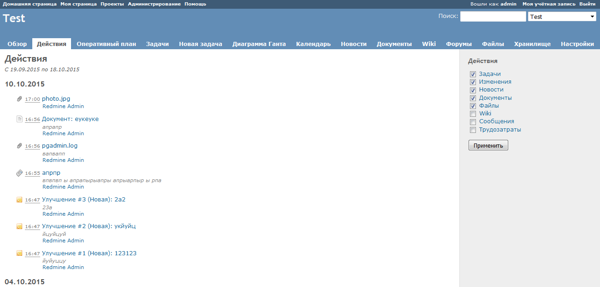

<meta charset="UTF-8" />
<link rel="stylesheet" href="dissertation.css" />

МИНИСТЕРСТВО НАУКИ И ОБРАЗОВАНИЯ

РОССИЙСКОЙ ФЕДЕРАЦИИ

Московский Технический Университет Связи и Информатики

(Федеральное государственное образовательное бюджетное учреждение высшего профессионального образования)

 

На правах рукописи

  

Ночевнов

Евгений Вячеславович

 

Программный каркас информационной системы управления проектами в области информационно-коммуникационных технологий

     

Специальность 05.13.10 «Управление в социальных и экономических системах»

    

Диссертация на соискание учёной степени

кандидата технических наук

     

Москва – 2016

Работа выполнена на кафедре «Математическая Кибернетика и Информационные Технологии» МТУСИ.

| | |
|---|---|
**Научный руководитель** | доктор экономических наук, профессор кафедры МКиИТ
| | Вартанян Аревшад Апетович
**Официальные оппоненты** | доктор ...
| | кандидат ...
**Ведущая организация** | 

# Содержание

Введение

Глава 1. Проблемы разработки каркаса ИСУП

- Принцип построения глоссария для ИСУП
- Обзор существующих решений ИСУП с возможностью доработки
  - 1С: Предприятие
  - Microsoft Project
  - Redmine
  - Tryton
- Общие требования к ИСУП
- Основные проблемы и факторы рисков в управлении ИТ-проектами
- Требования к компетентности специалистов по УП
- Выводы

Глава 2. Моделирование и разработка каркаса ИСУП

- Способ реализации продукта
- Проектирование и разработка средства анализа пользовательских запросов
- Уточнение требований на основе результатов анализа
- Моделирование сценариев работы пользователей в ИСУП
- Техническое задание на каркас ИСУП
- Проектирование и разработка каркаса ИСУП
- Проектирование и разработка ИСУП
- Выводы

Глава 3. Внедрение и развитие каркаса ИСУП

- Тестирование продукта
- Внедрение разработанных решений
- Промышленная эксплуатация
- Применение продукта
- Оценка эффективности
- Рекомендации по использованию
- Перспективы
- Выводы

Заключение

Литература

Приложение 1. Глоссарий в области управления проектами

Приложение 2. Формы отчётов, входных и выходных документов

# Список сокращений

ИСУП - Информационная система управления проектами

КСУП - Корпоративная система управления проектами

МП - Менеджер проектов, руководитель проектов

ПО - Программное обеспечение

УП - Управление проектами

# Введение

**Актуальность диссертационного исследования.**

В настоящее время широко распространён проектный способ организации разработки, внедрения и эксплуатации информационных систем, особенно в динамичных и сложных областях, таких как энергетика, строительство, коммуникации, электроника.
Проектный подход позволяет компании легко видоизменяться и приспосабливаться к новой ситуации, целям, задачам, обеспечивая необходимые условия для инноваций развития творческой активности.
В данной работе под словом «проект» понимается уникальный набор процессов, состоящих из координируемых и контролируемых работ с датами начала и окончания, которые выполняются для достижения целей проекта (по стандарту ГОСТ Р ИСО 21500-2014 «Руководство по проектному менеджменту»). Идея процессного управления заключается в рассмотрении функций во взаимосвязи друг с другом, т. е. в виде процессов.

Проекты разработки и внедрения продуктов и услуг информационных технологий (ИТ) связаны с большой непредсказуемостью процессов управления и результатов работы.
Проблема управления ИТ-проектами осложняется тем, что они зачастую выполняются без строгого следования методикам управления ИТ-проектами, поскольку эти методики недостаточно стандартизированы или недостаточно конкретны.

Распространение проектного подхода организации работы привело к становлению и развитию дисциплины «Управление проектами» (УП). Управление проектами -– дисциплина и методология организации, планирования, руководства, координации трудовых, финансовых и материально-технических ресурсов на протяжении проектного цикла, направленная на эффективное достижение его целей путём применения современных методов, техники и технологии управления для достижения определённых в проекте результатов по составу и объёму работ, стоимости, времени, качеству и удовлетворению участников проекта.

Существует множество методов и инструментов УП, что позволяет менеджеру наилучшим образом организовать процесс и повысить эффективность управления конкретным проектом.
Одним из инструментов современного управления проектами является система управления проектами (СУП), которая определяет цели, границы и содержание работ, организационную структуру проекта, роли участников команды, процедуры управления.
Распространение компьютеризации науки и бизнеса привело к появлению понятия «Информационная система управления проектами» (ИСУП), которая представляет собой организационно-технологический комплекс методических, технических, программных и информационных средств, направленный на поддержку и повышение эффективности процессов планирования и управления проектами, в основе которого лежит комплекс специализированного программного обеспечения.
Информационное обеспечение УП занимает значимое место в инфраструктуре управленческой деятельности.

Эффективное управление проектами с использованием информационной системы позволяет наладить взаимодействие между участниками проектной группы, повысить их качество и скорость работы.
В России УП с использованием современных технологий и инфокоммуникационных инструментов в настоящее время получает широкое распространение, в основном среди крупных компаний, внедряющих большие проекты с участием различных специалистов.
Ряд распространённых проблем ИТ-проектов можно решить с помощью ИСУП.

Развитие и внедрение методов обработки информации и принятия решений повышает качество управления в компаниях, что позволяет в сочетании с оптимальным использованием человеческого потенциала создавать и поддерживать конкурентные преимущества разрабатываемых и внедряемых продуктов в области ИТ.

Внедрение информационных средств управления позволяет уменьшить количество промежуточных звеньев между директором (руководителями) и работниками (исполнителями), уменьшая затраты времени и искажения в передаваемой информации между уровнями управления.

Для успешного внедрения ИСУП требуется обеспечить соответствие между действующими в организации процессами УП и их реализацией в ИСУП. К сожалению, возможностей существующих готовых решений не всегда для этого достаточно, поэтому многие организации пытаются создать свои ИСУП. Этот процесс сопряжён с рядом трудностей, среди которых можно выделить высокие требования к квалификации программистов и проектировщиков (необходимо понимание УП), сложность формализации требований и последующей доработки информационной системы.

Внедрение сложных информационных систем, не адаптированных под действующие нормы и процессы организаций, трудно назвать эффективным, потому что не достигаются цели по автоматизации процессов УП, следовательно, не сокращаются расходы и не повышается производительность труда.

Таким образом, можно обозначить проблему:

1. Существующие ИСУП не обладают достаточной гибкостью для их доработки с целью наиболее полного удовлетворения потребностей российских организаций в информационной поддержке процессов управления проектами.
2. Не существует решения, воплощающего основные структуры данных и функции для информационной поддержки управления проектами, на основе которого можно создать ИСУП, соответствующую бизнес-потребностям российских организаций.

**Степень научной разработанности проблемы**.
Вопросами разработки и внедрения программного обеспечения для управления проектами занимались Полковников А. В., Леффингуэлл Д. и др.
Управлению проектами разработки и внедрения программного обеспечения посвящены исследования Стеллмана Э., Перссона Дж., и др.
В области разработки и исследования моделей и методологий разработки программного обеспечения работали Ройс В., Бек К., Якобсон И., Швабер К., Сазерленд Дж. и др.
Вопросами стандартизации процессов УП занимались многие национальные и международные органы и комитеты, среди которых можно выделить Институт управления проектами (PMI, США), Международную организацию по стандартизации (ISO), Федеральное агентство по техническому регулированию и метрологии (Росстандарт, Россия).

При этом в научных трудах указанных авторов рассматриваются методы и алгоритмы работы отдельных составляющих ИСУП, но они описывают только часть деятельности, не затрагивая такие вопросы, как проектирование архитектуры и данных и всей функциональности ИСУП.

**Объектом** диссертационного исследования являются современные российские компании, выполняющие проекты в области ИТ и телекоммуникаций.

**Предметом** диссертационного исследования является архитектура, структуры данных и функции информационной системы управления проектами в области информационно-коммуникационных технологий, а также методики её проектирования и разработки.

**Цель диссертационного исследования**: разработка программного продукта, содержащего основные структуры данных и алгоритмы для информационной поддержки процессов управления проектами в области информационно-коммуникационных технологий. Для краткости этот продукт в дальнейшем называется каркасом. Разработанный каркас позволит создавать различные ИСУП на его основе с минимальными ограничениями на их пользовательский интерфейс.

При проведении диссертационной работы учитывались потребности российских организаций, выполняющих проекты в области ИТ и телекоммуникаций, стремящихся упорядочить процессы управления проектами с помощью применения комплексного решения -- корпоративной системы управления проектами, включающей в себя нормативно-регламентную базу, ИСУП и подготовленный (обученный) персонал.

**Задачи исследования**:

1. Исследовать понятия предметной области «управление проектами», в т. ч. «проект», «жизненный цикл проекта», «система управления проектами».
2. Формализовать требования к ИСУП.
3. Определить факторы рисков ИТ-проектов.
4. Разработать средство анализа пользовательских запросов для существующей ИСУП с целью определения необходимых доработок, которые позволят уточнить требования к каркасу ИСУП.
5. Составить техническое задание на разработку каркаса ИСУП и смоделировать сценарии использования ИСУП, построенной на основе предлагаемого каркаса.
6. Разработать каркас ИСУП.
7. Создать ИСУП, использующую предлагаемый каркас, в качестве примера использования этого каркаса.
8. Оценить перспективы и эффективность предложенных решений в качестве оптимизации выполнения проектов и организационных издержек.

**Теоретическую и методологическую основу** исследования составляют работы зарубежных и отечественных авторов в области теории общего менеджмента, проектного управления, статистического анализа, проектирования информационных систем, управления требованиями.

**Информационную базу** исследования составили материалы научной периодической печати, учебные пособия для аспирантов, российские государственные, иностранные и международные стандарты по разработке программного обеспечения, управлению проектами и сертификации менеджеров проектов, а также статистика запросов существующей прикладной информационной системы для управления проектами, собранная в реальных условиях использования.

Область диссертационного исследования соответствует требованиям паспорта специальностей ВАК 05.13.10 «Управление в социальных и экономических системах».

В рамках диссертационного исследования получены и **выносятся на защиту следующие научные результаты**:

1. Предложена структура и содержание глоссария понятий в области управления проектами.
2. Формализованы требования к ИСУП.
3. Составлен список основных факторов рисков в управлении ИТ-проектами.
4. Спроектирован и разработан инструмент статистического анализа пользовательских запросов прикладной информационной системы с целью формирования требований доработки ИСУП.
5. Сформированы требования к каркасу ИСУП.
6. Разработан программный каркас для проектирования ИСУП, включающий в себя основные объекты и алгоритмы управления проектами и реализующий основные процессы и функции управления проектами.
7. Создана ИСУП на основе разработанного каркаса.

**Научная новизна** диссертационного исследования заключается в следующем:

1. Представлен способ группировки понятий в области ИКТ и их определения.
2. Определены требования к ИСУП на основе процессного подхода в управлении проектами.
3. Предложена структура хранения данных и архитектура ИСУП, унифицированная для ведения проектов в области ИКТ.
4. Спроектирована структура ИСУП, основанная на предлагаемом каркасе.

**Теоретическая значимость** исследования состоит в углублении и специализации инструментов управления проектами в области информационно-коммуникационных технологий. Полученные результаты могут быть основой для дальнейших исследований в области управления проектами, программами и портфолио, интеграции проектного менеджмента со стратегическим и оперативным.

**Практическая значимость исследования** определяется возможностью использования результатов диссертационного исследования по следующим направлениям:

- сокращение трудозатрат на формирование корпоративного стандарта управления путём использования предложенного глоссария, разработанных программных средств и модели компетентности специалистов по управлению проектами;
- повышение устойчивости проектов к различным рискам благодаря составленному списку факторов рисков ИТ-проектов;
- повышение качества управленческих решений при использовании инструмента статистического анализа пользовательских запросов в прикладных информационных системах;
- экономия времени и средств, затрачиваемых на создание ИСУП в организации, при использовании разработанного каркаса ИСУП.

**Апробация результатов работы**. Основные положения диссертации были представлены на  конференциях различного уровня. Среди них: Молодежная научно-практическая конференция СКФ МТУСИ «ИНФОКОМ-2013» (2013), Международная научно-практическая конференция «Общество, наука и инновации» (2013), Международная научно-техническая конференция «Перспективные технологии в средствах передачи информации» (2015). Также результаты диссертационной работы были использованы при написании методического пособия для магистрантов МТУСИ по дисциплине «Распределённые информационные системы».

**Внедрение результатов диссертационного исследования**. Материалы исследования использованы при разработке инструмента оценки работы сотрудников в прикладной системе Redmine в организации «CityAds» (Smart Leads Inc.). На основе предложенного каркаса ИСУП были разработаны и внедрены ИСУП в компаниях ООО «Одмин и ко» и ООО «Унивеб».

Каков эффект от внедрения средства анализа в CityAds?

**Публикации**. По материалам и основным результатам  диссертации опубликовано 4 печатные работы, в т. ч. 1 статья.

**Структура диссертации**.
Материал диссертации сегментирован с выделением списка сокращений, введения, 3 глав, заключения с общими выводами по работе, списка использованных источников из *NN* наименований и 2 приложений. Содержание работы изложено на *NN* страницах компьютерного текста и включает *NN* таблиц и *NN* рисунков.

Содержание диссертации подразделяется следующим образом:

Во введении обоснована актуальность темы диссертационного исследования, сформулированы его цели и задачи, объект и предмет исследования, определена теоретическая, методическая и информационная база, дана характеристика научной новизны и практическое значение полученных результатов исследования.

**В первой главе**:

- рассмотрены существующие глоссарии понятий в области управления проектами;
- предложен принцип построения глоссария (определения приведены в Приложении 1) на основе пирамиды бизнеса и функциям управленческого цикла (планирование, организация, мотивация и контроль), включающий в себя выделение общих понятий и связанных с продуктами проекта, материально-технической базой (производством) и персоналом (потребителями и участниками проекта в целом);
- проведено исследование ближайшего похожего по функциональности и предназначению программного обеспечения для управления проектами, которое можно расширить или доработать с целью более полной информационной поддержки управления ИТ-проектами: Atlassian JIRA, Microsoft Project, Redmine, Tryton. Рассмотрены их особенности, функции и недостатки;
- исследованы темы автоматизации процессов управления проектами, создания системы управления проектами и корпоративного стандарта управления, существующие национальные и международные станадарты, относящиеся к разработке ПО для УП. Сформулированы общие требования для информационной системы управления проектами в области ИКТ;
- исследованы факторы рисков ИТ-проектов, которые могут значительно осложнить ведение проекта и даже привести его к провалу. Факторы рисков разделены на группы внешних и внутренних, среди внутренних выделены организационные, связанные с продуктами проекта, психологические и производственные. Основой этой классификации также является пирамида бизнеса. Предложены идеи по доработке программного обеспечения для управления проектами с целью снижения ряда факторов;
- требования к компетентности специалистов по УП дополнены навыком постановки требований к ИСУП.

**Во второй главе** определены способы, принципы построения, используемые инструменты и технологии реализации трёх программных продуктов: инструмент регистрации и анализа пользовательских запросов в существующей прикладной системе на примере Redmine, каркас ИСУП и созданная с его помощью ИСУП.

Статистический анализ был проведён на реальных данных с целью уточнения требований к функциональности и производительности ИСУП. Также было проведено моделирование работы и составлено техническое задание на ИСУП.

**В третьей главе** рассмотрены вопросы тестирования полученных результатов в ходе диссертационной работы, их внедрения на реальных предприятиях, описаны особенности внедрения каркаса ИСУП и требования к переводу результатов к промышленной эксплуатации.

Также приведены области возможного применения, оценка эффективности предлагаемых решений, полученная на основе теоретических и практических подходов, а также рекомендации по использования результатов диссертационной работы и перспективы их дальнейшего использования и развития.

В заключении излагаются основные констатации, выводы и рекомендации, вытекающие из результатов диссертационного исследования, проведенного автором.

В списке использованных источников перечислены информационные источники, которые непосредственно были использованных при проведении исследования, а также указаны наименования и выходные данные публикаций, использованных при выполнении диссертационного  исследования.

В **приложении №1** приведён глоссарий в области проектного управления, разработанный в рамках диссертационной работы. **Приложение №2** включает в себя формы отчётов, входных и выходных документов.

**Список публикаций:**

1. *Ночевнов Е. В., Вартанян А. А*. Создание нового принципа построения глоссария для инструмента управления инфокоммуникационными проектами в экономике // Труды Северо-Кавказского филиала Московского технического университета связи и информатики. Молодежная науч.-практ. конф. СКФ МТУСИ «ИНФОКОМ-2013», Ростов-на-Дону, 22-25 апреля 2013 г. Ростов-на-Дону: СКФ МТУСИ, 2013. С. 468-470.
2. *Ночевнов Е. В*. Факторы рисков ИТ-проектов // Сборник статей Междунар. науч.-практ. конф. «Общество, наука и инновации», Уфа, 29-30 ноября 2013 г.: в 4 ч. — Ч. 1. — Уфа: РИЦ БашГУ, 2013. — С. 173-176.
3. *Ночевнов Е. В*. Разработка инструмента для анализа запросов пользователей в прикладных системах (на примере Redmine) / Е. В. Ночевнов // Вестник Астраханского государственного технического университета. Серия: Управление, вычислительная техника и информатика, 2015. — № 4. — С. 66-71.
4. *Вартанян А. А., Ночевнов Е. В*. Инструмент статистического анализа запросов пользователей прикладной системы для определения её доработок (на примере системы Redmine).

3. http://vestnik.astu.org/Content/UserImages/file/inform_2015_4/08.pdf

# Глава 1. Проблемы разработки каркаса ИСУП

## Принцип построения глоссария для ИСУП

При ведении проектов в компании обычно действует соглашение по используемой терминологии. Использование единой терминологии значительно улучшает понимание в коллективе. В то же время, различные толкования зачастую помогают лучше понять смысл некоторого понятия, поскольку эти толкования рассматривают понятие с разных и, возможно, с нескольких сторон. То или иное определение может побудить к улучшению понимания сути предмета и к развитию других понятий и систем понятий.

Проектное внедрение информационных систем, как правило, проводится по государственным и международным стандартам. Назначение стандартов в контексте УП [[1]](#a-cfin-standards):

- чёткое формирование целей и требований;
- определение показателей оценки качества;
- повышение качества выполнения процессов;
- определение полномочий и ролей участников стандартизируемых процессов;
- передача успешных приёмов и подходов (передача передового опыта).

В международном стандарте ISO 21500:2012 «Guidance on project management», принятом в России под именем ГОСТ Р ИСО 21500-2014 «Руководство по проектному менеджменту», «проект» определён как уникальный набор процессов, состоящих «из координируемых и контролируемых работ с датами начала и окончания, которые выполняются для достижения целей проекта» [[2]](#a-gost-21500). В этом определении подчёркивается уникальность набора процессов и ничего нет утверждений об уникальности результатов проектов, потому что этот стандарт ISO имеет отношение к общему проектному управлению, а определение уникальности результатов -- к отраслевым методикам.

В стандарте ISO 10006:2003 «Системы менеджмента качества. Руководство по менеджменту качества при проектировании», принятом в России под кодовым именем ГОСТ Р ИСО 10006–2005 [[3]](#a-gost-10006), рассказывается об основных принципах и практических методиках, которые влияют на качество разработки и реализации проектов. Стандарт разделяет понятия на общие термины (такие как «процесс» и «проект») и по разделам: «системы менеджмента качества при проектировании», «ответственность руководства», «управление ресурсами», «изготовление продукции», «измерения, анализ и улучшение».

Кроме того, есть американский стандарт PMBOK «Руководство к своду знаний по управлению проектами» [[4]](#a-pmbok). Он широко применяется во всём мире, в том числе в России, и был создан в Институте управления проектами (PMI). В первой части этого стандарта содержатся основные сведения об УП, определены основные термины и общий обзор его глав. Вторая часть содержит описание групп управленческих процессов, третья часть описывает области знаний по УП. Термины никак не сгруппированы и даны в алфавитном порядке.

PMI также подготовил «PMI Lexicon of Project Management Terms» [[5]](#a-pmi-lexicon) («Словарь терминов управления проектами», перевод автора). Понятия никак не сгруппированы и даны в алфавитном порядке.

Представляет интерес также ГОСТ Р 54869–2011 «Проектный менеджмент. Требования к управлению проектом» [[6]](#a-gost-54869). Он содержит только основные понятия УП и описание требований к процессам управления.

В рассмотренных источниках приводятся или только некоторые понятия из области управления проектами, или отсутствует их классификация. Таким образом, стоит вопрос создания более полной классификации понятий управления проектами. Для этого в данной работе предлагается использовать пирамиду бизнеса [[7]](#a-vartanyan-is) и управленческий цикл.

Матрица бизнеса включает в себя элементы, характеризующие состояние трёх составляющих продаж (работники, производство, продукт) и трёх факторов продаж: бренд (репутация, титулы и регалии), опыт (история взаимоотношений с потребителями, с предприятиями, с продуктами и услугами) и логическая рациональная аргументация (свойства, функциональность продукта, навыки и умения работников, оборудование, помещение для производства). Матрица бизнеса, элементы которой получаются на пересечении факторов и составляющих продаж, позволяет оценить состояние предприятия и его составляющих в любой момент времени в произвольной точке пространства, наметить план изменений в интересах его потребителей.

Пирамида бизнеса включает в себя видение руководителя (или основных акционеров), миссию предприятия, матрицу бизнеса и маркетинговую деятельность компании. В вершине пирамиды можно расположить миссию компании, а в основании – матрицу бизнеса.

Управленческий цикл – это логическая последовательность действий менеджера, обобщённых в отдельные фазы или группы, направленная на решение управленческой задачи. Управленческий цикл включает в себя планирование, организацию, мотивацию и контроль.

Для построения классификации предлагается распределить понятия по четырём разделам: «общие понятия», «продукт», «производство» и «люди». Понятия в разделе «производство» можно дополнительно разделить по группам управленческого цикла: планирование, организация и контроль. В разделе «люди» – «лицо или группа лиц» и по управленческому циклу: планирование, организация, мотивация и контроль. Общие понятия предлагается разделить на «основополагающие понятия», «области управления проектами», «свойства и составляющие проекта» и «организация управления проектами».

Общая схема классификации и некоторые термины в качестве примера представлены в <nobr>таблице 1</nobr>.

Таблица 1. Пример классификации понятий УП по пирамиде бизнеса и управленческому циклу

Раздел и подраздел	| Примеры
---------------------------|-----------
Общие понятия	 | 
- Основополагающие понятия	| Проект, программа, портфель
- Области управления проектами	| Качество, маркетинг, риски
- Свойства и составляющие проекта	| Идея проекта, продолжительность проекта, финансовый результат
- Организация управления проектами	| Жизненный цикл проекта, фазы
Продукт	| Программное обеспечение
Производство	| 
- Планирование |	Дерево целей, веха, стратегическое управление
- Организация	| Проектная зрелость, ИСУП
- Контроль	| Мониторинг проекта, запрос на изменения
Люди	| 
- Лицо или группа лиц	| Руководитель проекта, потребитель, спонсор, клиент, команда проекта
- Планирование	| Кадровое планирование
- Организация	| Офис программы
- Мотивация	| Групповая мотивация
- Контроль |	Инструктаж

## Обзор существующих решений ИСУП с возможностью доработки

Для обзора существующих решений были выбраны информационные системы, в которых возможно выполнять наибольшее количество процессов управления проектами и возможности которых можно расширить с помощью программирования или использования готовых модулей, включая создание новых типов объектов системы (например, запросы на изменения). Это ближайшие похожие по назначению продукты, но не полные аналоги каркаса ИСУП.

### 1С: Предприятие

### Microsoft Project

Microsoft Project -- программное обеспечение для управления проектами. Существует несколько версий Microsoft Project (далее: MSP). В этом разделе рассматривается Microsoft Project Professional 2013. Менеджеры проектов используют MSP для календарного планирования работ, составления отчётов и др. Для организации коллективной работы на базе MSP предлагается использовать версии Online или Server.

Отображаемая информация зависит от выбранного представления в панели инструментов:

- список задач и диаграмма Ганта (рис. 1);
- сетевой график (рис. 2);
- представление списка задач на календаре;
- ресурсный план (рис. 3);
- лист ресурсов и другие.

Рис. 1. Список задач и диаграмма Ганта в Microsoft Project

Рис. 2. Сетевой график в Microsoft Project

Рис. 3. Просмотр используемых ресурсов в Microsoft Project

Перемещать задачи, изменять их длительность и связи между ними можно как в таблице, так и на диаграмме.

Поддерживаемые группы процессов УП:

- интеграция (частично);
- содержание (частично);
- ресурсы (частично);
- сроки;
- стоимость;
- качество;
- закупки (частично).

Функции MSP, помимо поддержки процессов УП:

- вставка подпроектов;
- хранение базовых и актуальных планов;
- добавление полей к задачам, ресурсам и проектам;
- настраиваемый генератор отчётов;
- поддержка многоязычности интерфейса;
- интеграция с программами и сервисами Microsoft, в т. ч. SharePoint, Exchange, Outlook, Visio;
- расширение возможностей MSP с помощью подключаемых модулей.

Среди недостатков по поддержке процессов УП в MSP можно выделить:

- устав, описание содержания проекта, контракты и другие документы предполагается хранить в отдельных файлах;
- нет поддержки процессов управления заинтересованными сторонами;
- нет функций по работе с запросами на изменения;
- нет встроенных средств для управления коммуникациями (для этого можно использовать SharePoint и Skype);
- нет управления версиями (выпусками), требованиями, организационной структурой проекта (с определением ролей и полномочий участников проекта), рисками (риски есть в онлайн-версиях).

Среди недостатков по функциям в MSP можно выделить:

- нет статусов задач (для хранения статусов можно добавить поле к задачам);
- MSP не удобен для исполнителей из-за сложного интерфейса (возможно использование стороннего ПО для исполнителей проектов, которое будет получать обновление планов из файлов MSP);
- возможности поиска ограничены выбранным представлением; так, поиск недоступен в представлении «Сетевой график»;
- в MSP не реализованы:
  - ограничение доступных для редактирования полей задачи в зависимости от роли пользователя;
  - управление приложенными к задачам файлами (отчасти эту роль выполняет SharePoint);
  - интеграция с системами хранения версий (репозиториями).

Есть альтернативное мнение о том, что можно управлять рисками в MSP [[8]](#a-project-risks). Для этого предлагается вносить риски в список задач, хотя это различные понятия.

### Redmine

Redmine -- это клиент-серверное программное обеспечение с открытым исходным кодом, написанное для Ruby с использованием фреймворка Rails, предназначенное для управления проектами и организации коллективной работы и распространяемое бесплатно по лицензии GPL [[9]](#a-redmine). Открытый код Redmine позволяет дорабатывать и расширять его возможности, в т. ч. с помощью подключаемых модулей (плагинов). В этом разделе рассматривается версия Redmine 3.1.1. Проекты могут быть общедоступными (такие проекты могут видеть все пользователи) или с ограниченным доступом (такие проекты могут видеть только участники проекта). Права пользователя в проекте основаны на ролях, которые имеет пользователь в данном проекте. Роль – это совокупность прав (полномочий). Пользователь может иметь несколько ролей в проекте, тогда его права в проекте определяются как объединение (сумма) всех разрешённых прав в данных ролях. Чтобы дать доступ к задаче, надо дать доступ ко всему проекту. Аналогично с файлами и репозиториями.

Способ определения последовательности смены статусов задач (поток работ, workflow) выглядит переусложнённым (матрица «текущий статус»-«новый статус», галочка на пересечении строки и столбца обозначает разрешённый переход, см. рис. 1), при этом нет возможности ввести такие правила, как:

- при установке статуса «Отклонена» надо ввести комментарий;
- при установке статуса «Тестируется» надо выбрать тестировщика.

Можно расширять возможности Redmine с помощью плагинов (plugins).

Рис. 1. Ограничение разрешённых статусов задач

Поддерживаемые группы процессов УП:

- интеграция (частично);
- заинтересованные стороны (частично);
- содержание (частично);
- ресурсы;
- сроки (частично);
- качество;
- закупки;
- коммуникации (частично).

Планы по качеству и закупкам можно хранить в виде файлов или wiki-документации в проектах, а мероприятия по обеспечению качества и закупкам -- как задачи проектов.

Функции Redmine, помимо поддержки процессов УП:

1. По управлению проектами:
  - ведение множества проектов и подпроектов;
  - с помощью функции копирования проектов можно создавать проекты на основе заготовленных шаблонов;
  - ограничение доступных в проекте модулей, типов задач, дополнительных полей к задачам;
  - возможность ограничить доступ к проекту только его участникам;
2. По управлению задачами:
  - просмотр списка задач на календаре работ;
  - фильтрация задач;
  - классификация задач по типам (трекерам), статусам, приоритетам, исполнителям, категориям;
  - с помощью функции копирования задач можно создавать задачи на основе заготовленных шаблонов;
  - ограничение доступных для редактирования полей задачи в зависимости от роли пользователя;
3. По учёту времени выполнения работ:
  - указание типа выполняемой работы (проектирование, разработка и т. п.);
  - в различных проектах могут быть доступны различные типы выполняемой работы;
  - просмотр фактических трудозатрат с фильтрацией по проектам, задачам, исполнителям, типам выполняемой работы, дате и времени (рис. 2);
4. По распространению информации о ходе выполнения проектов:
  - новости;
  - wiki-страницы с возможностью прикрепления файлов;
  - форумы (темы обсуждений с комментариями);
  - просмотр списка действий по проекту (рис. 3);
  - подписка на обновления по проектам и задачам (используется электронная почта и форматы RSS, Atom);
  - создание задач на основе сообщений, полученных по электронной почте;
5. По организации документооборота:
  - хранение и управление файлами (подразделяются на документацию и собственно файлы);
  - прикрепление файлов к задачам и проектам;
6. По интеграции с другим программным обеспечением:
  - просмотр содержимого репозитория, связанного с проектом;
  - интеграция с другим ПО возможна при доработке и/или создании плагина Redmine;
7. По управлению продуктами проекта:
  - управление версиями (выпусками);
8. По управлению пользователями, ролями и полномочиями:
  - просмотр и редактирование пользователем информации о себе;
  - просмотр действий пользователя с фильтрацией по типам объектов Redmine;
  - управление группами пользователей (в т. ч. назначение задач на группу);
  - управление ролями;
  - отчёт по правам доступа показывает в табличном виде наличие или отсутствие полномочий по всем ролям;
9. Прочие:
  - настройка персонализированной страницы позволяет расположить на экране блоки «мои задачи», «созданные задачи», «отслеживаемые задачи», «последние новости», «календарь», «документы», «трудозатраты»;
  - добавление полей к задачам в зависимости от типа (трекера) задачи, скрытие стандартных полей;
  - добавление полей к другим объектам Redmine (трудозатраты, проекты, версии и др.);
  - управление списками статусов, приоритетов задач, категорий документов, типам выполняемых работ;
  - поиск по содержимому объектов Redmine;
  - поддержка многоязычности интерфейса;
  - выбор темы оформления из установленных в системе Redmine;
  - возможность ограничить доступ к Redmine неавторизованным пользователям;
  - авторизация по имени и паролю, в т. ч. с помощью LDAP;
  - ограничение разрешённых статусов задачи в зависимости от текущего статуса и роли пользователя (упрощённая модель потока работ);
  - расширение возможностей с помощью плагинов.

Рис. 2. Просмотр трудозатрат в Redmine

Рис. 3. Просмотр действий по проекту в Redmine

Среди недостатков по поддержке процессов УП в Redmine можно выделить:

- управление интеграцией реализовано частично, это назначение руководителя проекта и членов команды проекта с определением их ролей, представление информации о выполнении работ в виде отчётов, закрытие проекта (перевод проекта в режим «только для чтения»);
- отсутствует управление запросами на изменения;
- нет реестра заинтересованных лиц проекта;
- нет аналитических и прогнозных функций для определения срока и содержания проекта по его завершении;
- скудные функции планирования, в частности нет вех;
- нет оптимизации расписания и выравнивания ресурсов;
- нет поддержки процессов управления стоимостью и рисками;
- к поддержке управления коммуникациями можно отнести средства распространения информации, в т. ч. подписку на обновления по проектам и задачам, в то же время в Redmine нет плана коммуникаций.

Среди недостатков по функциям в Redmine можно выделить:

- отсутствует единый интерфейс управления файлами: фактически, все файлы, прикреплённые к объектам Redmine, видны только на страницах тех объектов, к которым они прикреплены, и на странице со списком действий по проекту. Т. о., файлы могут располагаться в нескольких местах, что затрудняет их поиск и приводит к дублированию информации;
- отсутствует версионирование файлов;
- два места хранения документации выглядят избыточно: пользователь может загрузить файл на странице «Документы» проекта и прикрепить файл к wiki-странице, и для Redmine это будут разные файлы;
- нет подсистемы, агрегирующей информацию по нескольким проектам и различным условиям выборки, включая этап и процент выполнения проекта, и показывающей отчёт по проектам в наглядном виде;
- проектные и глобальные полномочия не разделены, нет возможности дать роль или полномочие вне проекта. Это проявляется в том, что для назначения пользователю полномочия «создавать проекты» нужно, чтобы пользователь имел роль с этим полномочием в любом проекте;
- нет графического представления потока работ;
- список требований можно хранить в файлах проекта или wiki-документации; соответственно, необходима ручная работа, чтобы определить, насколько результаты проекта удовлетворяют его требованиям;
- чтобы запросить у пользователя выполнение определённых действий при изменении статуса задачи, требуется доработка Redmine (например, при смене статуса на «Тестируется» назначить тестировщика ответственным за задачу);
- не предусмотрено установление в проекте времени и степени вовлечения членов команды проекта;
- нет поддержки типов зависимостей между задачами "начало после начала", "окончание после начала", "окончание после окончания";
- допустим, для выполнения текущей задачи необходимо дождаться завершения предыдущей. В Redmine не предусмотрена рассылка уведомлений после выполнения (или закрытия) предыдущей задачи о том, что можно начать выполнять текущую задачу.

Центральное положение в Redmine занимают пользователи и задачи: многие его функции напрямую связаны с ними. В то же время, управление множеством проектов в Redmine недостаточно проработано: отсутствуют аналитические средства и агрегирующие информацию по множеству проектов.

Поскольку Redmine распространяется с открытым исходным кодом, то можно исследовать его архитектуру. Файловая структура папки с кодом Redmine соответствует рекомендуемой в Rails, это разделение кода по модели MVC (Model, View, Controller) [[10]](#a-what-is-rails) на модели, виды (представления), контроллеры, а также хэлперы (вспомогательные модули с алгоритмами обработки и вывода данных). Для подготовки базы данных во время установки и обновления прикладной системы Redmine и отката проведённых в базе данных операций используются т. н. миграции [[10]](#a-what-is-rails). Миграции позволяют обновлять схему используемой базы данных при исполнении команды, которая применит к ней все новые для неё миграции:

    rake db:migrate

Интеграция с системами хранения версий (с репозиториями) сделана с помощью класса Repository, содержащего обобщённые алгоритмы работы с репозиториями, и его подклассов, уточняющих свойства и алгоритмы работы, по одному подклассу на каждую поддерживаемую систему хранения версий.

Подключаемые модули находятся в папке plugins в Redmine. Плагин рассматривается как подпроект Redmine и его файловая структура также соответствует рекомендуемой в Rails; отсутствуют папки bin, log, public, script, vendor (они относятся к работе прикладной системы в целом).

Не предусмотрено встраивание информационной системы Redmine в код другой системы. Redmine является самостоятельным приложением.

### Tryton

## Исследование проблемы разработки ИСУП

### Исследование и постановка организационных требований к ИСУП

Под словами «система управления проектами» (СУП) часто понимают ИСУП. ИСУП включает в себя:

- цели, границы и содержание работ;
- согласованный с участниками и утверждённый заказчиком план выполнения работ по проекту, включая календарный план, бюджет, план реагирования на риски, другие планы (при необходимости);
- другую необходимую для управления проектами информацию.

К основным проектным документам относятся:

- устав проекта (описывает цель, результаты проекта и др.);
- сводный план и контракты (описывают ответственность исполнителей за конкретные задачи);
- отчёты;
- журналы запросов на изменения, проблем и поручений.

Корпоративная система управления проектами (КСУП) -- комплекс организационных, методических, технических, программных и информационных средств, направленных на поддержку и повышение эффективности процессов планирования и управления проектами в компании [[11, стр. 394]](#a-mazur). КСУП включает в себя нормативно-регламентную базу (НРБ), ИСУП и подготовленный (обученный) персонал.

НРБ -- документ, определяющий объекты управления (организация, подразделение, проект и т. п.), процессы, порядок и сроки выполнения управленческих задач, распределение обязанностей сежду участниками процессов, состав, формы и содержание выпускаемых документов и другие обязательные для исполнения требования. За основу НРБ могут быть взяты действующие национальные или международные стандарты по УП. Типовая структура НРБ [[11, стр. 385]](#a-mazur):

- общие положения и терминология;
- классификация и описание объектов управления (проектов), в т. ч. их жизненный цикл;
- методические и регламентные документы по процессам управления проектами;
- детальные инструкции по использованию процедур и функций управления;
- описание организационных структур проектов и ролей;
- формы и состав основных документов по управлению проектами.

НРБ включает в себя:

- определение ответственности МП и его полномочий;
- определение организационной структурой проекта, ответственности, полномочий, ролей и системы мотивации его основных участников;
- согласованные управленческие процедуры, включая планирование, организацию исполнения, управление рисками и запросами на изменения, распределение информации и отчётности, принятие решений и утверждение результатов.

Разработка и внедрение КСУП представляет собой комплекс последовательных мероприятий, требующий тщательной проработки с целью формирования краткосрочных и долгосрочных эффектов от её внедрения.

Основными задачами ИСУП в настоящее время являются:

1. Повышение эффективности УП за счёт разработки и оптимизации моделей проектов, в т. ч. уменьшение или устранение ненадёжности и несвоевременности передачи информации о выполнении проектов.
2. Обеспечение принятия управленческих решений с помощью аналитических и прогнозных расчётов, моделирования ситуаций в ходе реализации проектов, в <nobr>т. ч.</nobr> срабатывание рисков, и предупреждения возможных последствий для проектов.
3. Обеспечение единого информационного пространства, коммуникаций, сбора, обработки и анализа данных о ходе выполнения работ по проекту. Информационная поддержка корпоративной системы управления проектами.

Информационные системы управления проектами помогают [[12]](#a-liberzon-ksup):

- обосновать целесообразность инвестиций;
- разработать оптимальную схему финансирования работ, поставок материалов и оборудования;
- составить план работ, включающий сроки исполнения работ, потребление ресурсов, необходимые затраты и их распределение во времени;
- проанализировать проектные риски;
- эффективно контролировать исполнение составленного плана;
- анализировать отклонения фактического хода выполнения работ от запланированного и своевременно и обоснованно корректировать плановые показатели;
- моделировать управленческие воздействия на моделях проектов и принимать обоснованные управленческие решения;
- вести архивы проектов, в которых анализируется опыт их реализации;
- контролировать выполнения контрактных обязательств и многое другое.

**См. [[13]](#a-liberzon-principles)**.

Офис проекта -- специфическая инфраструктура, обеспечивающая эффективную реализацию проекта в рамках системы ИТ и отработанных стандартов осуществления деятельности и коммуникаций; это среда (или место), где члены команды проекта могут осуществлять процессы управления им, проводить совещания, вести переговоры с партнёрами, хранить проектную документацию [[11, стр. 246]](#a-mazur). Проектный офис (офис управления проектами) -- подразделение, отвечающее за методологическое и организационное обеспечение проектного управления в организации, администрирование и управление проектами [[14, стр. 75]](#a-bogdanov). Офис проекта занимается одним проектом, офис управления проектами -- множеством проектов.

ИСУП с т. з. работников организаций является виртуальным офисом управления проектами, т. е. программно-телекоммуникационной средой, поддерживающей работу и коммуникации по единым стандартам. Основа виртуального офиса -- распределённая компьютерная система на базе телекоммуникационных сетей, позволяющая пользоваться едиными программными средствами, базами данных и знаний, вести единый учёт, контроль, мониторинг работ по проекту, проводить конференции и совещания в реальном режиме времени [[11, стр. 248]](#a-mazur).

Основные требования к организации офиса проекта [[11, стр. 248]](#a-mazur):

- наличие помещения для офиса проекта;
- единые внутрифирменные стандарты подготовки и сопровождения проектов (проекта);
- наличие ПО для управления проектом;
- база данных и шаблонов типовых решений по проектам;
- компьютерная сеть с доступом в интернет;
- виртуальный офис на базе ИТ и компьютерных сетей.

Согласно федеральному закону РФ (ФЗ) от 27 июля 2006 г. № 152-ФЗ «О персональных данных» (с изменениями и дополнениями по состоянию на 01.11.2015), к персональным данным относится «любая информация, относящаяся к прямо или косвенно определенному или определяемому физическому лицу (субъекту персональных данных)». К персональным данным, необходимым в ИСУП, относятся фамилия, имя и (если предусмотрено в программе) отчество. Другие персональные данные, такие как номер и серия паспорта, могут быть добавлены в ИСУП по усмотрению организации -- заказчика ИСУП.

Оператор персональных данных, согласно ФЗ «О персональных данных», -- это «государственный орган, муниципальный орган, юридическое или физическое лицо, самостоятельно или совместно с другими лицами организующие и (или) осуществляющие обработку персональных данных, а также определяющие цели обработки персональных данных, состав персональных данных, подлежащих обработке, действия (операции), совершаемые с персональными данными». В данном случае оператором персональных данных может быть организация, осуществляющая обработку персональных данных в ИСУП -- сбор, запись, систематизацию, накопление, хранение и т. п. Оператор персональных данных должен получить от граждан согласие на обработку персональных данных, чтобы внести их персональные данные в ИСУП.

Содержание и объем обрабатываемых персональных данных должны соответствовать заявленным целям обработки (ст. 5, ч. 5 ФЗ «О персональных данных»). Обработка персональных данных в ИСУП должна осуществляться в статистических или иных исследовательских целях при условии обязательного обезличивания персональных данных (ст. 6, ч. 1, п. 9 ФЗ «О персональных данных»).

Запрещается принятие на основании исключительно автоматизированной обработки персональных данных решений, порождающих юридические последствия в отношении субъекта персональных данных или иным образом затрагивающих его права и законные интересы, исключая случаи, когда подтверждено в письменной форме согласие субъекта персональных данных на принятие решений, порождающих юридические последствия в отношении этого субъекта, на основании исключительно автоматизированной обработки персональных данных, или в случаях, предусмотренных федеральными законами, устанавливающими также меры по обеспечению соблюдения прав и законных интересов субъекта персональных данных (ст. 16, ч. 1-2 ФЗ «О персональных данных»).

Базы данных, хранящие персональные данные граждан РФ, и средства их обработки должны находиться на территории Российской Федерации, за исключением случаев, указанных в пунктах 2, 3, 4, 8 части 1 статьи 6 (ст. 18, ч. 5 ФЗ «О персональных данных»).

Оператор при обработке персональных данных обязан принимать необходимые правовые, организационные и технические меры или обеспечивать их принятие для защиты персональных данных от неправомерного или случайного доступа к ним, уничтожения, изменения, блокирования, копирования, предоставления, распространения персональных данных, а также от иных неправомерных действий в отношении персональных данных (ст. 19, ч. 1 ФЗ «О персональных данных»).

В «Требованиях к защите персональных данных при их обработке в информационных системах персональных данных» (утв. постановлением Правительства РФ от 1 ноября 2012 г. N 1119) определены 3 типа угроз безопасности персональных данных и 4 уровня защищенности персональных данных. Для обеспечения защищенности персональных данных (для всех уровней) при их обработке в информационных системах необходимо использование средств защиты информации, прошедших процедуру оценки соответствия требованиям законодательства Российской Федерации в области обеспечения безопасности информации, в случае, когда применение таких средств необходимо для нейтрализации актуальных угроз (ч. 13, п. «г»).

Согласно федеральному закону от 27 июля 2006 г. N 149-ФЗ «Об информации, информационных технологиях и о защите информации» (с изменениями и дополнениями по состоянию на 01.11.2015), технические средства информационных систем, используемых государственными органами, органами местного самоуправления, государственными и муниципальными унитарными предприятиями или государственными и муниципальными учреждениями, должны размещаться на территории Российской Федерации (ст. 13, ч. 2.1).

Документооборот: хранилище документов с поиском, разграничением прав доступа, контролем распространения и использования, с присоединением к задачам, проектам, комментариям.

Система электронного документооборота должна обеспечивать [[11, стр. 254-255]](#a-mazur):

- централизованную регистрацию всех документов в системе;
- хранение документов в электронном виде в различных форматах;
- хранение централизованного каталога документов проекта, обеспечивающего возможность их поиска (по ключевым атрибутам, полнотекстовый и т. п.);
- хранение полной истории работы с документами (кто, когда, как работал с ними) и версий документов;
- надёжную систему защиты документов, регламентацию доступа к ним.

Компоненты ПО для документооборота [[11, стр. 255]](#a-mazur):

- система управления хранением документов (управление централизованным архивом документов);
- система управления документооборотом (администрирование документооборота, управление маршрутизацией и движением документов, координация документопотоков, контроль над передвижением документов и их своевременной обработкой и др.);
- набор стандартных бизнес-приложений, используемых для подготовки документов -- текстовых процессоров, электронных таблиц и др., а также специализированных функциональных приложений;
- система экспорта и импорта документов.

Организационная безопасность -- состояние фирмы, при котором вероятность появления угрозы для неё минимальна и она может существовать, нормально функционировать и прогрессивно развиваться в условиях конфликтов, неопределённости и риска складывающейся внешней обстановки [[15, стр. 579]](#a-vesnin). Основные цели обеспечения организационной безопасности [Там же, стр. 579-580]:

- предотвращение ущерба деятельности со стороны внешних и внутренних угроз;
- сохранение организации, поддержание её устойчивого и равновесного состояния, целостности составляющих её элементов;
- недопущение прямых открытых столкновений с соперниками;
- защита от природных явлений, способных нанести ущерб;
- выход из состояния конфликта с другой организацией с наименьшим ущербом или минимальными негативными последствиями;
- искусственное создание благоприятных условий внешней среды и пр.

Применительно к ИСУП основной целью обеспечения организационной безопасности является предотвращение ущерба деятельности организации со стороны внешних и внутренних угроз. 

Обеспечение организационной безопасности является комплексной задачей и включает в себя физическую, экономическую, информационную безопасность. Физическая безопасность достигается с помощью технических средства защиты рабочих помещений (предприятия, цеха́, офисы). Для обеспечения экономической безопасности проводится мониторинг надёжности работников, имеющих доступ к тайной информации и могущих быть источниками её разглашения либо иных неправомерных действий, анализируются контракты и контрагенты на предмет их надёжности, предотвращаются попытки захвата и банкротства организации и другое [[15, стр. 591-594]](#a-vesnin).

Требования к обеспечению информационной безопасности в ИСУП включают в себя:

- журналирование событий (записывать события в постоянную память);
- защиту от атак (SQL-инъекция, удалённое исполнение кода, XSS и других);
- обеспечение сохранности полученных от пользователей данных во всех процессах;
- обеспечение конфиденциальности коммерческой информации и персональных данных;
- контроль распространения документов в информационной системе;
- ограничение прав доступа пользователей к различным объектам ИСУП;
- предотвращение искажений, подделки, несанкционированных действий в отношении хранящейся в ИСУП информации.

Обеспечение организационной безопасности регулируется рядом законов, в т. ч. федеральными законами «О коммерческой тайне», «О персональных данных», «Об информации, информационных технологиях и о защите информации».

### Исследование и постановка требований к поддержке процессов управления проектами в ИСУП

Управленческая деятельность считается эффективной, если она полностью или частично решает поставленную задачу, воплощается в ожидаемом результате (внешняя эффективность, выгодность), причём обеспечивает его достижение за счёт оптимального использования имеющихся ресурсов (внутренняя эффективность, экономичность) [[15, стр. 30]](#a-vesnin).

Основные характеристики проекта: время, затраты, ресурсы, содержание и качество работ.

Критерии успеха проекта [[11, стр. 45]](#a-mazur):

1. Выполнение в срок, в рамках бюджета, в соответствии со спецификацией.
2. Достижение стратегических целей бизнеса, учитывая интересы основных участников проекта.

Результаты (продукты) проекта — это итог выполнения взаимосвязанных процессов в соответствии с планом проекта [[2]](#a-gost-21500); конечная продукция, полезный эффект проекта [[11, стр. 68]](#a-mazur). Определение цели проекта дополнительно уточняется за счет описания получаемых результатов [[2]](#a-gost-21500). Степень успешности проекта определяется по характеристикам проекта и продукта:

1. Насколько проект соответствует по своим затратным, временны́м характеристикам запланированному уровню.
2. Насколько продукт соответствует по своим затратным, доходным, инновационным, качественным, социальным, экологическим характеристикам запланированному уровню.

Проект всегда направлен на результат, на достижение определённых целей, на определённую предметную область. Команда проекта работает под руководством МП. В проектной документации должны быть зафиксированы цели и ожидаемые результаты проекта.

Для определения целей организации и проекта можно использовать логико-структурный подход (ЛСП), состоящий из двух фаз: аналитическая и планирование [[16]](#a-lfa). Логическая согласованность этих целей будет проработана при выполнении аналитической фазы, а на фазе планирования заполняется логико-структурная схема (матрица), содержащая основную информацию о целях и этапах проекта и помогающая оценить проект и спланировать работы по нему.

Проекты различаются по уровню (проекты, программы, комплексные программы), размеру, сложности, срокам реализации, уровню рисков и другим свойствам. Каждая компания может использовать свою классификацию проектов: что для неё «малый», а что «средний» проект, и т. д.

Некоторые проекты могут не иметь обозначенных ограничений по времени, бюджету и содержанию, но известно, что такие проекты выполняются по итерациям, имеющих перечисленные ограничения, что позволяет рассматривать каждую итерацию как подпроект. Если же не определены перечисленные ограничения ни по проекту, ни по его фазам/этапам/итерациям, то такую работу сложно рассматривать как проект. Проекты, не имеющие каких-либо из перечисленных ограничений, называют «открытыми»; их сложно спланировать с высокой степенью точности на начальных этапах, а планирование и реализация выполняется поэтапно, с учётом достигаемых результатов [[11, стр. 396]](#a-mazur). Для «открытых» проектов требуется общая стратегия реализации с выделением ключевых фаз и промежуточных результатов.

Для уменьшения рутинного труда по переносу информации из одной информационной системы в другую, действующие в организации, необходимо обеспечить взаимодействие между ними. Это возможно сделать с помощью использования общих форматов документов, которые для одной системы являются выходными, а для другой - входными; с помощью использования общих источников данных (базы данных); с помощью вызова команд API одной информационной системы в другой. Если затруднительно настроить прямое взаимодействие между ними с учётом их возможной доработки, то необходимо создать программный продукт, который будет получать данные из одной информационной системы, обрабатывать и передавать их в другую.

Ключевые параметры проекта для контроля:

- расписание работ;
- бюджет;
- ресурсы;
- настроение команды.

Заинтересованное лицо (заинтересованная сторона, причастная сторона) -- физическое или юридическое лицо, которое имеет заинтересованность, может влиять на какие-либо аспекты проекта, подвержено или считает себя подверженным какому-либо влиянию со стороны проекта [[2]](#a-gost-21500).

Добавить задачам свойство «Контроль исполнения» (пользователь), получится Поручение. Списки дел (ToDo) в задачах.

ИСУП для российских организаций должна соответствовать российским и международным стандартам:

- ГОСТ Р ИСО/МЭК 16085—2007 «Менеджмент риска. Применение в процессах жизненного цикла систем и программного обеспечения»;
- ГОСТ Р ИСО/МЭК ТО 16326—2002 «Программная инженерия. Руководство по применению ГОСТ Р ИСО/МЭК 12207 при управлении проектом»;
- ГОСТ Р ИСО 21500—2014 «Руководство по проектному менеджменту»;
- ГОСТ Р 52806—2007 «Менеджмент рисков проектов. Общие положения».

**ГОСТ Р ИСО/МЭК 16085—2007** «Менеджмент риска. Применение в процессах жизненного цикла систем и программного обеспечения».

Процесс менеджмента риска представляет собой непрерывные систематические действия с риском на всех стадиях жизненного цикла продукции или услуги.
Процесс менеджмента риска состоит из следующих действий:

- планирования и внедрения менеджмента риска;
- управления профилем риска проекта;
- анализа риска;
- мониторинга риска;
- обработки риска;
- оценки процесса менеджмента риска.

Процесс менеджмента риска не является каскадным процессом.

Профиль риска проекта -- текущие и хронологические данные о риске, присущем
проекту, в виде резюме или общего описания всех соответствующих индивидуальных рисков.

5.1.2.3 Установление и поддержка профиля риска проекта
Организация должна установить и поддерживать в рабочем состоянии профиль риска проекта. Профиль риска проекта должен содержать информацию о совокупном риске проекта, профилях всех индивидуальных рисков, которые, в свою очередь, включают в себя текущее состояние и хронологию риска. Профиль риска проекта должен включать в себя (при необходимости список может быть дополнен):

- особенности менеджмента риска;
- хронологические записи о статусе каждого риска, в том числе вероятность появления опасного события, его последствия и допустимый риск;
- приоритет каждого риска на основании критериев, представленных причастными сторонами;
- информацию о действиях с риском, а также статус обработки риска.

Профиль риска должен содержать подробное описание каждого риска и причины опасного события, используемую шкалу оценок, необходимые измерения для оценки статуса риска, планы действий в случае непредвиденных обстоятельств и другую информацию, связанную с определением статуса риска.
Если произошли изменения в статусе индивидуального риска, организация должна актуализировать профиль риска проекта, например при изменениях в описании, экспозиции или обработке риска, изменениях особенностей менеджмента риска проекта или при выявлении нового риска. Для быстрого сбора данных, обмена информацией и ее оценки информация может быть представлена в электронном виде.

Запись в реестре рисков включает в себя описание риска, вероятность наступления, последствия, ожидаемое время возникновения рискового события.

**ГОСТ Р ИСО/МЭК 16326—2002** «Программная инженерия. Руководство по применению ГОСТ Р ИСО/МЭК 12207 при управлении проектом»

Вопрос об отличии программных проектов от проектов, связанных с созданием других продуктов, услуг или результатов, рассмотрен Уоттом Хемпреем (Watts Haumphrey) и охватывает следующие аспекты:

- программные средства являются наиболее сложными;
- внести изменения в программное средство достаточно просто;
- большинство обнаруженных проблем с техническими средствами решают путём изменения программных средств;
- в связи с низкой стоимостью тиражирования для программных средств отсутствует установленный технологический процесс;
- программирование не связано с традиционными естественными науками и отсутствуют соответствующие методы тестирования и проектного моделирования;
- программные средства являются элементами общей системы, увеличивающими её сложность и создающими предпосылки для последующих её изменений;
- программные средства наиболее доступны для пользователей и поэтому являются основным объектом их претензий.

В стандарте **ГОСТ Р ИСО 21500—2014** процессы проектного менеджмента классифицированы двумя способами, как принадлежащие к определенным группам процессов с точки зрения проектного менеджмента (управленческие группы) и к группам, построенным на принадлежности к определенному предмету управления (предметные группы). Управленческие группы:

- группа процессов инициирования;
- группа процессов планирования;
- группа процессов исполнения;
- группа процессов контроля;
- группа процессов завершения.

Предметные группы:

- интеграция (процессы, необходимые для выявления, определения, комбинирования, объединения, координации, контроля и завершения различных процессов и работ, связанных с проектом);
- заинтересованные стороны (процессы по выявлению всех заинтересованных лиц проекта и взаимодействию с ними);
- содержание (процессы, обеспечивающие определение и включение в проект только тех работ и результатов, которые необходимы для успешного выполнения проекта);
- ресурсы (процессы, позволяющие обеспечить проект человеческими, материальными, инфраструктурными и иными ресурсами достаточными для достижения поставленных целей);
- сроки (процессы, необходимые для создания календарного графика проекта, отслеживания его выполнения и обеспечения своевременного завершения);
- стоимость (процессы формирования бюджета, отслеживания его выполнения и контроля затрат);
- риски (процессы, необходимые для идентификации и управления угрозами и возможностями);
- качество (процессы, необходимые для планирования и обеспечения и контроля качества);
- закупки (процессы, требуемые для планирования снабжения, приобретения или получения необходимых для завершения проекта продуктов, услуг или результатов, а также процессы управления взаимоотношениями с поставщиками);
- коммуникации (процессы, необходимые для планирования и управления коммуникациями, а также для распространения информации, относящейся к проекту).

Подробное описание всех процессов содержится в стандарте ГОСТ Р ИСО 21500—2014, ниже приведены требования к ИСУП для поддержки этих процессов.

По разработке устава проекта:

- хранение устава проекта, в т. ч. даты начала и окончания проекта, назначение руководителя проекта с определением его ответственности и полномочий, цели и ожидаемые результаты проекта;
- определённая процедура утверждения устава проекта (зависит от требований организации).

По разработке планов проекта:

- хранение плана проектного менеджмента, который определяет способ реализации, мониторинга и контроля проекта, а также определение ролей, областей ответственности, организационных структур и процедур управления по предметным группам;
- хранение плана проекта, включающего в себя определение содержания, сроков, стоимости и других предметных групп управления, целевые показатели;
- все параметры, описанные в плане проекта, должны быть согласованы и увязаны друг с 
другом;
- уведомление заинтересованных сторон о составлении и редактировании плана проекта;
- возможность пересмотра планов на основе запросов на изменения.

По контролю проектной деятельности:

- измерение производительности, оценка полученных результатов и определение тенденций, которые могут повлиять на реализацию проекта;
- представление собранной информации в наглядном виде (отчёты);
- создание запросов на изменения.

По контролю изменений:

- утверждение и отклонение запросов на изменения до их осуществления;
- контроль выполнения изменений;
- хранение оценки влияния изменений на содержание, необходимые ресурсы, сроки, затраты, качество, риски, последствия;
- уведомление заинтересованных сторон об утверждении изменения, которые будут его воплощать.

По завершению проекта или фазы:

- фиксация результатов проекта (или фазы) и сравнение полученных результатов с ожидаемыми;
- проверка корректности завершения или остановки процессов управления проектом (или фазой);
- сбор проектных документов для передачи в архив (в соответствии с принятыми стандартами в организации);
- весь персонал проекта и привлеченные ресурсы должны быть высвобождены, т. е. не должны продолжаться работы по выполнению проекта и не должны тратиться ресурсы;
- этот процесс выполняется, даже если не получены какие-либо результаты, передаваемые заказчику.

По сохранению накопленного опыта:

- формирование отчётов для анализа выполнения проекта;
- хранение документально оформленного накопленного опыта;

По определению состава заинтересованных лиц:

- хранение реестра заинтересованных лиц проекта;
- хранение организационной структуры проекта.

По руководству заинтересованными лицами проекта:

- создание запросов на изменения.

По определению содержания:

- хранение описания содержания проекта;
- хранение списка требований.

По определению структуры декомпозиции работ:

- хранение структуры декомпозиции работ и её справочника (т. е. определение используемых в элементах структуры понятий);
- связь между требованиями и элементами структуры декомпозиции работ с целью обеспечения реализации всех утверждённых требований.

По определению работ:

- хранение списка работ;
- связь между работами и структурой декомпозиции работ.

По управлению содержанием проекта:

- определение текущего состояния содержания проекта;
- сравнение текущего состояния с утвержденными целевыми показателями для выявления любых отклонений;
- прогноз содержания проекта по его завершении;
- создание запросов на изменения, которые направлены на устранение отрицательных последствий для содержания проекта.

По формированию команды проекта:

- возможность участия в проекте внештатных сотрудников и субподрядчиков;
- хранение информации, включающей в себя:
 - определение времени, степени вовлечения, обязательств, ролей и ответственности членов команды проекта;
 - определение места выполнения работ;
 - определение требований к отчетности и организации взаимодействия.

По оценке ресурсов проекта:

- хранение потребности в ресурсах для каждой работы проекта, включая название, тип (человеческие ресурсы, оборудование, материалы и другое), объём, характеристики, источники ресурсов, а также даты начала и завершения работы на проекте.

По определению организационной структуры проекта:

- хранение организационной структуры проекта, включая роли, ответственность и полномочия лиц, непосредственно участвующих в проекте;
- хранение списка ролей, используемых в проекте.

По управлению ресурсами проекта:

- создание запросов на изменения.

По определению последовательности работ:

- связывание задач между собой для формирования последовательности работ.

По оценке длительности работ:

- хранение оценки длительности работ.

По разработке расписания:

- алгоритмы оптимизации расписания и выравнивания ресурсов;
- построение сетевой диаграммы;
- хранение расписания.

По контролю расписания:

- сравнение плановых и фактических показателей выполнения проекта на основе расписания;
- формировании прогнозов, касающихся сроков завершения проекта;
- создание запросов на изменения.

По оценке затрат:

- хранение оценки затрат по каждой работе.

По составлению бюджета:

- утверждение перечня показателей эффективности затрат;
- хранение бюджета проекта (расписанные затраты по временным периодам).

По контролю затрат:

- определение текущего состояния затрат проекта;
- выявление отклонений путем сравнения с целевыми показателями затрат;
- формирование прогноза стоимости проекта по завершении;
- создание запросов на изменения.

По идентификации рисков:

- хранение реестра рисков.

По оценке рисков:

- хранение оценок влияния, вероятности и приемлемости рисков для ключевых заинтересованных сторон проекта;
- ранжирование рисков на основе их оценок.

По реагированию на риски:

- хранение плана действий в случае возникновения рисков;
- хранение плана действий по рискам до их возникновения (как предотвратить, минимизировать, передать или принять негативные риски; как усилить позитивные риски);
- создание запросов на изменения.

По управлению рисками:

- создание запросов на изменения.

По планированию качества:

- определённая процедура согласования с куратором проекта и другими заинтересованными лицами целей проекта и стандартов, соответствие требованиям которых необходимо обеспечить (зависит от требований организации);
- хранение плана обеспечения качества, который определяет виды обследований, области 
ответственности и состав участников;
- связь мероприятий по обеспечению качества с расписанием проекта;
- консолидация всей информации, связанной с обеспечением качества, в плане по качеству.

По обеспечению качества:

- создание запросов на изменения.

По контролю качества:

- мониторинг обеспечения качества конкретных результатов проекта и процессов и выявление 
дефектов с использованием установленных инструментов, процедур и методов;
- хранение отчётов по результатам аудита;
- создание запросов на изменения.

По планированию закупок:

- хранение плана закупок.

По выбору поставщиков:

- возможность сбора и оценки предложений поставщиков.

По управлению контрактами:

- отчёты по выполнению обязательств поставщиками.

По планированию коммуникаций:

- хранение плана коммуникаций.

По распространению информации:

- сбор информации, формирование и рассылка отчётов заинтересованным лицам в соответствии с планом коммуникаций и при реагировании на неожиданно возникающие запросы информации.

По процессам «Руководство проектной деятельностью», «Развитие команды проекта (проектной команды)», «Управление командой проекта», «Управление коммуникациями» возможно определить требования к отдельным, специальным методам УП.

В инициацию проекта может входить подписание контракта (при заказной разработке), тогда закрытие проекта включает в себя закрытие контракта. Однако закрытие контракта не всегда подразумевает закрытие проекта, например, результаты проекта могут быть переданы другому заказчику.

В стандарте **ГОСТ Р 52806—2007** «Менеджмент рисков проектов. Общие положения» приведён пример классификационной матрицы для проведения качественного анализа рисков (см. таблицу 1). Классификационная матрица качественного анализа может быть использована для выбора рисков, на которые следует обратить особое внимание при разработке предупредительных мер и при контроле рисков.

Таблица 1. Классификационная матрица качественного анализа

<table>
<thead>
<tr><th rowspan="2">Степень  вероятности риска</th><th colspan="3">Степень воздействия риска (ущерб)</th></tr>
 <tr><th>минимальная</th><th>средняя</th><th>значительная</th></tr>
</thead>
<tbody>
 <tr><td>Вероятно</td><td>Средняя</td><td>Высокая</td><td>Высокая</tr>
 <tr><td>Возможно</td><td>Низкая</td><td>Средняя</td><td>Высокая</tr>
 <tr><td>Маловероятно</td><td>Низкая</td><td>Низкая</td><td>Средняя</tr>
</tbody>
</table>

Так же в стандарте **ГОСТ Р 52806—2007** указаны возможные меры по обработке негативных рисков (тех, которые могут повлечь ущерб):

- устранение или предупреждение риска;
- распределение риска;
- снижение степени вероятности;
- снижение степени последствий.

Стандарт **ГОСТ Р 54869—2011** «Проектный менеджмент. Требования к управлению проектом» по содержанию похож на **ГОСТ Р ИСО 21500—2014** (далее: ИСО 21500), поэтому **ГОСТ Р 54869—2011** не учитывался в этой диссертационной работе, к тому же:

- **ГОСТ Р 54869—2011** имеет расхождения в терминах со стандартом ИСО 21500 (утверждается уникальность результата проекта вместо уникальности набора процессов его выполнения, используется название «управление обменом информацией» вместо «управление коммуникациями» и др.);
- процессы в **ГОСТ Р 54869—2011** выглядят обобщёнными, а их количество значительно меньше, чем в ИСО 21500 (12 по сравнению с 37).

По Друкеру, в основе управления лежат цели организации, после постановки целей можно определять функции, систему и методы взаимодействия элементов процесса управления [[Приводится по: 15, стр. 52]](#a-vesnin).

«Общие функции менеджмента, отражающие его содержание, порядок управления деятельностью организации, были сформулированы в 1916 г. А. Файолем. Это организация, планирование, координация, контроль и распорядительство. Сегодня к ним можно добавить ещё мотивацию, информирование и развитие» [[Цит. по: 15, стр. 9]](#a-vesnin). Это справедливо и для УП. Общие функции менеджмента, применённые к управлению проектами, составляют основу системы управления проектами. ИСУП включает в себя функции организации, планирования, координации, контроля, распорядительства и информирования о выполнении проектов.

План -- развёрнутая во времени система решений взаимосвязанных проблем, учитывающая возможные изменения среды и позволяющая организации достичь такого состояния, при котором реализуются нормативные требования и цели заинтересованных сторон [[15, стр. 363]](#a-vesnin).

Контроль -- процедура оценивания соответствия путём наблюдения и суждений, сопровождаемых соответствующими измерениями, испытаниями или калибровкой [[17]](#a-gost-9000). Контроль представляет собой неотъемлемую часть процесса принятия и реализации управленческого решения. С помощью контроля можно оценить правильность решений и выявить потребность в корректировке. Основная цель контроля -- обеспечение выполнения плановых показателей и повышение общей эффективности планирования [[11, стр. 559]](#a-mazur).

Контроль осуществляется на основе фактических результатов. Вспомогательным инструментом контроля является прогноз -- система аргументированных представлений о будущем состоянии организации и её окружения [[15, стр. 384]](#a-vesnin). Прогноз показывает возможное будущее состояние исследуемого объекта. В качестве объектов прогноза могут выступать процессы, явления, события, их качественные и количественные параметры. В области УП могут быть интересны прогнозы выполнения проектов, в т. ч. в случае наступления рисков, с целью выработки и принятия управленческих решений.

Контроль должен быть всеохватывающим, т. е. держать в поле зрения основные сферы деятельности организации и процессы, протекающие в ней, связанные с принятием и реализацией решений. Но контроль не должен быть тотальным, т. е. по каждому событию. Собираемой и анализируемой информации для контроля должно быть достаточно для получения объективной картины ситуации.

Контроль должен быть постоянным, происходить в течение всего срока реализации решения. Современный подход к контролю направлен на предотвращение ошибок, а не их исправление. Затраты на контроль должны быть меньше получаемой от него пользы, это достигается оптимизацией всех связанных с контролем издержек [[15, стр. 415]](#a-vesnin). Требования к системе контроля вырабатываются до начала выполнения проекта с участием заинтересованных сторон и определяют состав анализируемой информации, структуру отчётов и ответственность за сбор данных, анализ информации и принятие решений [[11, стр. 562]](#a-mazur).

Мониторинг -- систематическое или непрерывное наблюдение за объектом с обеспечением контроля и (или) измерения его параметров, а также проведение анализа с целью предсказания изменчивости параметров и принятия решения о необходимости и составе корректирующих и предупреждающих действий [[18]](#a-gost-53114).

Общие требования к ИСУП можно сгруппировать по выполняемым фнкциям менеджмента. Организационная функция и её воплощение в ИСУП:

- Создание структуры и системы управления, обеспечивающих внутреннюю согласованность всех элементов организации. ИСУП является частью системы управления проектами, устанавливая порядок и структуру проектного управления (процессы, функции УП). Для создания комплексного программного обеспечения по УП необходимо соблюсти согласованность процессов, функций, форм документов и других элементов УП.
- Определение форм разделения труда, прав и обязанностей исполнителей. ИСУП должна поддерживать разграничение полномочий и прав доступа к информации.
- Проектирование системы коммуникаций включает в себя определение заинтересованных лиц, нуждающихся в информации по управлению проектом, а также времени, периодичности, способе и формате информирования.
- Группировка задач для определения видов работ и их распределение по соответствующим подразделениям. В качестве основного способа группировки задач предлагается использовать группировку по выполняемым функциям и зоне ответственности участников проекта.

Планирование:

- Постановка целей проекта. Предлагается использовать логико-структурный подход (ЛСП).
- Определение комплекса мероприятий для достижения целей проекта, в частности, составление структуры декомпозиции работ (СДР).
- Определение необходимых ресурсов и составление плана по использованию ресурсов.
- Выявление последовательности выполнения задач. Составление календарного плана работ по проекту.
- Оценка необходимых расходов. Составление сметы проекта и бюджетного плана.
- Определение промежуточных результатов проекта. Составление плана выпуска версий продуктов проекта.
- Корректировка планов проекта по ситуации.
- Учёт внутренних и внешних факторов организации, влияющих на проект. Определение внешней среды проекта.
- Создание основы для контроля выполнения проекта, т. е. определение совокупности показателей для контроля.

Сущность планирования состоит в определении целей и способов их достижения на основе формирования комплекса работ, которые должны быть выполнены, выборе нужных для этого методов и средств, а также ресурсов, и согласовании действий участников проекта [[11, стр. 510]](#a-mazur). За выполнение каждой цели проекта должен нести ответственность конкретный орган управления или сотрудник: МП отвечает за выполнение миссии проекта, ответственные исполнители -- за достижение частных целей. Дерево целей должно совпадать со структурой подразделений организации, отвечающей за реализацию проекта. Для этого разрабатывается матрица ответственности, определяющая функциональные обязанности исполнителей по проекту, конкретизирующая набор работ, за выполнение которых исполнители отвечают персонально [[11, стр. 511]](#a-mazur).

Матрица ответственности служит основой для решения проблем координации работ по проекту, выявления узких мест, где нет баланса между правами и обязанностями исполнителей [[11, стр. 523]](#a-mazur). Матрица ответственности содержит список работ на одной оси и список ответственных лиц и подразделений на другой. Элементы матрицы ответственности -- название роли, видов деятельности и (или) стоимость работ [[11, стр. 526]](#a-mazur).

Распорядительство и его воплощение в ИСУП:

- Проводить совещания: совещания являются неотъемлемой частью рабочего процесса и желательно иметь возможность планировать проведение совещаний в ИСУП. Это особенно важно, когда команда является географически распределённой и нужно договориться о времени и способе проведения встречи. Кроме того, к совещаниям относятся встречи с представителями Заказчика с обсуждением работ и результатов проекта.
- Оформление организационно-распорядительных документов и доведение их до исполнителей - предполагается использование шаблонов для создания типовых документов и современных информационных технологий для информирования исполнителей.
- Разъяснение задач. В простейшем случае это комментирование задачи.
- Конкретизация задач: комментирование и создание подзадач.
- Назначение ответственных - по каждой выполняемой задаче должно быть определено лицо, отвечающее за неё.
- Контроль и оценка проводятся на основе определённых в организации показателей и их допустимых предельных значений.

Координирование и его воплощение в ИСУП:

- Объединение работ, упорядочивание, согласование во времени и пространстве. Координация планов выполнения задач по очерёдности, приоритетам и использованию ресурсов.

Контроль и его воплощение в ИСУП:

- Средства проверки и оценки результатов работ.
- Корректировка результатов работ.
- Выявление рисков по совокупности измеряемых показателей.

Информационная функция и её воплощение в ИСУП:

- Сбор, обработка и анализ данных - это основной способ использования ИСУП.
- Предоставление сведений в удобной форме, в т.ч. с помощью аналитических функций.

В каждый текущий момент времени ресурсы ограничены, поэтому основными задачами управления ресурсами являются [[11, стр. 736]](#a-mazur):

- оптимальное планирование ресурсов;
- управление материально-техническим обеспечением, в т. ч. закупками ресурсов и снабжением (поставки, запасы, распределение по работам проекта).

Закупки и поставки осуществляются на основе данных проектной документации. Графики закупок должны быть сбалансированы с общим планом проекта и учитывать длительность его фаз [[11, стр. 745]](#a-mazur). В плане закупок и поставок определяются организации и лица, ответственные за каждую позицию, подлежащую поставке [[11, стр. 745]](#a-mazur).

Ресурсное планирование включает [[11, стр. 739]](#a-mazur):

- разработку и сбалансированный анализ комплексов работ и ресурсов, направленных на достижение целей проекта;
- разработку системы распределения ресурсов и назначение ответственных исполнителей;
- контроль за ходом работ -- сравнение плановых параметров работ с фактическими и выработка корректирующих воздействий.

Поскольку для каждой работы в проекте можно установить потребность в ресурсах, то с помощью методов календарного планирования можно рассчитать потребности в ресурсах по проекту в целом, а методами выравнивания ресурсов выстроить соответствие между потребностями в ресурсах и возможностью обеспечения ресурсами. Ресурсное планирование обычно происходит при ограничении по времени проекта или по ресурсам. При ограничении по времени проекта допускается назначение дополнительных ресурсов на периоды перегрузок, а при ограниченных ресурсах -- увеличение срока проекта.

### Исследование и постановка требований к ИСУП для организации взаимодействия её субъектов между собой и с её объектами

Слово «организация» в этом разделе используется в двух значениях:

1. Группа работников и необходимых средств с распределением ответственности, полномочий и взаимоотношений [[17]](#a-gost-9000), «организационная система» [[19, стр. 53]](#a-novikov-methodology).
2. Совокупность процессов или действий,  ведущих к образованию и совершенствованию взаимосвязей между частями целого [[20]](#a-phil-dic).

Организационная структура -- структура, описывающая «распределение ответственности, полномочий и взаимоотношений между работниками» [[17]](#a-gost-9000).
Организационная структура -- внутреннее устройство системы управления, которое обычно описывается совокупностью организационных единиц (структурных подразделений и должностных лиц), их взаимоотношениями между собой и с управляемой деятельностью (объектом управления) [[11, стр. 200]](#a-mazur). К видам организационных структур относят функциональную, матричную, проектную и смешанные, подробнее про них см. в работе [[11, стр. 212-225]](#a-mazur). Все эти виды могут быть графически представлены матрицами с помощью структуры подразделений организации (рис. 1), отражающей вертикальные связи между работниками (т. е. на основе функционального подчинения), и названиях проектов (см. пример построения организационной структуры в таблице 1). Элементами матрицы являются записи о сотрудниках, участвующих в проектах: информация о том, кто является участником проекта, каковы его роли в проекте и количество рабочих часов, на которые он выделен на работы по проекту. В более привычном виде на пересечении структур записывается сумма рабочих часов задействованных сотрудников каждого отдела по каждому проекту.

На рис. 1 подчинённые показаны стрелками, а блоки сотрудников расположены так, чтобы на вертикали находился только один блок. Такое представление организационной структуры позволяет преобразовать её в табличный вид, что используется в таблице 1.

Рис. 1. Пример организационной структуры компании

Таблица 1. Пример организационной структуры в виде матрицы

Проекты | Исполнительный директор | Технический директор | Программист | Тестировщик | Директор по маркетингу | ...
---|---|---|---|---|---|---
Проект А | Куратор | Руководитель проекта | Исполнитель | Исполнитель | Функциональный руководитель | ...
Проект Б | Куратор |  | Исполнитель |  | Руководитель проекта | ...
... |

Невовлечённые в проекты подразделения отображаются отдельно от описанной матрицы. Для управления проектом (проектами) может быть сформировано подразделение в компании [[11, стр. 225]](#a-mazur).

Организационная структура проекта (иногда её называют организационной структурой команды проекта) -- уменьшённая версия организационной структуры компании, включающая в себя необходимых специалистов и руководителей, задействованных в проекте; создаётся на базе функциональных подразделений компании. Определение этой структуры включает в себя определение состава, полномочий, ответственности, функций и иерархии участников проекта [[21]](#a-project-struct). Для каждого сотрудника записывается количество его рабочих часов, выделенных на выполнение работ по проекту; в остальное время сотрудник занимается другими проектами или другой деятельностью.

У каждого участника проекта свои функции, степень участия (роли), мера ответственности в проекте; может быть несколько ролей в одном проекте у одного участника. Среди ролей в проекте можно выделить: заказчик, инвестор, проектировщик, поставщик, подрядчик, партнёр, консультант, менеджер проекта, функциональный менеджер, специалист, другие [[11, стр. 82-84]](#a-mazur).

Роли могут быть представлены в виде иерархии, например, «Главный тестировщик» может иметь все полномочия «Тестировщика» с добавлением менеджерских полномочий.

Проекты часто подразделяют на этапы (итерации) и фазы, состав и содержание которых определяется потребностями управления и контроля. Для устранения путаницы, под фазами проекта подразумеваются фазы жизненного цикла. Жизненный цикл -- совокупность стадий развития исследуемого объекта, проходящих одну за другой за время его существования. Жизненный цикл проекта (проектный цикл) охватывает период времени от начала проекта до его планового окончания или досрочного прекращения [[2]](#a-gost-21500). Фазы позволяют разделить проект на несколько обособленно управляемых элементов, совокупность которых составляет жизненный цикл проекта. Фазы жизненного цикла выполняют в логической последовательности, имеющей начало и окончание, и используют входные данные для получения результатов.

С жизненным циклом проекта связаны этапы работ , принятия управленческих решений, выделения финансов под проект, передача в эксплуатацию. Границами фаз жизненного цикла проекта обычно являются точки принятия решений, состав которых может зависеть от организационного окружения (внешней среды) проекта. Точки принятия решений облегчают руководство проектом. Момент смены фаз (точка принятия решений) также может называться вехой и сопровождаться официальным документом о переходе к следующей фазе. Во время смены фаз проверяется полнота и корректность проделанной работы по проекту, оцениваются перспективы проекта. На момент окончания последней фазы жизненного цикла проекта должны быть получены все результаты проекта. Начало и завершение проекта обычно сопровождаются официальными документами.

В целях менеджмента проекта на протяжении его жизненного цикла процессы УП должны использоваться как для проекта в целом, так и для его отдельных фаз командой проекта или подпроектов.

Жизненный цикл проекта обычно состоит из 3-4 фаз: инициация, планирование, осуществление, завершение (инициация и планирование могут быть объединены). Более сложные модели жизненного цикла проекта учитывают специфику выполняемых проектов и могут состоять из большего количества фаз, например, MSF (Microsoft Solutions Framework) описывает 5 фаз для проектов разработки ПО: выработка концепции (Envisioning), планирование (Planning), разработка (Developing), стабилизация (Stabilizing), внедрение (Deploying) [[22]](#a-msf).

Окончанием существования проекта могут быть [[11, стр. 71]](#a-mazur):

- при успешном выполнении проекта:
  - ввод в промышленную эксплуатацию и начало использования результатов проекта;
  - достижение заданных результатов;
- при отказе от внедрения результатов проекта:
  - вывод результатов проекта из эксплуатации,
  - внесение в проект серьёзных изменений, не предусмотренных первоначальным замыслом (например, изменение концепции, технико-эксплуатационных требований к продукту проекта),
  - прекращение финансирования проекта,
  - перевод команды проекта на другую работу.

Полезная для принятия решения информация должна быть представлена своевременно, по назначению и в удобной форме.

План коммуникаций может быть представлен в табличном виде (список составлен на основе примера структуры плана коммуникаций в источнике [[11, стр. 878]](#a-mazur) с дополнениями):

- отправитель информации;
- событие, время или периодичность уведомлений;
- получатель информации;
- способ и формат передачи информации (устно, письменно; телефонный звонок, электронное письмо и др.);
- какую информацию нужно передать;
- какова роль получателя и что его интересует в проекте;
- отправка уведомления после проверки (флаг): автоматическая отправка уведомления или проверка сообщения перед отправкой;
- отчёт получен (флаг);
- отчёт правильно понят (флаг);
- комментарий;
- дополнительные поля.

В результатах и процессе выполнения работ могут быть заинтересованы несколько человек, поэтому в ИСУП должна быть предусмотрена возможность подписки и отписки от уведомлений по работам. Пользователь ИСУП должен иметь возможность подписаться на рассылку уведомлений по тем объектам ИСУП, к которым он имеет доступ, например:

- на уровне компании: о запуске проекта, о пополнении команды, новости компании;
- на уровне проекта: о смене статуса, о выходе версии продукта, о создании и завершении задач;
- на уровне задач: о комментариях, о смене статуса.

Например, можно указать в задаче, кого, когда (или в каких случаях) и каким способом следует уведомить о ходе выполнения задачи и проблемах. Получателем уведомлений по задаче может быть задан её автор, другой пользователь ИСУП или тот, кто не имеет учётной записи в этой системе.

В плане коммуникаций может быть зафиксирована потребность заинтересованного лица в уведомлении при наступлении событий, которые могут быть выбраны из заранее подготовленного списка (например, комментарии к задаче, изменение статуса задачи, изменение сроков задачи). Конкретному событию может быть сопоставлена конкретная информация, которая нужна заинтересованному лицу. Так, при изменении статуса задачи нужно сообщить прежний и новый статусы, а также дату изменения статуса; при изменении сроков задачи нужно сообщить прежние и новые сроки. Тогда можно будет автоматизировать составление отчёта на основе необходимой каждому заинтересованному лицу информации.

Флаг «отправка уведомления после проверки» необходимо установить для заинтересованных лиц, которым нужна дополнительная обработка информации (агрегирование, выделение значимых частей, добавление пояснительного текста и другое) или передача отчётов неавтоматизируемым способом (например, устно). Руководитель проекта или другое лицо, ответственное за выполнение плана коммуникаций, должен иметь возможность просмотреть сгенерированный отчёт, изменить его по необходимости и отправить. Отправитель информации должен убедиться в том, что получатель правильно принял и понял информацию, для этого может потребоваться получение ответного сообщения или повторное обращение к получателю с такими вопросами, как: «Вы получили отчёт?», «Что Вы думаете по этому поводу?». Если отчёт был получен, нужно отметить это в плане коммуникаций («отчёт получен»), иначе повторно передать его, возможно, другим способом. Аналогично, если отчёт был правильно понят, нужно отметить это в плане коммуникаций («отчёт правильно понят»), иначе повторно передать его, изложив необходимую информацию в том виде, который нужен получателю.

Сгенерированные отчёты для коммуникаций должны сохраняться в ИСУП. Должна быть возможность сохранять шаблоны отчётов в ИСУП и использовать их во множестве проектов. Для каждого заинтересованного лица может быть подготовлено несколько шаблонов отчётов. У шаблонов есть комментарии, помогающие заполнить его необходимой информацией.

Совещания по проекту являются распространённым управленческим инструментом для передачи информации о проекте, получения обратной связи и контроля работ. План работ по проекту может включать в себя проведение совещаний, например, с представителями заказчика и с командой проекта. Вся ценная информация, созданная или полученная во время совещания, должна быть записана в протоколе совещания. На совещания можно пригласить как пользователей ИСУП, так и не зарегистрированных в ней лиц. Как зарегистрированные, так и незарегистрированные должны иметь возможность получения приглашений, уведомлений и протоколов совещаний, в которых они участвуют.

Совещание может быть представлено в виде задачи: присутствующие - соисполнители, рассылка уведомлений о совещании, бронирование ресурса «переговорная комната» (помещение для проведения совещания), совещания могут быть запланированы с заказчиками. Отличия: выбор помещения и времени совещания.

Управление планом коммуникаций после его утверждения происходит с помощью запросов на изменения. Доступ к плану коммуникаций может быть ограничен в зависимости от наличия полномочий.

По окончании проекта необходимо собрать все его результаты, включая документацию по проекту, в архив.

Особенности информации как ресурса [[15, стр. 545]](#a-vesnin):

- неисчерпаемость;
- сохраняемость и накапливаемость;
- возможность параллельного использования разными субъектами;
- лёгкость передачи.

Качество информации определяется её надёжностью, точностью, своевременностью, необходимым объёмом, значимостью [[15, стр. 545]](#a-vesnin).

Знание -- осмысленная и систематизированная информация в виде совокупности идеё, сведений, опыта, навыков, способностей, которые дают возможность перерабатывать новые данные и использовать их для решения стоящих задач [[15, стр. 557]](#a-vesnin). Информация является источником и средой знаний. Знания предполагают наличие убеждений и мнений, связаны с позицией, точкой зрения, целью.

Конкурентные преимущества, основанные на знаниях, более устойчивы, поскольку трудны для выявления, понимания и копирования соперниками. В то же время их легче адаптировать к изменениям ситуации, что существенно повышает гибкость организации, её адаптивность к изменениям во внешней среде [[15, стр. 557]](#a-vesnin).

Организациям, занимающимся ИТ-проектами, для поддержки и развития своего бизнеса важно создавать, использовать и распространять среди сотрудников организационные (коллективные) знания и опыт, т. е. наборы принципов, фактов, навыков, правил, которые обеспечивают информационную поддержку процессов принятия решений, поведение и действия в организации.

К инфраструктуре хранения и передачи знаний относятся библиотеки, базы данных, человеческие и компьютерные сети, исследовательские центры и организационная структура, ориентированная на знания (в частности, наличие отдела или сотрудника по управлению знаниями или интеллектуальными активами организации).

Для каждого уровня управления должны быть определены потребности в детализации планов. Как правило, чем выше уровень управления, тем более агрегированная, обобщённая информация используется для управления [[11, стр. 514-515]](#a-mazur). Пример для трёх уровней управления:

- на нижнем: план включает в себя задачи, последовательность их выполнения, связи задач с вехами;
- на среднем: ключевые вехи для контроля выполнения проекта;
- на верхнем: планирование проектов в целом (как работ).

Более того, агрегированные отчёты по выполнению планов проектов могут включать в себя планы более низких уровней, чтобы руководители при желании могли получить более подробную информацию о ходе проекта, например, чтобы выявить причины его задержки.

В ИСУП должна быть возможность показывать в отчётах вычисляемые значения на основе различных показателей проекта, применять группировку, сортировку и выделение цветом.

Вехи могут иметь уровни, показывающие их значимость для руководства. Отчёт по вехам для высшего руководства строится по вехам высшего уровня, для МП -- по всем уровням.

Участники проекта -- более широкое понятие, чем команда проекта. Команда проекта -- это группа сотрудников, непосредственно работающих над его осуществлением и подчинённых руководителю проекта [[11, стр. 771]](#a-mazur).

Основные принципы формирования команды проекта [[11, стр. 772]](#a-mazur):

1. Заказчик и подрядчик создают свои рабочие группы со своими руководителя проектов, эти руководители подчиняются единому руководителю проекта.
2. Для управления проектом создаётся единая команда во главе с руководителем, в которую входят представители участников проекта для осуществления функций согласно принятому распределению зон ответственности.

Соответственно, в одном проекте в ИСУП могут участвовать представители нескольких организаций, поэтому требуется поддержка работы множества организаций в одной ИСУП.

Для корректного определения дат начала и окончания выполнения работ и допустимой нагрузки сотрудников нужно хранить и использовать рабочий календарь с полями дата, выходной или будний день, количество рабочих часов.

Система управления полномочиями осуществляет [[11, стр. 255]](#a-mazur):

- разграничение доступа пользователей к информации (в т. ч. к документам различной степени секретности);
- регламентацию доступа пользователей к функциям, предоставляемым системой.

Полномочия -- совокупность официальных прав и обязанностей самостоятельно принимать решения, отдавать распоряжения и выполнять те или иные действия в интересах организации; совокупность прав по исполнению обязанностей [[15, стр. 271]](#a-vesnin). Полномочия определяют границы действий субъектов, являющихся их носителями, возможности использования ими ресурсов организации и пр. Рамки полномочий закрепляются уставами, положениями, должностными инструкциями, устными указаниями и, в общем случае, сужаются сверху вниз [[15, стр. 271]](#a-vesnin).

Подходы распределения полномочий [[15, стр. 271-272]](#a-vesnin):

- руководитель передаёт подчинённым полномочия и не вмешивается в их реализацию, подчинённые полностью отвечают за них; сочетается с единоначалием;
- руководитель передаёт подчинённым полномочия и сохраняет их за собой, чтобы иметь возможность в любой момент вмешаться в действия сотрудников нижестоящих уровней. В этом случае роль руководителя имеет все полномочия подчинённых, что позволяет рассматривать роли сотрудников как иерархическую структуру.

Принципы распределения полномочий [[15, стр. 273]](#a-vesnin):

1. Полномочий должно быть достаточно для решения стоящих задач.
2. Распределение полномочий должно быть таким, чтобы они помогали людям взаимодействовать между собой.
3. Рамки полномочий в организации должны быть чёткими, чтобы каждый сотрудник знал, от кого он получает полномочия, кому их передаёт, перед кем он отвечает и кто отвечает перед ним.
4. Исполнители обязаны самостоятельно решать все проблемы, не выходящие за рамки их полномочий, и нести полную ответственность за свою деятельность и её результаты.

Ответственность -- необходимость отдавать отчёт за принятые решения, действия и их последствия [[15, стр. 278]](#a-vesnin).

Полномочия могут быть:

- глобальными (во всей информационной системе -- администраторы системы);
- в рамках компании (менеджеры проектов);
- проектными (исполнители, администраторы проектов).

Содержание, сроки, качество и другие характеристики проекта и продукта могут меняться в процессе реализации проекта. Для контроля изменений и корректировки планов на основе изменений необходимо применять управление изменениями.

Базовый план -- основа для сравнения, отслеживания и мониторинга показателей выполнения проекта [[2]](#a-gost-21500). Базовый план должен быть неизменным и использоваться в отчётах для сравнения с текущим состоянием проекта. В некоторых организациях может использоваться несколько версий базовых планов, в таком случае подразумевается, что базовый план -- это утверждённый заказчиком план.

Фактические показатели проекта используются для корректировки текущих планов. Без внесения каких-либо корректировок текущий и базовый планы совпадают.

Изменение -- замещение одного решения другим вследствие воздействия различных внешних и внутренних факторов при разработке и реализации проекта [[11, стр. 576]](#a-mazur). Изменение базового плана может быть допустимым, когда меняется содержание проекта.

Рассмотрением запросов на изменения (утверждением или отклонением), как правило, занимается специально учреждённая комиссия в проекте. Членами комиссии могут быть РПО, спонсоры, заказчики и другие. Для того, чтобы сократить количество неучтённых изменений, необходимо блокировать изменение плана и других составляющих проекта вне санкционированных запросов на изменения. Также должна быть возможность автоматического утверждения запроса на изменение (или утверждения меньшим количеством членов) в определённых в организации случаях, например, при возникновении чрезвычайных ситуаций.

Пример процедуры контроля изменения [[11, стр. 582]](#a-mazur):

1. Описание проблемы.
2. Анализ и описание изменения.
3. Рассмотрение изменения.
4. Доработка запроса на изменения, детальный анализ последствий.
5. Переговоры.
6. Реализация.
7. Подтверждение исполнения.
8. Закрытие запроса на изменения.

Шаги 4-7 выполняются для утверждённых запросов на изменения.

Артефакты -- результаты выполнения задач: документы, модели, программный код и др. Для выполнения задач определённых типов может требоваться вложение определённых артефактов к ним. В целом, можно рассматривать всё, что может вложить к задаче исполнитель, как артефакты. В ИСУП должна быть возможность требовать наличие определённых артефактов и выполнение определённых действий при смене статуса задачи. Например, при установке статуса задачи «Выполнена» приложить к ней документ, подтверждающий её выполнение; МП проверит соответствие приложенного документа поставленной задаче и отметит её как решённую (или закрытую) или требующую доработки.

Во время планирования проекта МП может выбрать конкретного исполнителя или сотрудника, имеющего определённые компетенции (из справочника). Если указаны компетенции, то ИСУП должна показать, какие сотрудники имеют выбранные компетенции. Для этого должны быть определены компетенции каждого сотрудника.

Работа -- совокупность взаимосвязанных действий, направленных на достижение желаемого результата за намеченный (заданный) интервал времени (к определённому сроку) [[11, стр. 638]](#a-mazur). Работа, как и проект, имеет свойства: сроки, объём, стоимость, ресурсы, риски. Объём работы может выражаться в трудоёмкости или продолжительности.

Под содержанием работы подразумевается деятельность, необходимая для получения результата с определёнными характеристиками и функциями; под содержанием продукта -- его характеристики и функции) [[11, стр. 639]](#a-mazur).

Общие затраты проекта определяются как сумма прямых и косвенных затрат (накладных расходов). Косвенные затраты связаны с обеспечением процесса реализации проекта и включают административные расходы, затраты на организацию работ и др. [[11, стр. 642]](#a-mazur). Прямые затраты связаны с расходом денежных средств на оплату труда исполнителей и закупки [[11, стр. 642]](#a-mazur).

Сокращение сроков реализации проекта приводит к снижению косвенных и росту прямых затрат [[11, стр. 643]](#a-mazur). При построении графика зависимости затрат проекта от его продолжительности может быть обнаружена точка или интервал, на котором общие затраты минимальны.

Параметр работы алгоритма выравнивания ресурсов: допустимое (максимальное) количество рабочих часов ресурса. По умолчанию равно 8, в случае переработок может достигать 10-12 часов. Этот показатель называется пределом потребления ресурсов.

Методы выравнивания [[11, стр. 649]](#a-mazur):

- нормальное: работы планируются на более поздний срок за счёт резерва времени до появления необходимого количества ресурса;
- разбиение: работа разбивается на несколько частей (не автоматизируется в настоящее время, т. к. для применения этого метода требуется понимание сути работы);
- растяжение: уменьшение интенсивности использования ресурса за счёт увеличения продолжительности работы;
- сжатие (в случае избытка ресурса): уменьшение продолжительности выполнения работы за счёт увеличения интенсивности использования ресурса.

Среди характеристик работ можно выделить [[11, стр. 649-651]](#a-mazur):

- идентификатор (уникальный код работы);
- название;
- описание;
- плановая и фактическая продолжительность;
- процент выполнения;
- оставшаяся длительность (рассчитывается с помощью метода освоенного объёма);
- плановые даты начала и окончания, ранние и поздние;
- фактические даты начала и окончания;
- свободный резерв (время, на которое может быть задержано выполнение работы без изменения раннего начала всех последующих работ);
- полный резерв (время, на которое может быть задержано выполнение работы без изменения продолжительности всего проекта);
- предшествующие и последующие работы.

Критическим путём называется максимальный по продолжительности полный путь в сетевой диаграмме, а работы на этом пути называются критическими. Длительность критического пути определяет наименьшую общую продолжительность проекта в целом. Метод критического пути позволяет рассчитать возможные календарные графики выполнения комплекса работ на основе сетевой диаграммы и оценок продолжительности выполнения каждой работы, а в конечном плане определить критический путь для проекта в целом.

Результаты вычислений по методу критического пути позволяют получить:

- общую продолжительность проекта и календарную дату его окончания;
- критические работы;
- ранние и поздние календарные даты начала и окончания каждой работы.

Сетевой диаграммой называется графическое отображение работ проекта и зависимостей между ними. Сетевая диаграмма показывает логические зависимости между работами, не допускает циклов. Большое распространение получила сетевая диаграмма типа «вершина-работа» (диаграмма предшествования), представляющая собой граф со множеством вершин, соответствующих работам и соединённых линиями, представляющими связи между работами [[11, стр. 538]](#a-mazur). Диаграмму предшествования и (или) диаграмму Ганта, на которой работы представляются протяжёнными во времени отрезками, можно встретить в программных продуктах Microsoft Project, Redmine, рассмотренных в пункте диссертации «Обзор решений».

Метод предшествования, формирующий диаграмму предшествования, позволяет использовать 4 типа зависимостей между задачами [[11, стр. 544-545]](#a-mazur):

- начало после окончания (НО) -- предшествующая работа должна завершиться до начала последующей;
- начало после начала (НН) -- работы выполняются практически одновременно;
- окончание после окончания (ОО) -- окончание последующей работы контролируется окончанием предшествующей работы, используется также для одновременного выполнения работ;
- окончание после начала (ОН) -- может быть применён к задачам перехода к эксплуатации и сдачи-приёмки работ.

Между выполнением работ может быть установлена задержка, выраженная в днях или процентах длительности задач.

Необходимым этапом определения зависимостей между задачами является поиск циклов зависимостей, потому что они недопустимы в сетевой диаграмме.

Подзадача можно понимать как задачу, которая начинается после начала её родительской (суммарной) задачи и заканчивается до её завершения. Поэтому возможно отображать подзадачи и родительские задачи на канбан-доске [[23]](#a-msdn-kanban) или скрам-доске [[24]](#a-msdn-scrum) – при смене статуса (под)задач необходимо проверять их связи, а на карточке (под)задачи указывать, что у неё есть родительская и/или дочерние задачи.

Стандарт ГОСТ ISO 9000—2011 «Системы менеджмента качества. Основные положения и словарь» определяет качество как степень соответствия совокупности присущих характеристик требованиям [[17]](#a-gost-9000). Характеристика -- отличительное свойство [Там же]. Требование -- потребность или ожидание, которое установлено (например, определено в документе), обычно предполагается (относится к общепринятой практике организации и заинтересованных сторон) или является обязательным [Там же].

Каждое требование в проекте должно быть соотнесено с задачей, чтобы было видно, где оно реализуется. Если требование не связано с задачей, то, скорее всего, оно не будет выполнено. Установление связей между требованиями и задачами поможет уменьшить проблемы планирования без координации. Например, в требованиях к разрабатываемому ПО (продукту) указано, что должна быть проверка входящих данных, но не сказано, на какой стороне или в какой продукта. Два человека занимаются разными частями продукта и оба не сделали проверку входящих данных, потому что в их задачах не сказано, что проверка должна проходить на их стороне, и они понадеялись, что её сделает кто-то другой.

Соответственно, для реализации требования в проекте необходимо, чтобы все задачи по этому требованию были решены, проверены и закрыты.

Установление связей между требованиями и задачами улучшит сбор и анализ предыдущего опыта по разработке и внедрению похожих функций продуктов, а также облегчит отслеживание соответствия продукта установленным требованиям и подготовку отчётов о реализованных функциях.

Требования могут быть связаны между собой, например, требования могут быть иерархичны, т.е. дочерние требования уточняют родительское.

Согласно ГОСТ Р 51897—2011, риск -- это следствие влияния неопределённости на достижение поставленных целей, под неопределенностью понимается состояние полного или частичного отсутствия информации, необходимой для понимания события, его последствий и их вероятностей. Риск называется позитивным, если ожидаемый результат риска благоприятен для проекта, в частности, увеличивает возможность получения значительного дохода от продуктов проекта. Риск называется негативным, если ожидаемый результат риска приводит к потере части ресурсов, недополучения доходов или другим потерям.

Способы реагирования на риск включают в себя принятие риска и меры по минимизации риска, в т. ч. (по ГОСТ Р 52806—2007):

- устранение или предупреждение риска;
- распределение риска (передача, страхование);
- снижение степени вероятности;
- снижение степени последствий.

Свойства рисков:

- название;
- описание;
- причины;
- вероятность;
- влияние на проект (низкое, среднее, высокое);
- вид и численное значение потерь (ущерба) от наступления рискового события.

Влияние риска на проект может быть уточнено до характеристик проекта (сроки, стоимость, содержание и др.).

Стоимость проекта определяется совокупностью стоимостей ресурсов, стоимостью и временем выполнения работ проекта [[11, стр. 590]](#a-mazur). Бюджет -- это реестр планируемых расходов и доходов с распределением по статьям на соответствующий период времени, определяющий ресурсные ограничения проекта [[11, стр. 592]](#a-mazur). Смета проекта -- документ, содержащий обоснование и расчёт стоимости проекта (контракта), как правило, на основе объёмов работ проекта, требуемых ресурсов и цен [[11, стр. 592]](#a-mazur). После согласования на основе сметы формируется бюджет.

Заказчик может финансировать и контролировать выполнение проекта на основе сметы. Смета содержит перечень работ, сгруппированных по области, виду деятельности или другими способами, со сроками и стоимостью работ, а также общий срок и общую стоимость проекта.

Все затраты по проекту можно классифицировать:

- как прямые и накладные расходы;
- повторяющиеся и единовременные;
- постоянные и переменные по признаку зависимости от объёма работ;
- плату за сверхурочное и нормальное рабочее время.

Бюджетирование проекта -- определение стоимостных значений выполняемых в рамках проекта работ и проекта в целом; процесс формирования бюджета, описывающего распределение затрат по статьям, видам работ, по времени их выполнения или по иной структуре [[11, стр. 601]](#a-mazur).

При контроле стоимости проекта учитываются следующие показатели [[11, стр. 606-607]](#a-mazur):

- затраты, необходимые для завершения (НДЗ) -- сколько средств ещё нужно вложить, чтобы завершить работу;
- расчётная стоимость -- общая сумма затрат при завершении работы, равна сумме фактических и НДЗ затрат.

Расхождение по затратам -- разница между фактическими и плановыми затратами [[11, стр. 607]](#a-mazur).

Метод освоенного объёма основан на определении отношения фактических затрат к объёму работ, которые должны быть выполнены к определённой дате. Выявленные тенденции используются для прогноза будущей стоимости работ при завершении проекта и для определения факторов, оказывающих влияние на график выполнения работ. [[11, стр. 607-609]](#a-mazur)

Освоенный объём -- плановая стоимость фактически выполненных работ.

По затратам [[11, стр. 613]](#a-mazur):  
CV (Cost variance) - отклонение в денежных единицах, равно разнице между освоенным объёмом и фактическими затратами.  
CVP - отклонение в процентах, равно 100% * CV / освоенный_объём.

По расписанию [[11, стр. 613]](#a-mazur):  
SV (Schedule variance) - отклонение в денежных единицах, равно разнице между освоенным объёмом и плановыми затратами.  
SVP - отклонение в процентах, равно 100% * SV / освоенный_объём.

Индекс освоения затрат [[11, стр. 611]](#a-mazur): освоенный_объём / фактические_затраты.  
Индекс выполнения плана [[11, стр. 611]](#a-mazur): освоенный_объём / плановые_затраты.

Оценка конечной стоимости проекта [[11, стр. 613]](#a-mazur): плановые_затраты * индекс_освоения_затрат.

## Требования к компетентности специалистов по УП

Руководитель проекта (менеджер проекта, МП) -- представитель заказчика, обеспечивающий управление деятельностью по проекту, на него может возлагаться ответственность за проект в пределах фиксированной стоимости проекта [[11, стр. 27, 30]](#a-mazur).

В международных стандартах описываются специализированные области знаний, в которых МП должен иметь более углублённые компетенции и уметь выполнять соответствующие управленческие задачи на разных этапах реализации проекта.

Можно выделить следующие категории компетенций в области проектного менеджмента [[2]](#a-gost-21500):

- технические знания и навыки, позволяющие осуществлять системное управление проектом, в том числе знания о терминологии, принципах и процессах проектного менеджмента;
- поведенческие компетенции, определяющие способность руководителя строить отношения с участниками проекта;
- контекстные компетенции, связанные с управлением проектом в рамках определенной организационной и внешней среды.

## Основные проблемы и факторы рисков в управлении ИТ-проектами

Устойчивое развитие предприятия определяется влиянием целого ряда внутренних и внешних факторов. Есть много причин неблагоприятного исхода ИТ-проектов и много факторов, которые могут на него повлиять. Кроме того, отклонение одного фактора может влиять на отклонение других факторов. Поэтому допуск даже одного риска может повлечь появление ещё большего количества рисков, что в итоге и приведёт к серьёзным обострениям выполнения проекта, вплоть до его срыва.

ИТ-проекты связаны с большой непредсказуемостью, и поэтому применяется детализация планов до уровня конкретного исполнителя со сроком от одного дня до недели; сами работы часто выполняют по итерациям. Нетрудовые ресурсы и материалы редко используются, и поэтому редко отслеживаются [[25]](#a-pmsoft-it-types).

Многие проблемы могут оставаться незамеченными и не решёнными, если не проводится разносторонний анализ результатов проекта и его влияния на весь бизнес компании. Проблема управления ИТ-проектами осложняется тем, что они зачастую выполняются без строгого следования методикам управления ИТ-проектами, поскольку они недостаточно стандартизированы или недостаточно конкретны. И работать в таких проектах приходится больше с людьми, чем выполнять какой-то технический процесс.

Внешние факторы рисков ИТ-проектов:

- Неблагоприятная конъюнктура;
- Политическая нестабильность;
- Изменение возможностей заказчика и подрядчиков.

Внутренние факторы рисков ИТ-проектов:

1. Организационные:
   - Нечеткое разграничение ответственности, в том числе между проектными командами заказчика и исполнителя;
   - Планирование:
      1. с использованием ошибочных целей,
      2. на основе неполных или противоречивых данных,
      3. с привлечением только плановиков,
      4. без учёта предыдущего опыта,
      5. без учёта доступности ресурсов,
      6. без учёта координации,
      7. без учёта мотиваций,
      8. с излишней или недостаточной детализацией,
      9. не для контроля,
      10. без корректировки плана или без учёта изменений в требованиях;
   - Отсутствует управление ожиданиями;
   - Изменение и неправильная расстановка приоритетов (слишком много внимания уделяется второстепенным вопросам);
   - Отсутствует организационная политика, не используется методология управления проектами;
   - Отсутствует стратегическое планирование и план дальнейшего применения и развития проекта;
2. Связанные с продуктом проекта:
   - Не определена цель проекта или есть отступления от цели;
   - Недостаточно прозрачный процесс управления проектом, искажение данных о проекте;
   - Не учитывается свой и мировой опыт, стандарты и достижения, предложения конкурентов;
   - Отсутствие контроля качества, несоответствие средств и методов измерения показателей качества требуемому уровню.
   - Неучтённые отклонения от технического задания;
   - Не учтена отраслевая специфика (несоответствие ассортимента масштабам рынка, неправильное представление продукции и т. п.).
3. Психологические:
   - Нехватка трудовых ресурсов или их недостаточная квалификация;
   - Участники недостаточно вовлечены в проект или часто отвлекаются на другие дела;
   - Культурные различия между участниками проекта;
   - Неготовность заказчика и/или исполнителя к новшествам;
   - Незаинтересованность ключевых участников в получении результата проекта, низкая мотивация;
   - Трудности межличностного взаимодействия: утрата доверия, отсутствие обратной связи, недоступность ключевых участников, непонимание другой стороны, действия без согласования между сторонами;
   - Личностные качества участников проекта и отношения между ними;
   - Уход или смена ключевых участников проекта, в т. ч. заказчика;
   - Трудности адаптации работников.
4. Производственные:
   - Нехватка материальных ресурсов или их низкое качество;
   - Ненадёжные (несвоевременные) поставки ресурсов;
   - Ошибки оценки бюджета, ресурсов, трудозатрат, сложности, сроков проекта;
   - Ошибки оценки спроса и целевой аудитории.

Рассмотрим подробно те факторы рисков, которые могут быть снижены с помощью информационной системы управления проектами (ИСУП). Подразумевается абстрактная система. Часть задач в той или иной мере может быть решена в существующих системах.

При планировании на основе неполных или противоречивых данных может быть создан не тот продукт, который нужен; возможны ошибки в оценке сложности и состава продукта. Решением этой проблемы может быть формализация требований – опросники, базы знаний.

Планирование без учёта опыта или на основе неподходящего опыта (например, опыт в другой области или с другой сложностью проекта) могут давать нереальные оценки длительности. Чтобы снизить этот фактор риска,  нужно учитывать опыт в планировании содержания и длительности работ, ресурсов, стоимости, качества, рисков и закупок позволит накопление базы похожих проектов и задач.

Планирование без учета доступности ресурсов может стать причиной остановок в работе, связанных с ожиданием завершения других работ, а вместе с этим – и рост фактического срока выполнения проекта. Нужно, чтобы ИСУП корректировала план (расписание), например, при планировании каждого дня.

Планирование без учета координации. Любой достаточно большой проект разбивается на относительно независимые части, за реализацию которых отвечают самостоятельные подразделения. При отсутствии координирующих воздействий со стороны руководителя проекта они могут действовать, преследуя свои частные, локальные цели, что приводит к хаосу и срыву реализации проекта в целом [[11, с. 535]](#a-mazur). Все изменения сроков и приоритетов задач и их порядка выполнения должны автоматически приводить к пересчёту плана проекта.

Управление ожиданиями. Можно хранить список ожиданий в виде текста или таблицы со столбцами «Кто» и «Что ожидает».

Изменение и неправильная расстановка приоритетов (слишком много внимания уделяется второстепенным вопросам). Обнаружить это позволит диаграмма Ганта и другие средства визуализации, показывающие сроки выполнения проекта в зависимости от порядка выполнения работ по проекту.

Отсутствие контроля качества, несоответствие средств и методов измерения показателей качества требуемому уровню. Возможным решением этой проблемы может быть автоматизация тестирования, подготовка приёмочных тестов и интеграция средств тестирования с ИСУП (например, создание задач по проваленным тестам бета-версии продукта).

## Выводы

В первой главе рассмотрены существующие глоссарии понятий в области управления проектами и предложен принцип построения глоссария (определения приведены в Приложении 1) на основе пирамиды бизнеса и функциям управленческого цикла (планирование, организация, мотивация и контроль), включающий в себя выделение общих понятий и связанных с продуктами проекта, материально-технической базой (производством) и персоналом (потребителями и участниками проекта в целом).

Проведено исследование ближайшего похожего по функциональности и предназначению программного обеспечения для управления проектами, которое можно расширить или доработать с целью более полной информационной поддержки управления ИТ-проектами: Atlassian JIRA, Microsoft Project, Redmine, Tryton. Рассмотрены их особенности, функции и недостатки.

Исследованы темы автоматизации процессов управления проектами, создания системы управления проектами и корпоративного стандарта управления. Сформулированы общие требования для информационной системы управления проектами в области ИКТ.

Исследованы факторы рисков ИТ-проектов, которые могут значительно осложнить ведение проекта и даже привести его к провалу. Факторы рисков разделены на группы внешних и внутренних, среди внутренних выделены организационные, связанные с продуктами проекта, психологические и производственные. Основой этой классификации также является пирамида бизнеса. Предложены идеи по доработке программного обеспечения для управления проектами с целью снижения ряда факторов.

# Глава 2. Моделирование и разработка каркаса ИСУП

## Способ реализации продукта

Существующие программные продукты для управления проектами, как правило, готовы к использованию с минимальной настройкой. Однако их возможностей может быть недостаточно для реализации информационной поддержки действующих процессов в организации. Например, ни в одном из рассмотренных продуктов нет управления запросами на изменения. Это значит, что для воплощения недостающих функций необходимо разрабатывать или устанавливать дополнительные модули или дорабатывать сам продукт, создавать отдельное решение и интегрировать его с ПО для управления проектами. Но даже в этих случаях группа по внедрению УП оказывается стеснена возможностями существующего ПО, которое вынуждает организацию подстраиваться под его принципы и алгоритмы.

Альтернативным способом внедрения ПО для управления проектами является разработка программного продукта на основе действующих (или разрабатываемых в рамках КСУП) норм и процессов управления проектами в организации.

Поскольку можно выделить общую функциональность и общие требования организаций к ИСУП, занимающихся ИТ-проектами, то предлагается спроектировать и разработать программное обеспечение, реализующее основные функциональные блоки и структуры данных, характерные для управления проектами в области информационно-коммуникационных технологий.

Данное решение позволит организациям быстрее создавать ПО для управления проектами по сравнению с разработкой с чистого листа. Это решение является каркасом для ИСУП и, теоретически, может применяться для разработки ПО различных масштабов для управления проектами. Каркас в данном случае -- это основа для построения ПО, включающая в себя принципы организации структуры программного кода, входных и выходных данных, способов взаимодействия между разрабатываемым ПО и пользователями и другими информационными системами. Каркас не является готовым для использования продуктом, это технология построения ПО.

В программировании наиболее близкие к каркасу по смыслу понятия -- это библиотека и фреймворк. Библиотека является программным продуктом, который может быть подключён к разрабатываемому ПО во время компиляции или запуска, и предоставляет набор структур данных и функций согласно своему предназначению.

Фреймворк -- это программный продукт, описывающий структуру разрабатываемого ПО, накладывающий определённые ограничения на его архитектуру и возможности с целью ограждения программиста от использования нежелательных и небезопасных приёмов. В то же время, фреймворк берёт на себя большую часть работы по организации взаимодействия разрабатываемого ПО с его пользователями и другими программными продуктами, что, теоретически, позволяет сократить время разработки, концентрируясь на программировании объектов определённой предметной области.

Для реализации программного обеспечения в данной диссертационной работе выбран язык Ruby и фреймворк Rails благодаря динамической типизации языка, скорости выполнения и возможности создавать и использовать DSL (Domain Specific language, Предметно-ориентированный язык), который делает прикладной код нагляднее, короче и проще для понимания. Rails включает в себя компоненты для построения серверной части клиент-серверного приложения на основе веб-технологий, включая работу с базами данных, обработку пользовательских запросов, генерацию веб-страниц и другое [[10]](#a-what-is-rails). Клиентской стороной клиент-серверного приложения в данном случае является браузер пользователя, отправляющий запросы и получающий ответы в виде сообщений, отдельных файлов и веб-страниц.

Предлагаемый каркас расширяет и уточняет возможности Rails в области управления проектами и выполнен в виде библиотеки к нему. В среде Ruby такие библиотеки называются гемами (gem). Для установки, обновления и удаления библиотек используются программы RubyGems и Bundler.

Реализация каркаса в виде гема позволит встраивать его в различные приложения, написанные на Ruby и Rails.

## Проектирование и разработка средства анализа пользовательских запросов

В настоящее время автоматизация производственной деятельности, управление проектами, ресурсами и бизнес-процессами востребованы во многих компаниях, занимающихся разработкой и предоставлением высокотехнологичных продуктов и услуг, а так же там, где задействовано большое количество людей и оборудования. Разработчики программного обеспечения создают прикладные информационные системы для деятельности компаний, её функциональных подразделений и проектных команд, а также вспомогательные продукты, такие, как программы для управления базами данных и учётными записями [[7, стр. 31]](#a-vartanyan-is).

Бизнес-процесс -- совокупность различных функций, видов деятельности (цепочки работ), которые, вместе взятые, создают продукт или услугу, представляющие ценность для внешних или внутренних потребителей [[26]](#a-mazur-process). Бизнес-процесс разбивается на отдельные бизнес-операции. Идея процессного управления заключается в рассмотрении функций во взаимосвязи друг с другом, т. е. в виде процессов. Процессное управление организацией основано на информационных моделях предприятия: организационно-функциональной структуры, бизнес-процессов, жизненного цикла продукта, а также моделях внешней среды. Набор таких моделей создаёт системное представление об организации  и закладывает возможность управления организацией с системных позиций.

Разработчикам прикладного программного обеспечения в процессе промышленной эксплуатации интересны проблемы, возникающие у пользователей в части производительности и скорости работы программы, достоверности и согласованности используемых данных. Производительность и скорость работы системы тесно связаны с прилагаемой нагрузкой со стороны пользователя. Под словом «нагрузка» мы понимаем совокупный размер данных одновременно выполняемых запросов в системе, инициируемых пользователями в системе и встроенных в систему алгоритмов обработки данных. Большая нагрузка задаёт высокие требования к производительности системы, поэтому необходимо оперативно вносить изменения в оборудование и код системы для обеспечения эксплуатационных требований к ней в компании с заранее рассчитанным количеством пользователей. Периодически может возникать потребность разделения системы на части, взаимодействующие между собой, которые можно разместить на нескольких серверах или кластерах с целью уменьшения нагрузки на каждый сервер.

Таким образом, для обеспечения качественной и оперативной работы прикладной информационной системы необходимо проанализировать работу пользователей в ней. Среди отслеживаемых параметров выделим проведённое время в системе, количество и содержимое запросов. Для анализа таких параметров предлагается использовать продукт Redmine Log, разработанный авторами с вложенными алгоритмами статистического анализа, который позволит определить критические места по использованию системы и сформулировать необходимые требования для доработки прикладной системы. Продукт Redmine Log, занимающийся сбором выполняемых пользовательских запросов, а также их анализом и передачей собранной статистики, выполнен в виде плагина Redmine.

ИТ-специалистам компании и её руководителям важно получать оперативную информацию о нагрузке системы: процент загруженности процессора и процент использования оперативной памяти серверов (это можно получить с помощью средств операционной системы, например, используя интерфейс прикладного программирования, API), и количество просмотров и одновременных пользователей в системе, общее число входов в систему за день (это рассчитывается на основе сведений, сохраняемых предлагаемым инструментом).

Важным требованием к прикладной информационной системе является её бесперебойная работоспособность в течение ограниченного времени, указанного в требованиях к системе, например, в SLA [[27]](#a-sla). Критериями работоспособности могут быть: показатели назначения программы (каким количеством материалов и данных она может оперировать), производительности (допустимое количество обращений в секунду), целевое время отклика системы при выполнении каких-либо её функций (можно подразделить на группы: статичные, интерактивные страницы, на основе данных из других источников, с использованием аналитических функций) [[28]](#a-gasu). Предлагаемый инструмент позволяет также отслеживать показатели производительности системы и её отклика при выполнении функций по принятым запросам.

Вся собираемая информация сохраняется в базе данных и может быть передана в другие программы, например, можно пересылать вычисленные значения в средства мониторинга (Zabbix, Nagios, Munin и другие). Среди достоинств такой интеграции можно выделить единый интерфейс обработки и представления информации, рассылку уведомлений (email, SMS и другими способами), выполнение команд. Например, программный продукт «Zabbix» для сбора данных из внешних источников предлагает использовать пользовательские параметры (т.е. выполняемые программы на стороне источника данных, в данном случае – сервер Redmine), Zabbix Sender (программа для приёма данных) и загружаемые модули [[29]](#a-zbx-up)[[30]](#a-zbx-sender)[[31]](#a-zbx-lm).

Средства мониторинга позволяют выводить на дисплей компьютера графики и таблицы с полученными значениями, а также настраивать поведение программы мониторинга на изменение значений, в т. ч. уведомлять администраторов о пиковой нагрузке.

Возможности предлагаемого инструмента по исследованию эксплуатационных свойств прикладной системы включают в себя вычисление значений ряда показателей, в т. ч., влияющих на нагрузку, таких как количество просмотров, одновременных пользователей в системе, общее число входов за день, время генерации страницы.

Поскольку на каждый запрос пользователя, принятый системой, созданный инструмент делает запись в базу данных, то количество просмотров равно количеству записей [[32]](#a-redmine-log-1). Это справедливо и при ограничении выборки данных – фильтрации записей. Количество одновременных пользователей в прикладной информационной системе можно посчитать по количеству записей за единицу времени, например, за 1 минуту.

Инструмент ассоциирует каждую запись о запросе пользователя с сессией, определяемой как последовательность запросов одного пользователя, в которой перерывы между запросами не превышают 30 минут. Это позволяет определить общее число сессий в системе. Для получения общего числа входов достаточно посчитать количество записей, с которых начались сессии, при исключении записей с повторяющимися пользователями. Входом считается именно первый запрос пользователя в течение рассматриваемого периода.

Показатели нагрузки можно сопоставить с показателями загруженности процессора, памяти или размером трафика.

Графики на рис. 1, показывающие загруженность процессора и количеству пользователей в минуту, показывают, как меняется загруженность оборудования под нагрузкой. Нагрузку при стопроцентной загруженности процессора можно считать предельно допустимой нагрузкой для тестируемого программно-аппаратного комплекса (ПАК). Таким образом, совокупность графиков на рис. 1, показывающих эксплуатационные характеристики ПАК, позволяет ответить на вопрос, достаточно ли программно-аппаратных возможностей для работы под желаемой нагрузкой, и определить допустимое количество обращений в секунду. Существуют решения для моделирования нагрузки, например, Siege [[33]](#a-siege).

Рис. 1. Графики загруженности и нагрузки

Периодически повторяющиеся запросы могут появляться из-за того, что их посылают программы-боты, которые проверяют страницы и сообщают об обновлениях. Такие запросы можно уменьшить, если блокировать их на уровне сети или сервера (если они нежелательны) или создать API для разработчиков ботов. Для получения и отправки информации не требуется генерировать страницу целиком, значит, можно уменьшить количество выполняемых операций и затрачиваемое время. Более того, сервис API можно выделить на отдельный сервер для снижения нагрузки на основном сервере. Периодически повторяющиеся запросы можно обнаружить по регулярно появляющимся запросам с совпадающими параметрам (HTTP-метод и URI), используя данные, сохраняемые предлагаемым инструментом.

Величина времени отклика системы, т. е. длительности выполнения запросов, зависит от места измерения. Например, на компьютере клиента будет наибольшее значение времени отклика, а на уровне веб-сервера и системы – меньше. Предлагаемый инструмент замеряет время генерации ответа на уровне прикладной системы, потому что он интегрируется в неё.

Созданный продукт может быть применён в текущей работе для выявления критических мест прикладной системы и формирования требований её доработки. Собранная статистика может быть полезна для разработчиков систем коллективной работы и систем управления проектами, в т. ч. для разработки средств планирования и контроля. Возможно ограничить сбор статистики по пользователям и другим критериям. Примённый подход и созданные алгоритмы могут быть встроены в другое приложение.

В настоящее время многие компании используют разнообразные прикладные системы для формализации рабочих процессов и обеспечения выполнения работ в срок и в надлежащем качестве. Руководство компаний может быть заинтересовано в том, чтобы получать актуальную информацию о том, как их сотрудники работают в таких прикладных системах, как CRM (Customer Relationship Management, система управления взаимоотношениями с клиентами), системы управления проектами, системы документооборота, системы электронного обучения, системы поддержки пользователей (Help Desk, Service Desk) и других. В системах электронного обучения и поддержки пользователей может быть интересна статистика не только по сотрудникам, но и клиентам, а также любым другим объектам, по которым собирается информация. В данной статье все учётные записи в прикладных системах рассматриваются как учётные записи пользователей, у которых есть свои различные задачи, действия, цели, свойства характера и другое. Интересной задачей является рассмотрение различных типов пользователей, определение их потребностей и доработка прикладной системы для их удовлетворения.

Вовремя замеченные проблемы в работе сотрудников с прикладными системами позволят снизить риски, связанные с невыполнением задач в срок или с несоответствующим качеством (например, из-за нечёткого разграничения ответственности, неправильной расстановки приоритетов, отсутствия организационной политики, искажения данных о выполняемой работе). На основе собранной статистики можно определить, сколько времени тратит сотрудник на выполняемые задачи, достаточно ли трудовых ресурсов и их квалификации для выполнения работ; выявить ошибки оценки бюджета, ресурсов, трудозатрат, сложности, сроков выполнения работ в прикладных системах [[34]](#a-factory-riskov).

Данная статья описывает создание инструмента для сбора статистики и анализа запросов пользователей при работе с прикладными системами на примере Redmine — информационной системы для коллективной работы [[35]](#a-lesyuk). Разработка велась на основе технологий и алгоритмов, разработанных в рамках положений по управлению проектами с использованием глоссария, предложенного в работе [[36]](#a-glossary). Собранная информация может быть полезна для планирования и контроля работы пользователей системы, принятия управленческих решений и для доработки прикладной системы. Она позволит собрать ряд метрик использования системы, например: какие функции системы наиболее часто используются, сколько пользователей находились в системе в заданный период. Для этого потребуется собирать статистику посещений и определять пути пользователей в приложении (т. е. последовательности запросов каждого пользователя).

Созданный инструмент является плагином для Redmine. В то же время, предлагаемые подход и алгоритмы могут быть применены и для других прикладных систем. Благодаря открытому коду Redmine, его можно дорабатывать под свои нужды. Пользователи могут в этой системе создавать проекты и задачи, добавлять новости, файлы и комментарии, разрабатывать документацию, отмечать трудозатраты, заниматься планированием работ, в том числе с помощью диаграммы Ганта. Система позволяет подразделять задачи по категориям, трекерам (типам), статусам, приоритетам и др. Задачи могут быть связаны с изменениями (коммитами) в репозитории.

Разработанный плагин использует ту же среду разработки, что и Redmine (Ruby и Rails). Его код приведён в работе [[37]](#a-code-redmine-log). Далее слово «контроллер» (controller) употребляется в том же значении, как в среде Rails: класс в программном коде, обрабатывающий запросы пользователей и отправляющий результаты обработки. Action - это функция (метод) контроллера, связанная с обработкой пользовательских запросов определённого вида. В контроллере может быть несколько таких функций, объединённых общей предметной областью или по другим признакам.

Модуль анализа статистики включает в себя алгоритмы вычисления метрик и статистического анализа, в частности поиск ассоциаций (для поиска сочетаний запросов, которые чаще всего выполняются в течение одной сессии). Под словом «метрика» в статье понимается вычисляемое значение или набор значений на основе статистики, характеризующие некоторые её свойства. В качестве примеров анализа статистики в этом плагине реализованы следующие метрики:

- количество просмотров за день или заданный период (количество запросов к сайту или определённой странице);
- количество визитов за день или заданный период (количество сессий просмотров);
- количество посетителей за день или заданный период (количество пользователей, открывших сайт/страницу в заданный период);
- количество просмотров по источникам переходов (в т. ч. по подсистемам – по названию контроллера: главная страница, поиск, список проектов и т. д.);
- пути просмотра и глубина просмотра (количество страниц, открытых одним пользователем за один визит);
- наиболее посещаемые страницы (в т. ч. по сочетанию controller и action);
- страницы входа (с какой страницы начался просмотр) и выхода (какой страницей он закончился).

В качестве критериев составления путей используются следующие:

- сессия описывает запросы только одного пользователя;
- между загрузками страниц за одну сессию проходит не более 30 минут.

Это не новые метрики, а уже известные по продуктам компаний Яндекс и Google, которые предлагают решения для сбора статистики и анализа всего сайта. Недостаток этих решений в том, что им недоступен код и данные исследуемой прикладной системы, а доступно только то, что получает браузер; к тому же, эта статистика хранится в интернете (вне сервера, на котором размещён сайт), что может быть расценено как угроза безопасности.

Предлагаемое в статье решение позволяет собирать и анализировать статистику запросов, используя код и базу данных интегрируемой системы, что позволит получать и обрабатывать более детальную статистику. Вся собранная информация хранится в базе данных системы, в которую она интегрирована.

Аналогичный по приципу работы плагин для Redmine для сбора статистики о запросах пользователя redmine_access_logger предназначен только для сбора информации и не может быть использован полноценно для анализа полученной статистики [[38]](#a-Kiwamu). Он записывает посещения в текстовом файле, что затрудняет операции группировки, поиска и т. п.; не сохраняет адрес страницы и источник перехода на текущую страницу.

Предлагаемый в статье плагин для сбора и анализа статистики встраивается в последовательность  обработки запросов к прикладной системе, благодаря этому в базу данных записывается каждый запрос к Redmine, кроме запросов на чтение изображений и файлов CSS и JS. В ходе установки разработанного плагина создаётся таблица logs для хранения записей об обращениях (в табл. 1 представлена структура таблицы logs), а в интерфейсе Redmine появляется параметр, включающий или отключающий сбор статистики, его можно найти на странице настроек плагина.

Таблица 1. Структура таблицы logs

Атрибут |	Тип значения	| Комментарий
-------|-------|------
id	| Целое число	| Уникальный номер записи, первичный ключ
http_method	| Строка	| HTTP-метод (GET, POST и др.)
query	| Строка	| URI, кроме названия домена
parameters	| Строка	| Параметры запроса из адресной строки и отправленной формы, записанные в виде JSON
user_id	| Целое число	| Номер пользователя в системе, внешний ключ
response_code	| Целое число	| HTTP-код ответа (200, 404 и др.)
created_at	| Дата и время	| Дата и время создания записи
updated_at	| Дата и время	| Дата и время последнего изменения записи
controller	| Строка	| Название контроллера, обрабатывающего запрос
referer	| Строка	| URI источника перехода на текущую страницу
referer_controller	| Строка	| Название контроллера источника перехода на текущую страницу
first_id	| Целое число	| Номер записи в таблице logs, с которой началась текущая сессия

Для тестирования созданного плагина была подготовлена среда разработки на основе Redmine 3.0.1, Ruby 2.1, PostgreSQL 9.3.6. Для заполнения таблицы тестовыми данными были взяты реальные данные у компании, внедрившей этот инструмент. Данные были обезличены и не содержат конфиденциальную и тайную информацию [[39]](#a-log-test-data). Тестовые данные содержат в себе запросы 121 пользователя за 7 дней, всего 34461 запись, 1767 визитов (сессий).

Были протестированы обе составляющие плагина: сбор статистики и анализ статистики. В базу данных записывалось каждое обращение к серверу (это можно отследить по количеству запросов в браузере и количеству строк в таблице logs, используемой для хранения статистики). Как показало тестирование, во всех случаях плагин правильно записывает данные, кроме одного: когда не запущен Redmine или СУБД (в этом случае и Redmine не работает). Сбоев не обнаружено.

Плагин также определяет и записывает дополнительную информацию о запросе: код ответа, название контроллера, обрабатывающего текущий запрос (если он был определён по адресу запроса), адрес источника (если браузер передаёт эту информацию), контроллер источника (определяется всегда, кроме случаев, когда браузер не передаёт адрес источника или когда источником не является данный запущенный экземпляр Redmine).

Для проверки алгоритмов анализа статистики сравнивались результаты, выдаваемые плагином, с результатами, полученными выполнением SQL-запросов и ручными операциями. Например, для получения количества строк в таблице можно использовать функцию SQL count; для получения путей просмотра, страниц входа и выхода можно фильтровать записи по значению столбца first_id, в нём хранится id первой записи данной сессии.

Модуль анализа статистики определяет количество просмотров по количеству записей в таблице logs (можно фильтровать выборку по датам, пользователям и т. д.). Количество визитов определяется по количеству записей, которые являются первыми в сессии. Количество посетителей считается, как количество уникальных посетителей, т. е. количество первых заходов посетителей в течение всего заданного периода.

Для определения сочетаний запросов, которые чаще всего выполняются в течение одной сессии, нужно решить задачу поиска ассоциаций. Для этого предлагается использовать алгоритм Apriori [[40]](#a-apriori)[[41]](#a-code-apriori). На вход этого алгоритма подаётся набор данных, называемых транзакциями. Каждая транзакция содержит список строк, состоящих из названия HTTP-метода и адреса (query) по каждому пользовательскому запросу за одну сессию. Алгоритм составляет набор правил, т. е. ассоциативных выражений вида _X_ => _Y_ [_support_, _confidence_], где _X_ и _Y_ — наборы элементов транзакций, _support_ — доля транзакций, содержащих _X_ и _Y_ («поддержка»), _confidence_ — доля транзакций, содержащих _X_, которые также содержат _Y_. Результатом работы алгоритма является набор правил, удовлетворяющих заданным параметрам работы алгоритма: _min_support_ (минимальное значение поддержки) и  _min_confidence_ (минимальное значение достоверности).

Результаты, полученные в ходе тестирования алгоритмов анализа статистики, приведены в табл. 2-4: в табл. 2 –  список контроллеров и количество обращений по ним, в табл. 3 – самые частые запросы при тестировании, в табл. 4 – ассоциативные правила при параметрах алгоритма Apriori _min_support_ = 0,01 и _min_confidence_ = 0,6.

Таблица 2. Контроллеры с наибольшим количеством обращений (на тестовых данных)

Контроллер	| Просмотры
------------|------------
issues	| 18905
screen	| 3147
my	| 1637
attachments	| 1469
projects	| 811
repositories	| 757
bulk_time_entries	| 680
account	| 666
users	| 653
search	| 463

Таблица 3. Самые частые запросы (на тестовых данных; выборка по controller и action)

Действие	| Просмотры
------------|------------
issues#show	| 9541
issues#index	| 4506
screen#index	| 3174
issues#edit	| 2359
issues#update	| 2071
my#page	| 1752
issues#update_form	| 1379
attachments#thumbnail	| 954
account#login	| 769
issues#new	| 595

Таблица 4. Ассоциативные правила по результатам тестирования

X (левая часть ассоциативного правила)	| Y (правая часть ассоциативного правила)	| Confidence (достоверность)
-------------------------|----------------------------|---------------------------------
POST /projects/devcawm/issues	| GET /projects/devcawm/issues/new	| 1.0
GET /issues?page=2&set_filter=0	| GET /issues?set_filter=0	| 0.97
POST /issues/bulk_update	| POST /issues/bulk_edit.js	| 0.97
POST /issues/bulk_edit.js	| POST /issues/bulk_update	| 0.97
GET /login	| GET /	| 0.95
GET /projects?level_limits[]=118&level_limits[]=117&offset=25&page=2	| GET /projects	| 0.95
POST /projects/devcawm/issues/update_form.js	| GET /projects/devcawm/issues/new	| 0.91
POST /projects/accounts/issues	| GET /projects/accounts/issues/new	| 0.89
GET /projects/devcawm/issues/new	| POST /projects/devcawm/issues/update_form.js	| 0.88
POST /projects/accounts/issues/update_form.js	| GET /projects/accounts/issues/new	| 0.82
POST /issues	| GET /issues?set_filter=0	| 0.7

 

По результатам статистического анализа тестовых данных можно сделать вывод о том, что на этом наборе данных самая востребованная часть системы — это работа с задачами (issues). 9 из 11 найденных ассоциативных правил связаны с просмотром и редактированием задач.

Таким образом, для обеспечения качественной и оперативной работы прикладной информационной системы необходимо проанализировать работу пользователей в ней. Среди отслеживаемых параметров выделим проведённое время в системе, количество и содержимое запросов. Для анализа таких параметров предлагается использовать продукт Redmine Log, разработанный авторами с вложенными алгоритмами статистического анализа, который позволит определить критические места по использованию системы и сформулировать необходимые требования для доработки прикладной системы. Продукт Redmine Log, занимающийся сбором выполняемых пользовательских запросов, а также их анализом и передачей собранной статистики, выполнен в виде плагина (динамически подключаемого программного модуля) Redmine [[32]](#a-redmine-log-1).

С помощью разработанного решения можно получать дополнительную информацию о пользователях и на основе этого сегментировать их. Например, какие функции программы популярны в разных странах и в разных сегментах пользователей?

Сохраняемая информация о запросах пользователей позволяет определить, кто и какие части системы использует. Так, для разделения системы на взаимодействующие между собой сервисы можно выделить кластеры, которые состоят из часто используемых вместе подсистем, а подсистемы разных кластеров значительно реже используются вместе. Т. е. поскольку на практике используются не все функции системы, то неиспользуемые части можно изменить, удалить или выделить в отдельный продукт. Для поиска групп подсистем предлагается использовать методы кластерного анализа, а в качестве входных данных можно взять количество пользовательских запросов по контроллерам (в терминах фреймворка Rails, используемого в Redmine).

Для сегментирования пользователей и запросов используется алгоритм кластеризации DIANA [[42]](#a-ai4r). В качестве входных данных алгоритма используется массив запросов, сгруппированный по идентификатору пользователя. После выделения кластеров определяется среднеквадратическая ошибка, показывающая разреженность кластера, и таблица расстояний между кластерами, рассчитываемая по трём характеристикам: минимальное, максимальное и среднее расстояния между парами элементов кластеров. Чем компактнее расположены элементы кластера, тем меньше ошибка. Размером кластера называют количество элементов в нём.

Введём обозначения для пояснения работы алгоритмов:

_i_ = 1.._n_, _n_ равно количеству подсистем,

_j_ = 1.._m_, _m_ равно количеству кластеров,

_Li_ – количество запросов к _i_-ой подсистеме,

_Cij_ – количество запросов к _i_-ой подсистеме, относящихся к _j_-ому кластеру,

_Pij_ – отношение _Cij_ к _Li_.

После кластеризации алгоритм определения групп подсистем на основе полученного разбиения и информации о запросах рассчитывает долю вхождения _Pij_ запросов по каждой подсистеме в каждый кластер, чтобы выделить группы подсистем, а алгоритм сегментирования пользователей по используемым ими функциями прикладной системы выделяет те функции, которыми они пользуются чаще пользователей из других кластеров.

Результаты, полученные в ходе тестирования алгоритма выделения подсистем, приведены в табл. 1 – размеры кластеров, среднеквадратическая ошибка по каждому кластеру, среднее расстояние до ближайшего кластера, а также подсистемы Redmine, по которым _Pij_ ≥ 70% по каждому отдельно рассматриваемому кластеру. Расчёты сделаны при параметре «количество кластеров», равным 14.

Таблица 1. Результаты работы алгоритма выделения подсистем

№ кластера	| Размер кластера	| Ошибка	| Расстояние до ближайшего кластера	| Подсистемы
---------------|----------------|--------------|------------------------|----------------------
1	| 61	| 36	| 138	| enumerations, issue_statuses, settings, admin, trackers, roles, custom_fields, city
2	| 1	| 0	| 446	| -
3	| 3	| 62	| 162	| -
4	| 1	| 0	| 766	| account, welcome
5	| 1	| 0	| 802	| -
6	| 1	| 0	| 446	| -
7	| 1	| 0	| 446	| -
8	| 15	| 79	| 164	| -
9	| 1	| 0	| 301	| reports
10	| 1	| 0	| 338	| -
11	| 7	| 69	| 166	| calendars
12	| 26	| 56	| 138	| contacts, contacts_tasks, spent_time, contacts_duplicates, auto_completes, rss
13	| 1	| 0	| 166	| -
14	| 1	| 0	| 162	| -

 

Подсистемы, которые не удалось соотнести с какими-либо кластерами при ограничении _Pij_ ≥ 70%:	bulk_time_entries, announcements, wiki, activities, repositories, screen, easy_issues, attachments, modal_selectors, timelog, projects, easy_documents, files, issues, users, macroview, journals, workflows, context_menus, issue_relations, my, gantts, versions, search, user_allocation_gantt, members, documents, previews, watchers.

В первом кластере в основном находятся подсистемы, связанные с изменением настроек прикладной системы, в четвёртом – страницы профиля, в девятом – просмотр отчётов, в одиннадцатом – просмотр списка своих задач в виде календаря, в двенадцатом – подсистемы, используемые при работе с контактами. В остальных кластерах не удалось выявить достаточное количество запросов, чтобы соотнести с ними какие-либо подсистемы. Подсистемы, используемые при работе с задачами и проектами, не были соотнесены с каким-то одним кластером, потому что по ним _Pij_ < 70%. Анализ тестовых данных показывает, что эта функциональность широко используется многими пользователями.

Результаты, полученные в ходе тестирования алгоритма сегментирования пользователей по используемым функциям прикладной системы, приведены в табл. 2 – размеры кластеров, среднеквадратическая ошибка по каждому кластеру, среднее расстояние до ближайшего кластера, а также наборы функций, которые чаще всего встречались в пользовательских запросах. Расчёты сделаны при параметре «количество кластеров», равным 9.

Таблица 2. Результаты работы алгоритма сегментирования пользователей

№ кластера	| Размер кластера	| Ошибка	| Расстояние до ближайшего кластера	| Функции
---------------|----------------|--------------|------------------------|----------------------
1	| 107	| 80	| 318	| issues#edit, issues#index, issues#show, issues#update, issues#update_form, my#page
2	| 1	| 0	| 444	| screen#index
3	| 1	| 0	| 756	| issues#index, issues#show
4	| 1	| 0	| 777	| screen#index
5	| 1	| 0	| 756	| account#login, issues#index, issues#show, my#page
6	| 7	| 120	| 318	| issues#edit, issues#index, issues#show,  issues#update
7	| 1	| 0	| 444	| screen#index, users#save_button_settings
8	| 1	| 0	| 350	| attachments#thumbnail, issues#edit, issues#index, issues#show, issues#update, issues#update_form, my#page, users#save_button_settings
9	| 1	| 0	| 345	| issues#show, repositories#show

 

Сегментирование пользователей по используемым функциям на тестовых данных не выявило значимых закономерностей, почти все выделенные функции относятся к просмотру и редактированию задач. Это может говорить об однородности входных данных – работа с задачами и проектами является основным предназначением прикладной системы Redmine и анализ тестовых данных показывает, что задачами пользовались все или почти все пользователи.

По результатам статистического анализа тестовых данных можно сделать вывод о том, что на этом наборе данных самая востребованная часть системы — это работа с задачами, и выделить её в отдельный продукт вряд ли имеет смысл. В отдельные продукты или сервисы можно выделить работу с контактами и расширенные возможности по администрированию проектов.

## Уточнение требований на основе результатов анализа

Разработанный инструмент сбора и анализа статистики пользовательских запросов для существующей ИСУП позволяет проверить гипотезы, которые помогут уточнить требования к функциям и технической реализации ИСУП:

*1. Функции чтения данных выполняются в 3 раза чаще функции записи, изменения и удаления данных.*

Проверка этой гипотезы позволяет определить, для каких функций при работе с данными должна быть оптимизирована система хранения и обработки данных. Если гипотеза подтверждается, то необходима оптимизация для частых операций чтения. Если гипотеза опровергается, то необходима оптимизация для частых операций записи, изменения и удаления данных. Число 3 выбрано потому, что скорость поиска записи по индексу GIN в 3 раза выше скорости поиска по индексу GiST, а скорость создания, обновления и удаления значения в индексе GIN в 3 раза ниже, чем в индексе GiST (в СУБД PostgreSQL); в данном случае GIN и GiST индексы являются примерами технически похожих решений, оптимизированных для разных функций [[43]](#a-pgsql-gin-gist).

*2. Действия пользователей, имеющих сопоставимые роли в организации (исполнитель, функциональный руководитель, руководитель проекта, руководитель проектного офиса, директор), очень похожи между собой и имеют мало общего с действиями пользователей с другими уровнями полномочий.*

Для проверки этой гипотезы необходимо собрать список запросов, сгруппировать по пользователям и кластеризовать его по функциям ИСУП. При этом известны роли пользователей. Допущения: на наборе данных определяется только одна роль для каждого пользователя, количество кластеров равно количеству групп пользователей по ролям. Гипотеза будет считаться верной, если список пользователей, связанных с каждым кластером пользовательских запросов, на 90% или больше совпадает со списком пользователей, объединённых в группы по ролям.

Если гипотеза подтверждается, то необходима подстройка интерфейса ИСУП под роль пользователя.
Если гипотеза опровергается, то интерфейс ИСУП должен быть унифицированным для различных ролей пользователей.

*3. Возможно выделить группы подсистем, каждой из которых часто пользуются определённые группы людей и редко пользуются остальные.*

Если гипотеза подтверждается, то необходимо иметь возможность создать отдельные приложения (взаимодействующие между собой при необходимости) по каждой группе подсистем, которыми пользуются только некоторые определённые группы людей, что в дальнейшем позволит развивать и поддерживать эти приложения несколькими подразделениями или отдельными сотрудниками, а также снизит сложность и сузит круг решаемых приложениями задач, повысит их качество.

Если гипотеза опровергается, то нет необходимости разделять ИСУП на несколько приложений.

Проверка всех гипотез проводится на тестовом наборе данных, приведённом в источнике [[39]](#a-log-test-data).

Проверка **первой гипотезы** основывается на подсчёте количества запросов чтения данных, с одной стороны, и количества запросов записи, изменения и удаления данных, с другой стороны. При этом рассматриваются запросы в целом, без выделения конкретных операций СУБД, хранящей пользовательские запросы. Каждый запрос может приводить к выполнению нескольких различных операций СУБД. Redmine использует принцип RESTful, согласно которому запросы, выполняемые с помощью метода GET, не должны менять содержимое ресурса, к которому направлен запрос; для создания ресурса используется метод POST, для изменения -- PATCH (изменение только части ресурса) или PUT (замена ресурса целиком на основе значений, переданных в запросе), а для удаления -- метод DELETE [[44]](#a-rails-routing). Поскольку Redmine Log сохраняет название метода запроса, то возможно произвести необходимые расчёты с помощью следующего кода:

    method_count = Log.select(:http_method).group(:http_method).count
    read_count = method_count['GET']
    modify_methods = method_count.slice('POST', 'PUT', 'PATCH', 'DELETE')
    modify_count = modify_methods.reduce(0) { |a, e| a+e[1] }
    puts "Чтение: #{read_count}", "Запись, удаление и изменение: #{modify_count}"
    puts "Запросов на чтение в #{read_count.to_f / modify_count} раз больше"

Результат выполнения этого кода: 28533 запросов на чтение, 5928 запросов записи, изменения и удаления данных, запросов на чтение в 4,8 раз больше. **Первая гипотеза подтверждена.**

Для проверки **второй гипотезы** требуется подготовить два набора данных:

- список пользователей, сгруппированный по ролям;
- матрица использования функций, содержащая количество запросов каждого пользователя по каждой функции Redmine, причём каждая строка матрицы связана с одним пользователем.

Кластеризация матрицы использования функций проводится со следующими параметрами:

- эвклидово расстояние **почему?**;
- количество кластеров равно количеству ролей, которые есть у рассматриваемых пользователей;
- расстояние между кластерами определяется как расстояние между их центрами.

Для кластеризации используется алгоритм DIANA [[42]](#a-ai4r). После кластеризации каждому элементу каждого кластера ставится в соответствие идентификатор пользователя, в результате получается список пользователей, объединённых в группы по функциям ИСУП, которые они использовали. Далее этот список сравнивается со списком пользователей, сгруппированным по должности: выявляются наиболее похожие группы между этими списками. Если не удаётся найти для группы из одного списка соответствующую группу из другого списка, элементы которых совпадают на 90% или больше, то рассматриваемая гипотеза опровергается.

    people_by_job = User.group_by_job # список пользователей, сгруппированный по ролям
    clusters_count = people_by_job.size
    results = Log.user_segments(clusters_count) # результаты кластеризации
    people_by_cluster = results[:users_clusters]
    
    conformity = [] # соответствие [{by_cluster: index, by_job: index}, ...]
    people_by_job.each_with_index do |group_job, job_index|
      selected_clusters = conformity.map { |line| line[:by_cluster] }
      (people_by_cluster.keys - selected_clusters).each do |cluster_index|
        group_cluster = people_by_cluster[cluster_index]
        intersection = group_job & group_cluster
        if intersection.size.to_f / group_job.size >= 0.9 && intersection.size.to_f / group_cluster.size >= 0.9
          conformity << {by_cluster: cluster_index, by_job: job_index}
          break # выход из цикла по кластерам
        end
      end
    end
    
    # если удалось найти соответствие между всеми группами,
    # то количество элементов в conformity должно быть равным clusters_count
    success = conformity.size == clusters_count

Проверка **третьей гипотезы** заключается в определении связи между подсистемами, в данном случае -- между контроллерами Redmine. В работе [[45]](#a-redmine-log-2) предлагается решить эту задачу с помощью кластеризации запросов, сгруппированных по пользователям, но в результате получились всё-таки группы запросов, по которым трудно однозначно определить связь между подсистемами. Решением поставленной задачи может быть поиск корреляции между контроллерами Redmine. Корреляция определяется по квадратной матрице, элементы которой содержат количество запросов с контроллером _j_ после запроса с контроллером _i_, где _i_ и _j_ -- индексы строк и столбцов матрицы.

Метод снижения размерности матрицы позволяет получить матрицу вхождения подсистем в группы подсистем, для этого используется метод главных компонент. **почему мгк?** Каждая столбец полученной матрицы рассматривается, как группа подсистем: подсистема относится к группе, если элемент на пересечении выбранных столбца и строки имеет значение больше нуля. Возможно, что одна подсистема таким образом будет отнесена к нескольким группам, это означает, что эта подсистема нужна в нескольких группах, или, возможно, необходимо изменить входный параметр «количество подсистем».

    def controllers_matrix(logs)
      matrix = Hash.new_with_default { Hash.new_with_default(0) }
      paths = logs.paths
      # [ [controller, ...], ... ]
      paths_controller = paths.values.map { |session_logs| session_logs.pluck(:controller) }
      paths_controller.each do |row|
        row[1..-1].each_with_index do |j, jk|
          ik = jk - 1
          i = row[ik]
          matrix[i][j] += 1
        end
      end
      matrix
    end
    
    groups_count = 3
    matrix = controllers_matrix(Log)
    pca = calc_pca(matrix, groups_count)
    
    # теперь определим группы контроллеров
    groups = Array.new(groups_count) { [] }
    pca[:data].each_with_index do |controller, index|
      controller.each_with_index do |estimate, group_index|
        groups[group_index] << matrix.keys[index] if estimate > 0
      end
    end
    groups
    
    require 'pca'
    
    def calc_pca(matrix, components_count)
      pca = PCA.new components: components_count
      data = pca.fit_transform(matrix)
      evr = pca.explained_variance_ratio
      {data: data, evr: evr}
    end

Использование доработанного программного обеспечения для управления проектами позволило убыстрить разработку инструмента для анализа запросов пользователей и его тестирование на типовых данных. Представленный инструмент, выполненный на примере Redmine, собирает статистику запросов и определяет эксплуатационные свойства интегрируемой системы, позволяя получать и передавать информацию о её производительности и работоспособности, планировать нагрузку.

## Моделирование сценариев работы пользователей в ИСУП

Предположим, что процессы управления проектами происходят в следующем порядке:

1. Инициация проекта.
2. Составление плана управления проектом.
3. Определение содержания проекта.
4. Определение структуры декомпозиции работ.
5. Планирование закупок и ресурсов.
6. Определение работ/операций.
7. Составление расписания и бюджета проекта.
8. Составление планов коммуникаций и качества.
9. Идентификация и оценка рисков.
10. Процессы исполнения проекта.
11. Процессы контроля выполнения проекта.
12. Закрытие проекта.

Этот порядок выполнения процессов УП поможет смоделировать работу пользователей в ИСУП.

### Сценарии авторизации пользователя

### Сценарии окончания сессии пользователя

### Сценарии управления задачами и жизненного цикла задачи

### Сценарии управления проектами и жизненного цикла проекта

### Сценарии управления запросами на изменения

### Сценарии планирования задач

### Сценарии управления отчётами

### Сценарии управления коммуникациями

### Сценарии планирования ресурсов

### Сценарии управления рисками

### Сценарии управления версиями продуктов

### Сценарии управления качеством

## Техническое задание на каркас ИСУП

### Функциональные требования (9 страниц)

Объекты ИСУП.
Поддержка многопользовательского режима работы.
Роли.
Полномочия.
Жизненные циклы задач.
Фазы и жизненные циклы проектов.
Планирование задач.
Запросы на изменения.
Организационная и проектная структура.
Отчёты.
Коммуникации.
Ресурсы.
Риски, жизненный цикл рисков.
Версии продуктов.
Основные процессы и функции УП.
Управление качеством.
Маркетинг проекта.
Проектное финансирование.
Стоимость проекта.

Формы отчётов, входных и выходных документов приведены в Приложении 2.

### Прочие требования (3 страницы)

Производительность.
Доступность.
Надёжность.
Требования к рабочим местам.
Время хранения данных и архивация.
Информационная безопасность.
Аудит.
Рассылка уведомлений.

## Проектирование и разработка каркаса ИСУП

## Проектирование и разработка ИСУП

## Выводы

Во второй главе определены способы, принципы построения, используемые инструменты и технологии реализации трёх программных продуктов: инструмент регистрации и анализа пользовательских запросов в существующей прикладной системе Redmine, каркас ИСУП и созданная с его помощью ИСУП.

Статистический анализ был проведён на реальных данных с целью уточнения требований к функциональности и производительности ИСУП. Также было проведено моделирование работы и составлено техническое задание на ИСУП.

# Глава 3. Внедрение и развитие каркаса ИСУП

## Тестирование продукта

## Внедрение разработанных решений

Этапы внедрения системы управления проектами [[46]](#a-liberzon-pms):

1. Обучение руководства и планирование внедрения.
2. Разработка прототипов корпоративных стандартов, справочников и библиотеки типовых фрагментов.
3. Отработка системы на пилотном проекте.
4. Тиражирование системы на другие проекты организации.
5. Внедрение управления портфелем проектов.

Продолжительность внедрения системы в большой организации – примерно 1-2 года, в первом пилотном проекте – от 4-х месяцев.

Переоценка значимости инструментальных средств и недостаточное внимание к созданию эффективной организационной структуры управления, мотивации персонала часто являются причинами неудач и разочарований при построении КСУП [[11, стр. 395]](#a-mazur). Разработка и внедрение КСУП является проектом.

Под внедрением каркаса ИСУП подразумевается разработка и внедрение ИСУП, использующей этот каркас, как часть процесса внедрения КСУП. Внедрение ИСУП само по себе является проектом и проходит через несколько стадий [[11, стр. 48-52]](#a-mazur):

1. Создание новых или адаптация действующих структур организации.
2. Разработка механизма функционирования (т. е. определение меры делегирования полномочий).
3. Подготовка персонала.
4. Правовое регулирование (разработка нормативно-регламентной базы).
5. Финансирование проекта внедрения.
6. Внедрение технических и программных средств (установка, настройка).

Если организация не готова к полномасштабному внедрению КСУП (нет необходимых условий для разработки и запуска проекта), тогда можно воспользоваться стратегией «быстрой полезности» (иначе говоря, пилотный проект), заключающейся в проведении минимальных организационных изменений на небольшом количестве проектов и получении быстрого эффекта от внедрения, обосновывающего его полезность [[11, стр. 402]](#a-mazur). После рассмотрения результатов пилотного проекта внедрения КСУП руководство организации может разрешить или отклонить внедрение КСУП в большем масштабе.

## Промышленная эксплуатация

Промышленная эксплуатация ПО начинается в конце внедрения и заканчивается перед выводом из эксплуатации (например, в случае замены поставленного ПО).
Вместе с запуском промышленной эксплуатации начинается процесс поддержки ПО.
Во время фазы промышленной эксплуатации проводится анализируется достижение целей внедрения.

Под «опытной эксплуатацией» следует понимать эксплуатацию системы заказчиком в режиме параллельной работы с основной информационной системой, которая находится в «промышленной эксплуатации». В ходе опытной эксплуатации в систему может вводиться заведомо некорректная информация, поэтому результаты такой работы не используются для принятия бизнес-решений, а служат исключительно для сопоставления с результатами «старой» системы или с бизнес-требованиями заказчика (если система разрабатывалась не для замены существующей). Именно это и является главным отличительным критерием понятия «опытная эксплуатация»: результаты работы системы на этом этапе не должны использоваться в реальной деятельности предприятия.

«Опытно-промышленная эксплуатация» отличается тем, что получаемые результаты уже не вызывают сомнений и используются для принятия бизнес-решений. А общее с предыдущим видом здесь состоит в том, что автоматизированная информационная система еще не принята службой эксплуатации на свою ответственность. Система находится в зоне ответственности разработчика, который оперативно исправляет ошибки, вносит изменения, производит доработки, оптимизирует конфигурационные (настроечные) файлы. Другими словами, в ходе опытно-промышленной эксплуатации разработчик не только несет ответственность за созданную им систему, но и имеет все полномочия по ее доработке и настройке.

И в том и в другом случае заказчик (пользователь) может отказаться от новой системы и вернуть ее на доработку, равно как и разработчик может отозвать продукт из опытной (или даже опытно-промышленной) эксплуатации без значительного ущерба для бизнеса. Ответственность за использование результатов работы при этом несет заказчик, за устранение недоработок и ошибок — разработчик, а за регламентную поддержку оборудования и программного обеспечения должна отвечать служба эксплуатации. В таких условиях вполне естественно ограничить сроки опытно-промышленной эксплуатации, которая может быть только временной. В «промышленной эксплуатации» система эксплуатируется без каких-либо альтернатив, без дублирующих систем. И если случается ее незапланированная остановка (по любой причине), критичная для ведения бизнеса, если предприятие несет косвенные убытки, недополучая прибыль и теряя клиентов, то говорить о её возврате в опытную или опытно-промышленную эксплуатацию уже нельзя. Если два вида опытной эксплуатации по сути являются временными (допускающими остановку системы), то промышленная — это уже эксплуатация постоянная, стабильная.

При этом, как уже было сказано, эксплуатационная служба (инженеры, администраторы, сопровождение) несет полную ответственность за действующую систему, и разработчики не могут по своей воле вносить в неё какие бы то ни было изменения (настройки). Конечно, передача продукта в промышленную эксплуатацию не снимает с разработчиков ответственности за локализацию и исправление ошибок. Но разработчик не может что-либо делать в системе минуя службу эксплуатации. Мало того, каждый инцидент должен протоколироваться, а каждое исправление ошибки, каждая доработка — проходить тщательную проверку на предмет работоспособности решения. Необходимо проводить детальный анализ причин и вырабатывать план мероприятий по предотвращению подобных инцидентов в будущем.

говорить о стабильности сложной информационной системы, интегрированной в пространство (ландшафт) инфраструктуры предприятия, можно только при условии стабильного функционирования всех других, смежных систем. Сложные информационные системы состоят из подсистем, которые взаимодействуют с внешними системами, являющимися поставщиками информации, а значит, и зависят от них. Отказ внешней системы, задержка информации, получение недостоверных данных — всё это означает приостановку или некорректную работу системы внутренней, потребляющей эту информацию. Надежность работы информационной системы является производной величиной от вероятности потери работоспособности, а когда таких систем несколько, то эта вероятность умножается. И говорить об отсутствии простоев в работе системы можно лишь условно, когда не анализировались причины сбоев других систем.

Для обеспечения работоспособности ПО нужно использовать средства мониторинга, протоколировать все инциденты, составлять по каждому инциденту и для каждой подсистемы отдельный протокол или акт (на основании оперативного аудита) с анализом причин и разработкой плана мероприятий для исключения подобных инцидентов в будущем. В акте обязательно должны указываться смежные системы — как вызвавшие инцидент, так и пострадавшие из-за него.

Штатные процедуры разбора произошедших инцидентов и принятых мер должны проводиться еженедельно (а не аврально) на уровне руководства ИТ-службы предприятия. Только при таком подходе можно ожидать постепенного снижения числа отказов и сбоев в работе информационных систем, находящихся в опытно-промышленной эксплуатации.

В систему, сданную в эксплуатацию, не должны вноситься изменения, поскольку служба эксплуатации не может в этом случае гарантировать работоспособность. С внесением каждой доработки следует сдвигать срок опытно-промышленной эксплуатации, начинать данный этап заново или рассматривать доработки как отдельные проекты, требующие тщательной проверки.

Разработчик не должен иметь доступа к ПО, находящемуся в промышленной эксплуатации. Ограничение на доступ к данным связано с конфиденциальностью хранимой и обрабатываемой информации, ограничение на доступ к коду — с ответственностью эксплуатационной службы за стабильную и устойчивую работоспособность системы. Но опытно-промышленная эксплуатация явно предполагает доступ к системе разработчика, ограниченный только списком ответственных сотрудников.

Все действия администраторов автоматизированных информационных систем фиксируются в журнале аудита, который должен быть отделен от администраторов и доступен аудиту ИТ.

Для перехода к промышленной эксплуатации служба эксплуатации должна получить полный комплект документации, включая все смежные информационные системы, с которыми взаимодействует система, вводимая в эксплуатацию [[47]](#a-ekspl).

[Электронный ресурс]. URL: http://www.iemag.ru/clouds/opinions/detail.php?ID=15742 (дата обращения: 12.10.2015).

Виды эксплуатации системы: тестовая, опытная, опытно-промышленная, промышленная и пилотная.
Опытная: использование внедряемой ИС параллельно со старыми ИС, дублирование информации.
Опытно-промышленная: опытная + заполнение реальными данными.
Промышленная: реальное использование, без доработки.
Пилотная: введение в действие системы на отдельном участке учета, в отдельном подразделении или где-то еще.

Опытно-промышленная эксплуатация включает следующие работы: обучение пользователей, заполнение баз данных, отладку программного обеспечения по замечаниям и предложениям Заказчика в процессе опытной эксплуатации спроектированной системы. Завершается этот этап подготовкой программного обеспечения (окончательная корректировка), инструкций пользователям (замена временных на постоянные) и другой технической документации в промышленную эксплуатацию.

По результатам опытной эксплуатации составляется акт о сдаче в промышленную эксплуатацию. На этом проект внедрения ИСУ на предприятии, как правило, считается завершенным. В дальнейшем в течение нескольких месяцев производится поддержка эксплуатации ИСУ силами собственных и приглашенных специалистов до тех пор, пока интегрированная система не станет рутинной практикой управленческих служб предприятия.

## Применение продукта

## Оценка эффективности

## Рекомендации по использованию

## Перспективы

Адаптация предлагаемого каркаса ИСУП для ведения операционной (производственной, непроектной) деятельности.
Доработка каркаса ИСУП для поддержки управления программами и портфелями.
Доработка каркаса ИСУП для связь проектного и стратегического менеджмента. Для реализации стратегии организации может потребоваться управление программами и портфелями.

## Выводы

В третьей главе рассмотрены вопросы тестирования полученных результатов в ходе диссертационной работы, их внедрения на реальных предприятиях, описаны особенности внедрения каркаса ИСУП и требования к переводу результатов к промышленной эксплуатации.

Также приведены области возможного применения, оценка эффективности предлагаемых решений, полученная на основе теоретических и практических подходов, а также рекомендации по использования результатов диссертационной работы и перспективы их дальнейшего использования и развития.

# Заключение

Основные результаты работы

Ограничения

Значимость результатов

# ЛИТЕРАТУРА

1.  *Аншина М., Бузмаков В*. Проблемы стандартизации и проектной деятельности в области ИТ // Корпоративные системы. – Киев: Комиздат, 2007. – № 1.
2.  ГОСТ Р ИСО 21500-2014 «Руководство по проектному менеджменту».
3.  ГОСТ Р ИСО 10006-2005 «Системы менеджмента качества. Руководство по менеджменту качества при проектировании».
4.  A Guide to the Project Management Body of Knowledge (PMBOK® Guide). — Fifth Edition. — USA: Project Management Institute, 2013.
5.  PMI Lexicon of Project Management Terms — USA: Project Management Institute, 2012.
6.  ГОСТ Р 54869–2011 «Проектный менеджмент. Требования к управлению проектом».
7.  *Вартанян А. А*. Интеллектуальные системы и инфокоммуникационные технологии на предприятиях связи. — М.: Медиа Паблишер, 2012
8.  *Bogdanov V*. Microsoft Project 2013 для управления рисками [Электронный ресурс]. URL: https://www.linkedin.com/pulse/microsoft-project-2013-для-управления-рисками-vadim-bogdanov (дата обращения: 10.10.2015).
9.  Redmine [Электронный ресурс]. URL: http://redmine.org (дата обращения: 10.10.2015).
10.  *Kehoe D*. What is Ruby on Rails? [Электронный ресурс]. URL: http://railsapps.github.io/what-is-ruby-rails.html (дата обращения: 11.10.2015).
11.  Управление проектами / И. И. Мазур [и др.]; под общ. ред. И. И. Мазура и В. Д. Шапиро. ‒ 8-е изд., стер.  ‒ М.: Издательство «Омега-Л», 2012.  ‒ 960 с.
12.  *Либерзон В. И*. Корпоративные системы управления проектами [Электронный ресурс]. URL: http://www.spiderproject.com/ru/images/img/ppt/pmsoft.ppt (дата обращения: 10.10.2015).
13.  *Либерзон В. И*. Задачи и принципы построения корпоративной системы управления проектами и требования к ПО управления проектами [Электронный ресурс]. URL: http://www.spiderproject.com/ru/images/img/pdf/princ_corp_pms.pdf (дата обращения: 10.10.2015).
14.  *Богданов В. В*. Управление проектами. Корпоративная система - шаг за шагом. — М.: Манн, Иванов и Фербер, 2012. — 248 с.
15.  *Веснин В*. Менеджмент. — 4-е изд. — М.: Проспект, 2012. — 616 с.
16.  **ЛСП**.
17.  ГОСТ ISO 9000—2011 «Системы менеджмента качества. Основные положения и словарь».
18.  ГОСТ Р 53114—2008 «Защита информации. Обеспечение информационной безопасности в организации. Основные термины и определения».
19.  *Новиков Д. А*. Управление проектами: организационные механизмы. — М.: ПМСОФТ, 2007. — 140 с.
20.  Философский энциклопедический словарь / Гл. редакция: Л. Ф. Ильичёв, П. Н. Федосеев, С. М. Ковалёв, В. Г. Панов. — М.: Советская энциклопедия, 1983. — 840 с.
21.  *Владимирова И. Г*. Организационные структуры управления компаниями // Менеджмент в России и за рубежом, 1998. -- № 5.
22.  Обзор Microsoft Solutions Framework (MSF) [Электронный ресурс]. URL: https://msdn.microsoft.com/ru-ru/library/jj161047(v=vs.120).aspx.
23.  Kanban basics [Электронный ресурс]. URL: https://msdn.microsoft.com/Library/vs/alm/work/kanban/kanban-basics (дата обращения: 09.11.2015).
24.  Task board [Электронный ресурс]. URL: https://msdn.microsoft.com/en-us/Library/vs/alm/Work/scrum/task-board (дата обращения: 09.11.2015).
25.  ИТ-проекты [Электронный ресурс]. URL: http://www.pmsoft.ru/services/solutions/common/project_types/it/ (дата обращения: 27.11.2013).
26.  *Мазур И. К*. Процессный подход: эффекты и проблемы // Сборник статей Междунар. науч.-практ. конф. «Общество, наука и инновации», Уфа, 29-30 ноября 2013 г.: в 4 ч. — Ч. 1. — Уфа: РИЦ БашГУ, 2013. — C. 149-152.
27.  *Гиббонс Пол Л*. Все, что вы хотели знать о SLA / пер. с англ. / Л. Гиббонс Пол // Директор информационной службы. — М.: Издательство "Открытые системы". — №4, 2008.
28.  Технические требования на доработку и развитие государственной автоматизированной системы «Управление» (за исключением подсистемы «Контур») и типового регионального решения [Электронный ресурс]. URL: http://gasu2.ru/sites/default/files/documents/2013/02/19/Технические_требования_ГАСУ_(2012-2014).pdf.
29.  Пользовательские параметры [Электронный ресурс]. URL: https://www.zabbix.com/documentation/2.2/ru/manual/config/items/userparameters.
30.  Sender [Электронный ресурс]. URL: https://www.zabbix.com/documentation/2.2/ru/manual/concepts/sender.
31.  Loadable Modules [Электронный ресурс]. URL: https://www.zabbix.com/documentation/2.2/manual/config/items/loadablemodules.
32.  *Ночевнов Е. В*. Разработка инструмента для анализа запросов пользователей в прикладных системах (на примере Redmine) / Е. В. Ночевнов // Вестник Астраханского государственного технического университета. Серия: Управление, вычислительная техника и информатика, 2015. — № 4. — С. 66-71.
33.  Siege [Электронный ресурс]. URL: https://github.com/JoeDog/siege.
34.  *Ночевнов Е. В*. Факторы рисков ИТ-проектов // Сборник статей Междунар. науч.-практ. конф. «Общество, наука и инновации», Уфа, 29-30 ноября 2013 г.: в 4 ч. — Ч. 1. — Уфа: РИЦ БашГУ, 2013. — С. 173-176.
35.  *Lesyuk A*. Mastering Redmine. Великобритания: Packt Publishing, 2013. 366 с.
36.  *Ночевнов Е. В., Вартанян А. А*. Создание нового принципа построения глоссария для инструмента управления инфокоммуникационными проектами в экономике // Труды Северо-Кавказского филиала Московского технического университета связи и информатики. Молодежная науч.-практ. конф. СКФ МТУСИ «ИНФОКОМ-2013», Ростов-на-Дону, 22-25 апреля 2013 г. Ростов-на-Дону: СКФ МТУСИ, 2013. С. 468-470.
37.  *Ночевнов Е. В*. Redmine Log plugin [Электронный ресурс]. URL: https://github.com/crosspath/redmine_log (дата обращения: 29.09.2015).
38.  *Kiwamu K*. redmine_access_logger [Электронный ресурс]. URL: https://github.com/kiwamu/redmine_access_logger (дата обращения: 29.09.2015).
39.  *Ночевнов Е. В*. Log Test Data [Электронный ресурс]. URL: https://github.com/crosspath/log_test_data (дата обращения: 29.09.2015).
40.  *Stanišić P., Tomović S*. Apriori multiple algorithm for mining association rules // Information Technology And Control. — Каунас, Латвия: Kauno Technologijos Universitetas, 2008, Vol. 37. — No. 4. — С. 311-320.
41.  *Kazuhiro S*. Apriori::Algorithm [Электронный ресурс]. URL: https://github.com/seratch/apriori-algorithm (дата обращения: 29.09.2015).
42.  Ai4r [Электронный ресурс]. URL: https://github.com/SergioFierens/ai4r.
43.  PostgreSQL: Documentation: 9.1: GiST and GIN Index Types [Электронный ресурс]. URL: http://www.postgresql.org/docs/9.1/static/textsearch-indexes.html (дата обращения: 11.11.2015).
44.  Rails Routing from the Outside In — Ruby on Rails Guides [Электронный ресурс]. URL: http://guides.rubyonrails.org/routing.html (дата обращения: 11.11.2015).
45.  *Вартанян А. А., Ночевнов Е. В*. Инструмент статистического анализа запросов пользователей прикладной системы для определения её доработок (на примере системы Redmine).
46.  *Либерзон В. И*. Внедрение Корпоративной Системы Управления Проектами на платформе Spider Project [Электронный ресурс]. URL: http://www.spiderproject.com/ru/images/img/pdf/corp_pms_sp.pdf (дата обращения: 10.10.2015).
47.  *Галактионов В., Орлов Ю*. Проект vs эксплуатация // Intelligent Enterprise/RE. — М.: СК Пресс, 2008. — №1 (177).

# Приложение №1. Глоссарий (15 стр)

# Приложение №2. Формы отчётов, входных и выходных документов ИСУП (10 стр)
